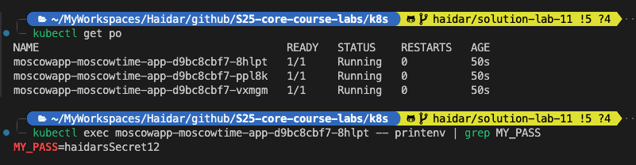
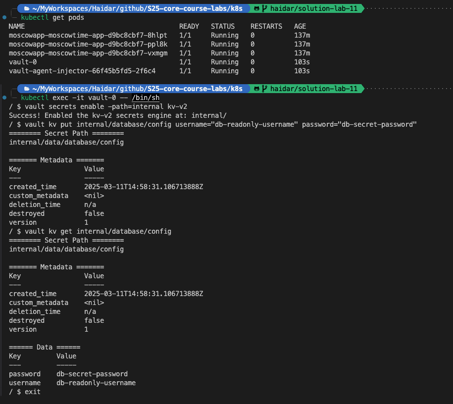
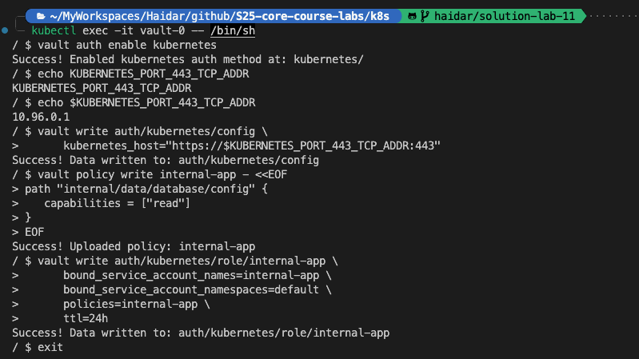

# Lab 11: Kubernetes Secrets and Hashicorp Vault

## Task 1: Kubernetes Secrets and Resource Management

- Create a Kubernetes secret using the following command:

  ```bash
  kubectl create secret generic my-app-secret --from-literal=MY_PASSWORD=supersecret123
  ```

- Verify and Decode Your Secret

  ```bash
  > kubectl get secret my-app-secret -o yaml

  apiVersion: v1
  data:
  MY_PASSWORD: c3VwZXJzZWNyZXQxMjM=
  kind: Secret
  metadata:
  creationTimestamp: "2025-03-09T12:30:52Z"
  name: my-app-secret
  namespace: default
  resourceVersion: "391"
  uid: 0e31ef5f-812d-4964-8fe0-c48de4e3cffa
  type: Opaque

  > base64 -D
      c3VwZXJzZWNyZXQxMjM=
      supersecret123
  ```

- Managing Secret with Helm
  - We use the helm-secrets plugin to securely manage secrets in our Helm charts
  - The plugin allows encrypting sensitive values using SOPS (Mozilla's Secrets OPerationS)
  - Example workflow:

    ```bash
    helm plugin install https://github.com/zendesk/helm-secrets
    ```

  

## Task 2: Vault Secret Management System

### Set a Secret in Vault

  

### Configure Kubernetes Authentication

  

### Implement Vault Secrets in Your Helm Chart

```bash
appuser@moscowapp-moscowtime-app-c667bd657-5xc74:/vault/secrets$ cat config -e
export MY_PASS="db-secret-password"
```

### Resources

```bash
appuser@moscowapp-moscowtime-app-c667bd657-5xc74:/vault/secrets$ df -h
Filesystem Size Used Avail Use% Mounted on
overlay 59G 43G 13G 77% /
tmpfs 64M 0 64M 0% /dev
shm 64M 0 64M 0% /dev/shm
/dev/vda1 59G 43G 13G 77% /etc/hosts
tmpfs 384M 4.0K 384M 1% /vault/secrets
tmpfs 384M 12K 384M 1% /run/secrets/kubernetes.io/serviceaccount
tmpfs 3.9G 0 3.9G 0% /proc/scsi
tmpfs 3.9G 0 3.9G 0% /sys/firmware
```
