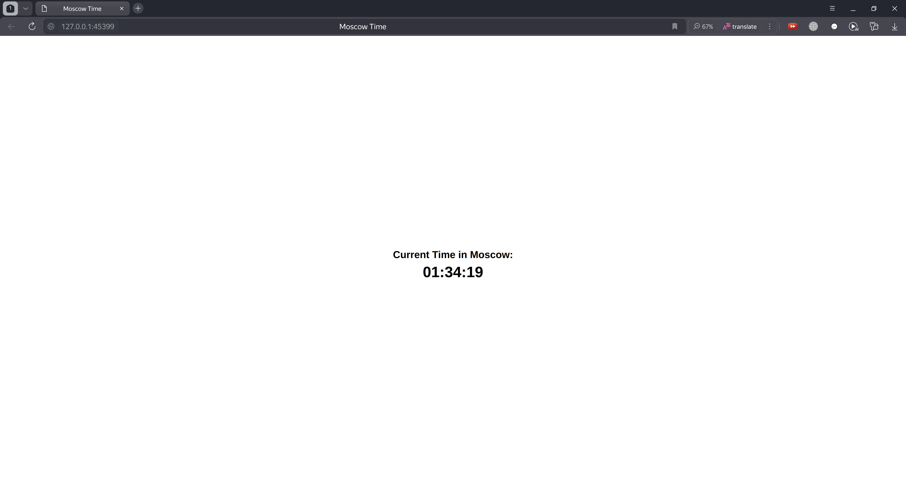
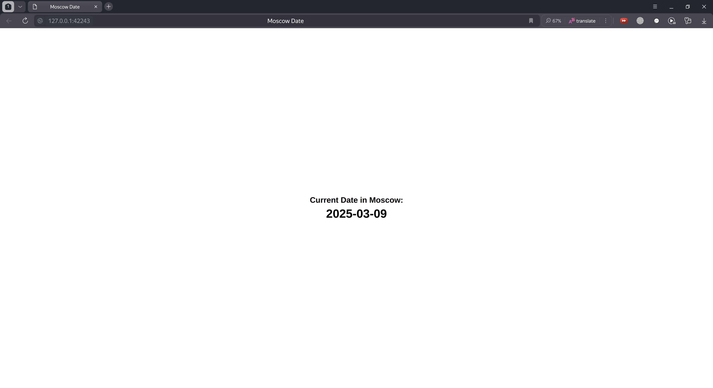

# Kubernetes Secrets and Hashicorp Vault

## Kubectl Secrets

Create a secret

```bash
kubectl create secret generic my-secret --from-literal=MY_PASS=supersecretpassword

secret/my-secret created
```

Get the secret

```bash
kubectl get secrets
NAME                                    TYPE                 DATA   AGE
my-secret                               Opaque               1      24s
sh.helm.release.v1.app-go-helm.v1       helm.sh/release.v1   1      4d9h
sh.helm.release.v1.app-python-helm.v1   helm.sh/release.v1   1      4d9h
```

Describe the secret

```bash
kubectl describe secret my-secret

Name:         my-secret
Namespace:    default
Labels:       <none>
Annotations:  <none>

Type:  Opaque

Data
====
MY_PASS:  19 bytes
```

Get the secret value

```bash
kubectl get secret my-secret -o jsonpath="{.data.MY_PASS}" | base64 --decode

supersecretpassword
```

## Helm Secrets

Install application using Helm Secrets

```bash
helm secrets install app-python-helm ./app-python-helm/ -f ./app-python-helm/secrets.yaml

NAME: app-python-helm
LAST DEPLOYED: Sun Mar  2 14:50:01 2025
NAMESPACE: default
STATUS: deployed
REVISION: 1
NOTES:
1. Get the application URL by running these commands:
  export POD_NAME=$(kubectl get pods --namespace default -l "app.kubernetes.io/name=app-python-helm,app.kubernetes.io/instance=app-python-helm" -o jsonpath="{.items[0].metadata.name}")
  export CONTAINER_PORT=$(kubectl get pod --namespace default $POD_NAME -o jsonpath="{.spec.containers[0].ports[0].containerPort}")
  echo "Visit http://127.0.0.1:8080 to use your application"
  kubectl --namespace default port-forward $POD_NAME 8080:$CONTAINER_PORT
```

Get pods

```bash
kubectl get po

NAME                              READY   STATUS    RESTARTS        AGE
app-go-helm-d56b9f695-8dl69       1/1     Running   1 (4d17h ago)   4d18h
app-python-helm-5b774c57c-vbdb5   1/1     Running   0               74m
```

Print secret environment variable

```bash
kubectl exec app-python-helm-5b774c57c-vbdb5 -- printenv | grep PASSWORD

PASSWORD=supersecretpassword
```

## Hashicorp Vault

### Set a secret in Vault

Enter the vault shell

```bash
kubectl exec -it vault-0 -- /bin/sh

/ $
```

Put a secret

```bash
vault kv put internal/database/config username="db-readonly-username" password="db-secret-password"

======== Secret Path ========
internal/data/database/config

======= Metadata =======
Key                Value
---                -----
created_time       2025-03-08T22:00:24.000336858Z
custom_metadata    <nil>
deletion_time      n/a
destroyed          false
version            2
```

Get the secret

```bash
vault kv get internal/database/config

======== Secret Path ========
internal/data/database/config

======= Metadata =======
Key                Value
---                -----
created_time       2025-03-08T22:00:24.000336858Z
custom_metadata    <nil>
deletion_time      n/a
destroyed          false
version            2

====== Data ======
Key         Value
---         -----
password    db-secret-password
username    db-readonly-username
```

Exit the vault shell

```bash
exit
```

### Configure Kubernetes authentication

Enter the vault shell

```bash
kubectl exec -it vault-0 -- /bin/sh

/ $
```

Enable the Kubernetes authentication method 

```bash
vault auth enable kubernetes

Success! Enabled kubernetes auth method at: kubernetes/
```

Configure the Kubernetes authentication method

```bash
vault write auth/kubernetes/config kubernetes_host="https://$KUBERNETES_PORT_443_TCP_ADDR:443"

Success! Data written to: auth/kubernetes/config
```

Write the policy

```bash
vault policy write app-python - <<EOF
path "internal/data/database/config" {
    capabilities = ["read"]
}
EOF

Success! Uploaded policy: app-python
```

Write the role

```bash
vault write auth/kubernetes/role/app-python \
    bound_service_account_names=app-python \
    bound_service_account_namespaces=default \
    policies=app-python \
    ttl=24h

Success! Data written to: auth/kubernetes/role/app-python
```

Exit the vault shell

```bash
exit
```

### Create service account

Create a service account

```bash
kubectl create sa app-python

serviceaccount/app-python created
```

Annotate the service account

```bash
kubectl annotate sa app-python \
    meta.helm.sh/release-name=app-python-helm \
    meta.helm.sh/release-namespace=default --overwrite

serviceaccount/app-python annotated
```

Label the service account

```bash
kubectl label sa app-python \
    app.kubernetes.io/managed-by=Helm --overwrite

serviceaccount/app-python labeled
```

### Start the app

Install the app

```bash
helm secrets install app-python-helm ./app-python-helm/ -f secrets.yaml

NAME: app-python-helm
LAST DEPLOYED: Sun Mar  9 01:06:48 2025
NAMESPACE: default
STATUS: deployed
REVISION: 1
NOTES:
1. Get the application URL by running these commands:
  export POD_NAME=$(kubectl get pods --namespace default -l "app.kubernetes.io/name=app-python-helm,app.kubernetes.io/instance=app-python-helm" -o jsonpath="{.items[0].metadata.name}")
  export CONTAINER_PORT=$(kubectl get pod --namespace default $POD_NAME -o jsonpath="{.spec.containers[0].ports[0].containerPort}")
  echo "Visit http://127.0.0.1:8080 to use your application"
  kubectl --namespace default port-forward $POD_NAME 8080:$CONTAINER_PORT
removed 'secrets.yaml.dec'
```

Get pods

```bash
kubectl get po

NAME                                    READY   STATUS    RESTARTS       AGE
app-python-helm-766479b8d4-jpsnl        1/1     Running   0              39s
vault-0                                 1/1     Running   2 (5d1h ago)   6d4h
vault-agent-injector-66f45b5fd5-94mb7   1/1     Running   2 (5d1h ago)   6d4h
```

### Inject secrets

Patch the deployment

```bash
kubectl patch deployment app-python-helm --patch-file=./app-python-helm/patch-inject-secrets.yaml

deployment.apps/app-python-helm patched
```

Get pods right after the patch

```bash
kubectl get po

NAME                                    READY   STATUS            RESTARTS       AGE
app-python-helm-5b7ff4b9d7-4vswm        0/2     PodInitializing   0              1s
app-python-helm-766479b8d4-jpsnl        1/1     Running           0              83s
vault-0                                 1/1     Running           2 (5d1h ago)   6d5h
vault-agent-injector-66f45b5fd5-94mb7   1/1     Running           2 (5d1h ago)   6d5h
```

Get pods after some time

```bash
kubectl get po

NAME                                    READY   STATUS    RESTARTS       AGE
app-python-helm-5b7ff4b9d7-4vswm        2/2     Running   0              17s
vault-0                                 1/1     Running   2 (5d1h ago)   6d5h
vault-agent-injector-66f45b5fd5-94mb7   1/1     Running   2 (5d1h ago)   6d5h
```

### Check the secrets

Check the secret in the pods

```bash
kubectl exec -it app-python-helm-5b7ff4b9d7-4vswm --container app-python-helm -- cat /vault/secrets/database-config.txt

data: map[password:db-secret-password username:db-readonly-username]
metadata: map[created_time:2025-03-08T22:00:24.000336858Z custom_metadata:<nil> deletion_time: destroyed:false version:2]
```

```bash
kubectl exec -it app-python-helm-5b7ff4b9d7-4vswm --container app-python-helm -- df -h

Filesystem                Size      Used Available Use% Mounted on
overlay                 245.5G    190.1G     42.9G  82% /
tmpfs                    64.0M         0     64.0M   0% /dev
shm                      64.0M         0     64.0M   0% /dev/shm
tmpfs                   384.0M      4.0K    384.0M   0% /vault/secrets
/dev/nvme0n1p6          245.5G    190.1G     42.9G  82% /dev/termination-log
/dev/nvme0n1p6          245.5G    190.1G     42.9G  82% /etc/resolv.conf
/dev/nvme0n1p6          245.5G    190.1G     42.9G  82% /etc/hostname
/dev/nvme0n1p6          245.5G    190.1G     42.9G  82% /etc/hosts
tmpfs                   384.0M     12.0K    384.0M   0% /run/secrets/kubernetes.io/serviceaccount
tmpfs                    15.6G         0     15.6G   0% /proc/asound
tmpfs                    15.6G         0     15.6G   0% /proc/acpi
tmpfs                    64.0M         0     64.0M   0% /proc/kcore
tmpfs                    64.0M         0     64.0M   0% /proc/keys
tmpfs                    64.0M         0     64.0M   0% /proc/latency_stats
tmpfs                    64.0M         0     64.0M   0% /proc/timer_list
tmpfs                    15.6G         0     15.6G   0% /proc/scsi
tmpfs                    15.6G         0     15.6G   0% /sys/firmware
tmpfs                    15.6G         0     15.6G   0% /sys/devices/virtual/powercap
```

## Resources requests and limits

Check the resources requests and limits

```bash
kubectl describe deployments.apps app-python-helm
Name:                   app-python-helm
Namespace:              default
CreationTimestamp:      Sun, 09 Mar 2025 01:07:00 +0300
Labels:                 app.kubernetes.io/instance=app-python-helm
                        app.kubernetes.io/managed-by=Helm
                        app.kubernetes.io/name=app-python-helm
                        app.kubernetes.io/version=1.16.0
                        helm.sh/chart=app-python-helm-0.1.0
Annotations:            deployment.kubernetes.io/revision: 2
                        meta.helm.sh/release-name: app-python-helm
                        meta.helm.sh/release-namespace: default
Selector:               app.kubernetes.io/instance=app-python-helm,app.kubernetes.io/managed-by=Helm,app.kubernetes.io/name=app-python-helm,app.kubernetes.io/version=1.16.0
Replicas:               1 desired | 1 updated | 1 total | 1 available | 0 unavailable
StrategyType:           RollingUpdate
MinReadySeconds:        0
RollingUpdateStrategy:  25% max unavailable, 25% max surge
Pod Template:
  Labels:           app.kubernetes.io/instance=app-python-helm
                    app.kubernetes.io/managed-by=Helm
                    app.kubernetes.io/name=app-python-helm
                    app.kubernetes.io/version=1.16.0
                    helm.sh/chart=app-python-helm-0.1.0
  Annotations:      vault.hashicorp.com/agent-inject: true
                    vault.hashicorp.com/agent-inject-secret-database-config.txt: internal/data/database/config
                    vault.hashicorp.com/role: app-python
  Service Account:  app-python
  Containers:
   app-python-helm:
    Image:      azamatbayramov/s25-devops-py:latest
    Port:       8001/TCP
    Host Port:  0/TCP
    Limits:
      cpu:     200m
      memory:  256Mi
    Requests:
      cpu:      200m
      memory:   256Mi
    Liveness:   http-get http://:http/ delay=0s timeout=1s period=10s #success=1 #failure=3
    Readiness:  http-get http://:http/ delay=0s timeout=1s period=10s #success=1 #failure=3
    Environment:
      PASSWORD:    <set to the key 'PASSWORD' in secret 'credentials'>  Optional: false
      PY_VAR:      py-value
    Mounts:        <none>
  Volumes:         <none>
  Node-Selectors:  <none>
  Tolerations:     <none>
Conditions:
  Type           Status  Reason
  ----           ------  ------
  Available      True    MinimumReplicasAvailable
  Progressing    True    NewReplicaSetAvailable
OldReplicaSets:  app-python-helm-766479b8d4 (0/0 replicas created)
NewReplicaSet:   app-python-helm-5b7ff4b9d7 (1/1 replicas created)
Events:
  Type    Reason             Age   From                   Message
  ----    ------             ----  ----                   -------
  Normal  ScalingReplicaSet  23m   deployment-controller  Scaled up replica set app-python-helm-766479b8d4 from 0 to 1
  Normal  ScalingReplicaSet  22m   deployment-controller  Scaled up replica set app-python-helm-5b7ff4b9d7 from 0 to 1
  Normal  ScalingReplicaSet  21m   deployment-controller  Scaled down replica set app-python-helm-766479b8d4 from 1 to 0
```

```bash
kubectl describe deployments.apps app-go-helm

Name:                   app-go-helm
Namespace:              default
CreationTimestamp:      Sun, 09 Mar 2025 01:28:00 +0300
Labels:                 app.kubernetes.io/instance=app-go-helm
                        app.kubernetes.io/managed-by=Helm
                        app.kubernetes.io/name=app-go-helm
                        app.kubernetes.io/version=1.16.0
                        helm.sh/chart=app-go-helm-0.1.0
Annotations:            deployment.kubernetes.io/revision: 1
                        meta.helm.sh/release-name: app-go-helm
                        meta.helm.sh/release-namespace: default
Selector:               app.kubernetes.io/instance=app-go-helm,app.kubernetes.io/managed-by=Helm,app.kubernetes.io/name=app-go-helm,app.kubernetes.io/version=1.16.0
Replicas:               1 desired | 1 updated | 1 total | 1 available | 0 unavailable
StrategyType:           RollingUpdate
MinReadySeconds:        0
RollingUpdateStrategy:  25% max unavailable, 25% max surge
Pod Template:
  Labels:           app.kubernetes.io/instance=app-go-helm
                    app.kubernetes.io/managed-by=Helm
                    app.kubernetes.io/name=app-go-helm
                    app.kubernetes.io/version=1.16.0
                    helm.sh/chart=app-go-helm-0.1.0
  Service Account:  app-go-helm
  Containers:
   app-go-helm:
    Image:      azamatbayramov/s25-devops-go:latest
    Port:       8002/TCP
    Host Port:  0/TCP
    Limits:
      cpu:     100m
      memory:  128Mi
    Requests:
      cpu:      100m
      memory:   128Mi
    Liveness:   http-get http://:http/ delay=0s timeout=1s period=10s #success=1 #failure=3
    Readiness:  http-get http://:http/ delay=0s timeout=1s period=10s #success=1 #failure=3
    Environment:
      GO_VAR:      goVar value
    Mounts:        <none>
  Volumes:         <none>
  Node-Selectors:  <none>
  Tolerations:     <none>
Conditions:
  Type           Status  Reason
  ----           ------  ------
  Available      True    MinimumReplicasAvailable
  Progressing    True    NewReplicaSetAvailable
OldReplicaSets:  <none>
NewReplicaSet:   app-go-helm-59b5b7d8 (1/1 replicas created)
Events:
  Type    Reason             Age    From                   Message
  ----    ------             ----   ----                   -------
  Normal  ScalingReplicaSet  3m50s  deployment-controller  Scaled up replica set app-go-helm-59b5b7d8 from 0 to 1
```

Test the applications

```bash
minikube service app-python-helm

|-----------|-----------------|-------------|--------------|
| NAMESPACE |      NAME       | TARGET PORT |     URL      |
|-----------|-----------------|-------------|--------------|
| default   | app-python-helm |             | No node port |
|-----------|-----------------|-------------|--------------|
😿  service default/app-python-helm has no node port
❗  Services [default/app-python-helm] have type "ClusterIP" not meant to be exposed, however for local development minikube allows you to access this !
🏃  Starting tunnel for service app-python-helm.
|-----------|-----------------|-------------|------------------------|
| NAMESPACE |      NAME       | TARGET PORT |          URL           |
|-----------|-----------------|-------------|------------------------|
| default   | app-python-helm |             | http://127.0.0.1:45399 |
|-----------|-----------------|-------------|------------------------|
🎉  Opening service default/app-python-helm in default browser...
❗  Because you are using a Docker driver on linux, the terminal needs to be open to run it.
find_ffmpeg failed, using the integrated library.
Opening in existing browser session.
```



```bash
minikube service app-go-helm

|-----------|-------------|-------------|--------------|
| NAMESPACE |    NAME     | TARGET PORT |     URL      |
|-----------|-------------|-------------|--------------|
| default   | app-go-helm |             | No node port |
|-----------|-------------|-------------|--------------|
😿  service default/app-go-helm has no node port
❗  Services [default/app-go-helm] have type "ClusterIP" not meant to be exposed, however for local development minikube allows you to access this !
🏃  Starting tunnel for service app-go-helm.
|-----------|-------------|-------------|------------------------|
| NAMESPACE |    NAME     | TARGET PORT |          URL           |
|-----------|-------------|-------------|------------------------|
| default   | app-go-helm |             | http://127.0.0.1:42243 |
|-----------|-------------|-------------|------------------------|
🎉  Opening service default/app-go-helm in default browser...
❗  Because you are using a Docker driver on linux, the terminal needs to be open to run it.
find_ffmpeg failed, using the integrated library.
Opening in existing browser session.
```



## Environment variables

Get the environment variables

```bash
kubectl exec -it app-python-helm-78f74b5fc9-d9qlz --container app-python-helm -- printenv | grep PY_VAR

PY_VAR_1=pyVar1 value
PY_VAR_2=pyVar2 value
```

```bash
kubectl exec -it app-go-helm-74698c69ff-sjmfx --container app-go-helm -- printenv | grep GO_VAR

GO_VAR_1=goVar1 value
GO_VAR_2=goVar2 value
```
