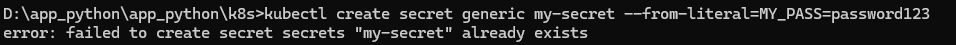
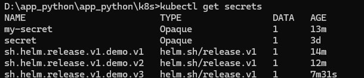
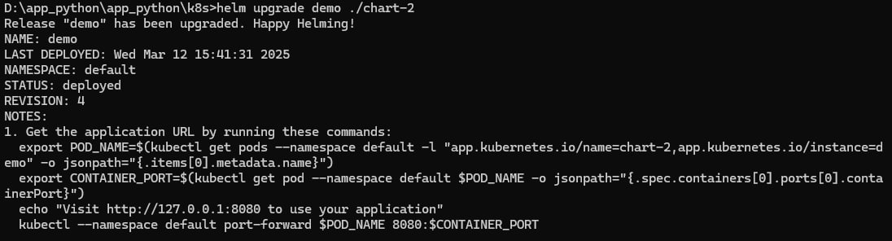
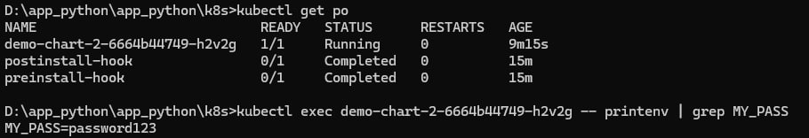

# Secrets Lab

## Task 1

### Creating secret

```cmd
kubectl create secret generic my-secret --from-literal=MY_PASS=password123
```



### Verifying secret

```cmd
kubectl get secrets

kubectl describe secret my-secret

kubectl get secret my-secret -o jsonpath='{.data.MY_PASS}'
```



### Helm secrets management

1. Created secrets.yaml

2. Updated values.yaml

3. Updated deployment.yaml

4. Helm release upgraded

```cmd
helm upgrade demo ./chart-2
```



### Pods checking

```cmd
kubectl get po
```

```cmd
kubectl exec demo-chart-2-6664b44749-h2v2g -- printenv | grep MY_PASS
```



