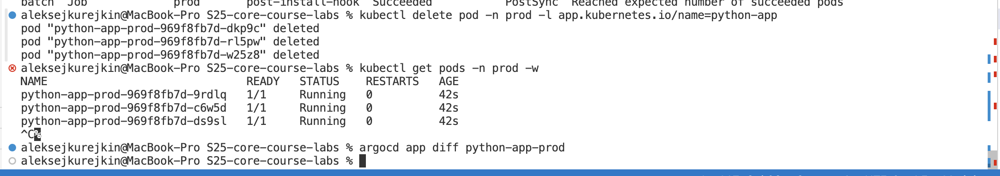
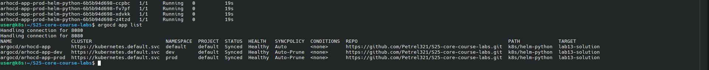
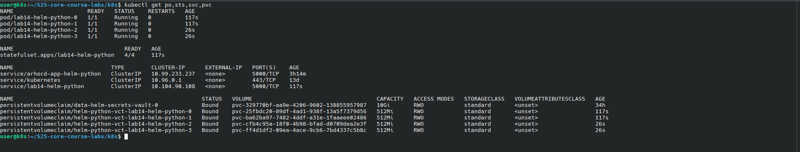
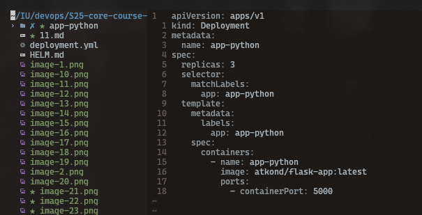
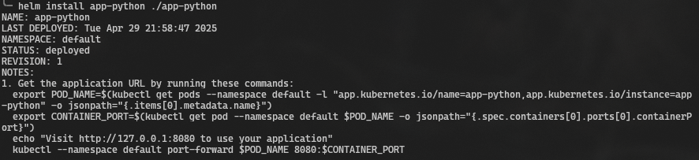
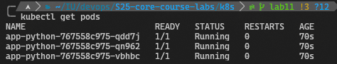
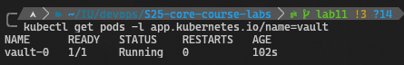
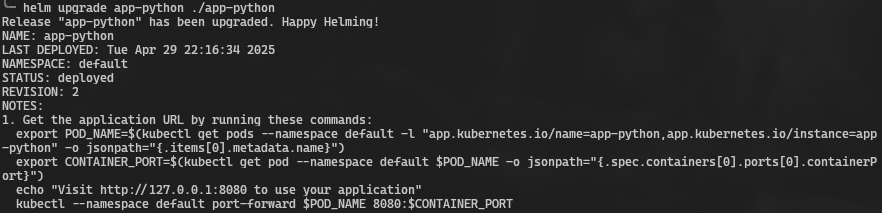

# Kubernetes Secrets and Hashicorp Vault

## Kubernetes Secrets and Resource Management







## Manage secrets with Helm








### `kubectl exec app-python-767558c975-vbhbc -- printenv | grep API_TOKEN  `

`API_TOKEN=random`

## Vault Secret Management System

### Installation

`curl -LO https://github.com/hashicorp/vault-helm/archive/refs/heads/main.zip`

`unzip main.zip`

`helm install vault ./vault-helm-main/ --set "server.dev.enabled=true"`



### `kubectl exec -it vault-0 -- /bin/sh`

```
/ $ export VAULT_ADDR='http://127.0.0.1:8200'
/ $ export VAULT_TOKEN='root'
/ $ vault status
Key             Value
---             -----
Seal Type       shamir
Initialized     true
Sealed          false
Total Shares    1
Threshold       1
Version         1.19.0
Build Date      2025-03-04T12:36:40Z
Storage Type    inmem
Cluster Name    vault-cluster-956d13bc
Cluster ID      5793da38-217c-eab2-9703-5ebab27d5ca3
HA Enabled      false
/ $ vault secrets enable -path=internal kv-v2
Success! Enabled the kv-v2 secrets engine at: internal/
/ $ vault kv put internal/database/config api_token="rng"
======== Secret Path ========
internal/data/database/config

======= Metadata =======
Key                Value
---                -----
created_time       2025-04-29T19:08:05.689988684Z
custom_metadata    <nil>
deletion_time      n/a
destroyed          false
version            1
/ $ vault auth enable kubernetes
Success! Enabled kubernetes auth method at: kubernetes/
/ $ vault write auth/kubernetes/config \
> kubernetes_host="https://$KUBERNETES_PORT_443_TCP_ADDR:443" \
> token_reviewer_jwt="$(cat /var/run/secrets/kubernetes.io/serviceaccount/token)" \
> kubernetes_ca_cert=@/var/run/secrets/kubernetes.io/serviceaccount/ca.crt \
> issuer="https://kubernetes.default.svc.cluster.local"
Success! Data written to: auth/kubernetes/config
/ $ vault policy write internal-app - <<EOF
> path "internal/data/database/config" {
>   capabilities = ["read"]
> }
> EOF
Success! Uploaded policy: internal-app
/ $ vault write auth/kubernetes/role/moscow-time-app \
> bound_service_account_names="moscow-time-app" \
> bound_service_account_namespaces="default" \
> policies="internal-app" \
> ttl=24h
Success! Data written to: auth/kubernetes/role/moscow-time-app
/ $ exit
```

Updated values.yaml to create podAnnotations



`kubectl get pods -l app.kubernetes.io/name=app-python`

```
NAME                          READY   STATUS     RESTARTS   AGE
app-python-8f7b8684-2bbp6     1/2     Running    0          12m
```
### Verify secrets:

`export POD_NAME=$(kubectl get pods -l app.kubernetes.io/name=app-python -o jsonpath="{.items[0].metadata.name}")`

`kubectl exec $POD_NAME -- cat /vault/secrets/database-config.txt`

### Result:

```
database:
  api_token: rng
```