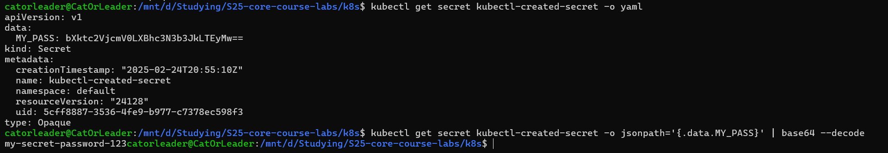
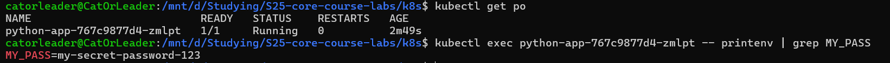
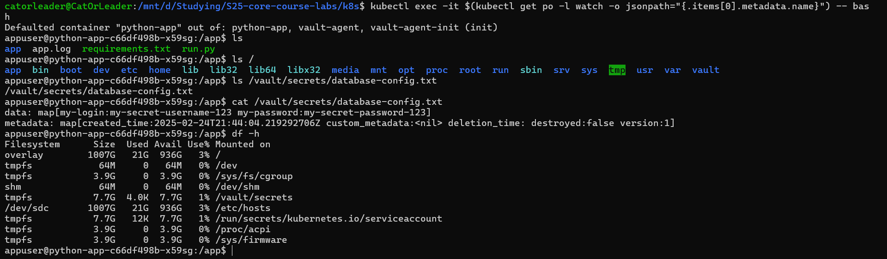
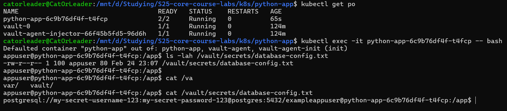
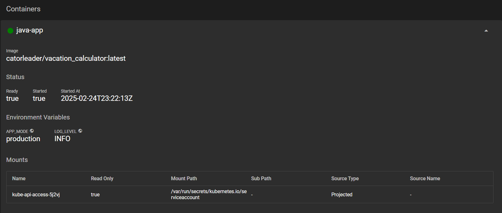
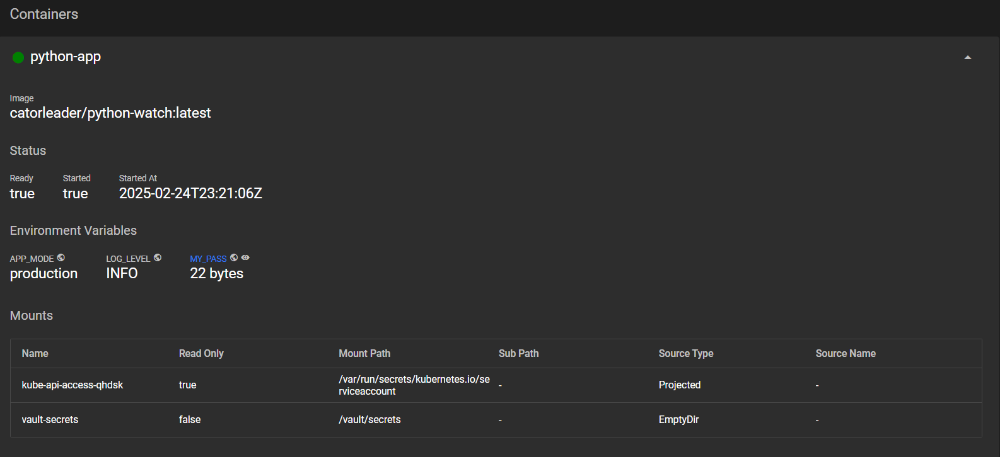

# Lab #11

---

## Secrets

* ```bash
  kubectl create secret generic kubectl-created-secret \
  --from-literal=MY_PASS="my-secret-password-123" \
  -n default
  ```
  


---

* I  implemented the solution to create a `_secrets.yaml` file in the `common-lib` directory for Helm charts,
  in order to satisfy the DRY (Don't Repeat Yourself) principle.

* Also, I use `sops` to properly manage the secrets exporting during the Helm deployment process; Additionally, I put
  the decrypted secret inside the `k8s` directory for justification purposes, that secret is the same as in the pods



---

## Vault

* `kubectl get pods` after the vault installation

```bash
catorleader@CatOrLeader:/mnt/d/Studying/S25-core-course-labs/k8s$ kubectl get pods
NAME                                    READY   STATUS    RESTARTS   AGE
python-app-c66df498b-x59sg              1/1     Running   0          9m3s
vault-0                                 1/1     Running   0          2m49s
vault-agent-injector-66f45b5fd5-96d6h   1/1     Running   0          2m49s
```

* Creation of secrets

```bash
catorleader@CatOrLeader:/mnt/d/Studying/S25-core-course-labs/k8s$ kubectl exec -it vault-0 -- /bin/sh
/ $ vault secrets enable -path=internal kv-v2
Success! Enabled the kv-v2 secrets engine at: internal/
/ $ vault kv put internal/database/config my-login="my-secret-username-123" my-password="my-secret-password-123"
======== Secret Path ========
internal/data/database/config

======= Metadata =======
Key                Value
---                -----
created_time       2025-02-24T21:44:04.219292706Z
custom_metadata    <nil>
deletion_time      n/a
destroyed          false
version            1
/ $ vault kv get internal/database/config
======== Secret Path ========
internal/data/database/config

======= Metadata =======
Key                Value
---                -----
created_time       2025-02-24T21:44:04.219292706Z
custom_metadata    <nil>
deletion_time      n/a
destroyed          false
version            1

======= Data =======
Key            Value
---            -----
my-login       my-secret-username-123
my-password    my-secret-password-123
/ $ exit
```

* Command to properly define the role-accessibility to the vault:

```bash
/ $ vault write auth/kubernetes/role/internal-app \
>       bound_service_account_names=python-app,java-app \
>       bound_service_account_namespaces=default \
>       policies=internal-app \
>       ttl=24h
Success! Data written to: auth/kubernetes/role/internal-app
```

* Then, I change the `values.yaml` for python-app and redeploy helm chart



---

* Additionally, I had a problem with the '-' in the secrets names; However, this was fixed by using the `index` function
  that treats field names as a string parameters, and not parsing it in template

* Applying patch by the command: `kubectl patch deployment python-app --patch-file=patch-inject-secrets-as-template.yaml`



---

## Resources & Env

* Resources of the deployments (achieved by uncommenting the necessary section in `values.yaml`)

```bash
catorleader@CatOrLeader:/mnt/d/Studying/S25-core-course-labs/k8s$ helm secrets install python-app python-app/ -f common-secret.yaml
NAME: python-app
LAST DEPLOYED: Tue Feb 25 02:20:40 2025
NAMESPACE: default
STATUS: deployed
REVISION: 1
NOTES:
1. Get the application URL by running these commands:
  export NODE_PORT=$(kubectl get --namespace default -o jsonpath="{.spec.ports[0].nodePort}" services python-app)
  export NODE_IP=$(kubectl get nodes --namespace default -o jsonpath="{.items[0].status.addresses[0].address}")
  echo http://$NODE_IP:$NODE_PORT
catorleader@CatOrLeader:/mnt/d/Studying/S25-core-course-labs/k8s$ helm install java-app java-app/
NAME: java-app
LAST DEPLOYED: Tue Feb 25 02:21:48 2025
NAMESPACE: default
STATUS: deployed
REVISION: 1
NOTES:
1. Get the application URL by running these commands:
  export NODE_PORT=$(kubectl get --namespace default -o jsonpath="{.spec.ports[0].nodePort}" services java-app)
  export NODE_IP=$(kubectl get nodes --namespace default -o jsonpath="{.items[0].status.addresses[0].address}")
  echo http://$NODE_IP:$NODE_PORT
catorleader@CatOrLeader:/mnt/d/Studying/S25-core-course-labs/k8s$ kubectl describe deployment python-app
Name:                   python-app
Namespace:              default
CreationTimestamp:      Tue, 25 Feb 2025 02:21:04 +0300
Labels:                 app.kubernetes.io/instance=python-app
                        app.kubernetes.io/managed-by=Helm
                        app.kubernetes.io/version=1.16.0
Annotations:            deployment.kubernetes.io/revision: 1
                        meta.helm.sh/release-name: python-app
                        meta.helm.sh/release-namespace: default
Selector:               app.kubernetes.io/instance=python-app,app.kubernetes.io/managed-by=Helm,app.kubernetes.io/version=1.16.0
Replicas:               1 desired | 1 updated | 1 total | 1 available | 0 unavailable
StrategyType:           RollingUpdate
MinReadySeconds:        0
RollingUpdateStrategy:  25% max unavailable, 25% max surge
Pod Template:
  Labels:           app.kubernetes.io/instance=python-app
                    app.kubernetes.io/managed-by=Helm
                    app.kubernetes.io/name=python-app
                    app.kubernetes.io/version=1.16.0
                    helm.sh/chart=python-app-0.1.0
                    watch=
  Annotations:      vault.hashicorp.com/agent-inject: true
                    vault.hashicorp.com/agent-inject-secret-database-config.txt: internal/data/database/config
                    vault.hashicorp.com/role: internal-app
  Service Account:  python-app
  Containers:
   python-app:
    Image:      catorleader/python-watch:latest
    Port:       5000/TCP
    Host Port:  0/TCP
    Limits:
      cpu:     100m
      memory:  128Mi
    Requests:
      cpu:     100m
      memory:  128Mi
    Environment:
      MY_PASS:     <set to the key 'MY_PASS' in secret 'common-secret-python-app'>  Optional: false
      LOG_LEVEL:   INFO
      APP_MODE:    production
    Mounts:        <none>
  Volumes:         <none>
  Node-Selectors:  <none>
  Tolerations:     <none>
Conditions:
  Type           Status  Reason
  ----           ------  ------
  Available      True    MinimumReplicasAvailable
  Progressing    True    NewReplicaSetAvailable
OldReplicaSets:  <none>
NewReplicaSet:   python-app-cf9ffbfd5 (1/1 replicas created)
Events:
  Type    Reason             Age   From                   Message
  ----    ------             ----  ----                   -------
  Normal  ScalingReplicaSet  5m9s  deployment-controller  Scaled up replica set python-app-cf9ffbfd5 from 0 to 1
catorleader@CatOrLeader:/mnt/d/Studying/S25-core-course-labs/k8s$ kubectl describe deployment java-app
Name:                   java-app
Namespace:              default
CreationTimestamp:      Tue, 25 Feb 2025 02:22:12 +0300
Labels:                 app.kubernetes.io/instance=java-app
                        app.kubernetes.io/managed-by=Helm
                        app.kubernetes.io/version=1.16.0
Annotations:            deployment.kubernetes.io/revision: 1
                        meta.helm.sh/release-name: java-app
                        meta.helm.sh/release-namespace: default
Selector:               app.kubernetes.io/instance=java-app,app.kubernetes.io/managed-by=Helm,app.kubernetes.io/version=1.16.0
Replicas:               1 desired | 1 updated | 1 total | 1 available | 0 unavailable
StrategyType:           RollingUpdate
MinReadySeconds:        0
RollingUpdateStrategy:  25% max unavailable, 25% max surge
Pod Template:
  Labels:           app.kubernetes.io/instance=java-app
                    app.kubernetes.io/managed-by=Helm
                    app.kubernetes.io/name=java-app
                    app.kubernetes.io/version=1.16.0
                    helm.sh/chart=java-app-0.1.0
                    vacation-calculator=
  Service Account:  java-app
  Containers:
   java-app:
    Image:      catorleader/vacation_calculator:latest
    Port:       8080/TCP
    Host Port:  0/TCP
    Limits:
      cpu:     100m
      memory:  128Mi
    Requests:
      cpu:     100m
      memory:  128Mi
    Environment:
      LOG_LEVEL:   INFO
      APP_MODE:    production
    Mounts:        <none>
  Volumes:         <none>
  Node-Selectors:  <none>
  Tolerations:     <none>
Conditions:
  Type           Status  Reason
  ----           ------  ------
  Available      True    MinimumReplicasAvailable
  Progressing    True    NewReplicaSetAvailable
OldReplicaSets:  <none>
NewReplicaSet:   java-app-5bdc8749b4 (1/1 replicas created)
Events:
  Type    Reason             Age    From                   Message
  ----    ------             ----   ----                   -------
  Normal  ScalingReplicaSet  4m10s  deployment-controller  Scaled up replica set java-app-5bdc8749b4 from 0 to 1
```

* Check out the ENVs inside the pods




