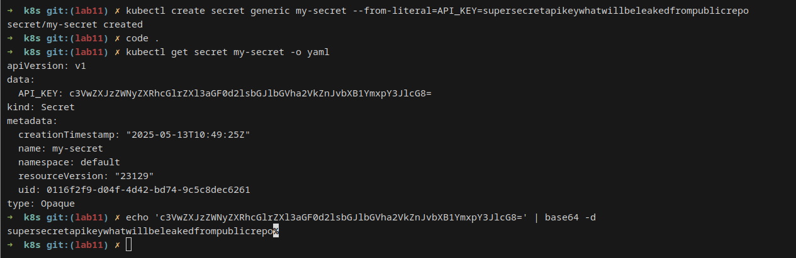

# Secret management

## Task 1

```bash
$ kubectl create secret generic my-secret --from-literal=API_KEY=supersecretapikeywhatwillbeleakedfrompublicrepo
secret/my-secret created
```



Deployment with Helm:

```bash
➜  k8s git:(lab11) ✗ helm install timeapp timeapp
NAME: timeapp
LAST DEPLOYED: Tue May 13 14:45:30 2025
NAMESPACE: default
STATUS: deployed
REVISION: 1
➜  k8s git:(lab11) ✗ kubectl get po
NAME                      READY   STATUS      RESTARTS   AGE
timeapp-95f746659-5zhxg   1/1     Running     0          66s
timeapp-95f746659-f6lb4   1/1     Running     0          66s
timeapp-95f746659-grq4n   1/1     Running     0          66s
timeapp-post-install      0/1     Completed   0          66s
timeapp-pre-install       0/1     Completed   0          91s
➜  k8s git:(lab11) ✗
```

Checking secret prescence:

```bash
➜  k8s git:(lab11) ✗ kubectl exec timeapp-95f746659-5zhxg -- printenv | grep MY_PASS
MY_PASS=supersecret
➜  k8s git:(lab11) ✗
```

## Task 2

Added vault:

```bash
➜  k8s git:(lab11) ✗ helm install vault hashicorp/vault --set "server.dev.enabled=true"
NAME: vault
LAST DEPLOYED: Tue May 13 15:08:01 2025
NAMESPACE: default
STATUS: deployed
REVISION: 1
NOTES:
Thank you for installing HashiCorp Vault!

Now that you have deployed Vault, you should look over the docs on using
Vault with Kubernetes available here:

https://developer.hashicorp.com/vault/docs


Your release is named vault. To learn more about the release, try:

  $ helm status vault
  $ helm get manifest vault
➜  k8s git:(lab11) ✗ kubectl get po
NAME                                    READY   STATUS      RESTARTS   AGE
timeapp-95f746659-5zhxg                 1/1     Running     0          22m
timeapp-95f746659-f6lb4                 1/1     Running     0          22m
timeapp-95f746659-grq4n                 1/1     Running     0          22m
timeapp-post-install                    0/1     Completed   0          22m
timeapp-pre-install                     0/1     Completed   0          22m
vault-0                                 0/1     Running     0          3s
vault-agent-injector-75f9dfc9c8-n6sp9   0/1     Running     0          3s
```

Add a secret

```bash
➜  k8s git:(lab11) ✗ kubectl exec -it vault-0 -- /bin/sh
/ $ vault secrets enable -path=internal kv-v2
Success! Enabled the kv-v2 secrets engine at: internal/
/ $ vault kv put internal/secret password="hiddenpassword"
==== Secret Path ====
internal/data/secret

======= Metadata =======
Key                Value
---                -----
created_time       2025-05-13T12:09:05.822605884Z
custom_metadata    <nil>
deletion_time      n/a
destroyed          false
version            1
/ $ vault kv get internal/secret
==== Secret Path ====
internal/data/secret

======= Metadata =======
Key                Value
---                -----
created_time       2025-05-13T12:09:05.822605884Z
custom_metadata    <nil>
deletion_time      n/a
destroyed          false
version            1

====== Data ======
Key         Value
---         -----
password    hiddenpassword
/ $
```

Enable authenticaton:

```
➜  k8s git:(lab11) ✗ kubectl exec -it vault-0 -- /bin/sh
/ $ vault auth enable kubernetes
Success! Enabled kubernetes auth method at: kubernetes/

/ $ vault write auth/kubernetes/config \
>       kubernetes_host="https://$KUBERNETES_PORT_443_TCP_ADDR:443"
Success! Data written to: auth/kubernetes/config
/ $ vault policy write internal-app - <<EOF
> path "internal/data/secret" {
>    capabilities = ["read"]
> }
> EOF
Success! Uploaded policy: internal-app
/ $ vault write auth/kubernetes/role/internal-app \
>       bound_service_account_names=internal-app \
>       bound_service_account_namespaces=default \
>       policies=internal-app \
>       ttl=24h
Success! Data written to: auth/kubernetes/role/internal-app
/ $ exit
```

And created a service account:

```bash
➜  k8s git:(lab11) ✗ kubectl create sa internal-app
serviceaccount/internal-app created
```

> Here I had a little issue, because the docs have a little mistake. The correct policy has path "internal/data/secret", because it is v2

Now we can install the app and check the secret:

```bash
➜  k8s git:(lab11) ✗ helm install timeapp timeapp/
NAME: timeapp
LAST DEPLOYED: Tue May 13 17:52:56 2025
NAMESPACE: default
STATUS: deployed
REVISION: 1
➜  k8s git:(lab11) ✗ kubectl get po
NAME                                    READY   STATUS      RESTARTS   AGE
timeapp-6b575f8669-8plg2                2/2     Running     0          7s
timeapp-6b575f8669-bsrfk                2/2     Running     0          7s
timeapp-6b575f8669-pjr87                2/2     Running     0          7s
timeapp-post-install                    0/1     Completed   0          7s
timeapp-pre-install                     0/1     Completed   0          12s
vault-0                                 1/1     Running     0          165m
vault-agent-injector-75f9dfc9c8-n6sp9   1/1     Running     0          165m
```

And we have access to our secret:

```bash
➜  k8s git:(lab11) ✗ kubectl exec -it timeapp-6b575f8669-bsrfk -- /bin/sh
Defaulted container "timeapp" out of: timeapp, vault-agent, vault-agent-init (init)
/app $ ls /vault
secrets
/app $ ls /vault/secrets/
secret.txt
/app $ cat /vault/secrets/secret.txt
data: map[password:hiddenpassword]
metadata: map[created_time:2025-05-13T12:09:05.822605884Z custom_metadata:<nil> deletion_time: destroyed:false version:1]
/app $
```
