# Lab 11: Kubernetes Secrets and Hashicorp Vault
- Daniil Vasilev, d.vasilev@innopolis.university

## Task 1: Kubernetes Secrets and Resource Management
### Step 1: Create a Secret Using kubectl:
- ```bash
  kubectl create secret generic test-secret --from-literal=PASS=testpassword
  ```

### Step 2: Verify and Decode The Secret:
- ```bash
  kubectl get secrets
  ```
  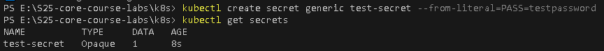
- ```bash
  kubectl describe secret test-secret
  ```
  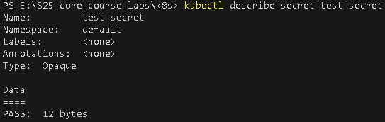
- ```bash
  kubectl get secret test-secret -o jsonpath="{.data.PASS}"
  ```
  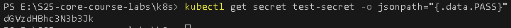
- ```text
  dGVzdHBhc3N3b3Jk
  Decoded base64: testpassword
  ```

### Step 3: Manage Secrets with Helm
- `kubectl get po`: 
- 
- `kubectl exec demo-5f898f5f4c-2gpnd -- printenv`: 
- 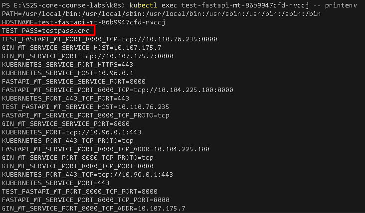

## Task 2: Vault Secret Management System

### Step 2 & 3:
- Setting a Secret in Vault Result:
  - 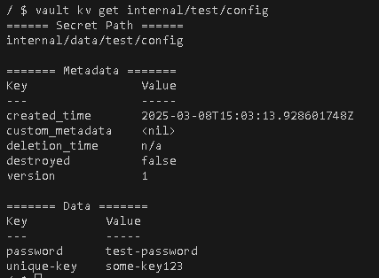
- Configuring Kubernetes Authentication:
  - 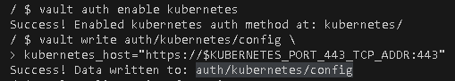
- Configuring Policy:
  - 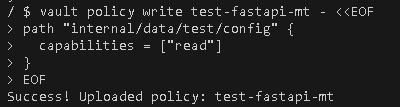
- Creating a Kubernetes authentication role:
  - 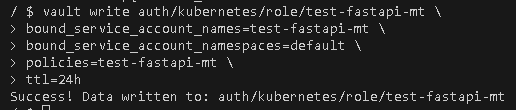
- Pods status while upgrading:
  - 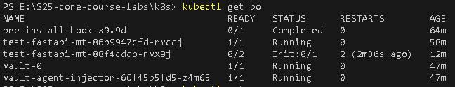
- Pods status after container upgrade:
  - 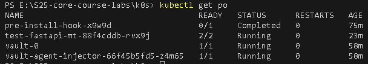
- Test (After apply)
  - 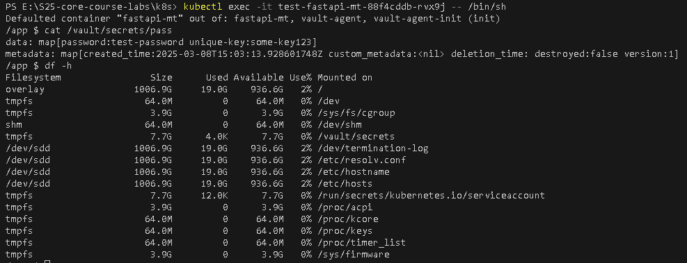

## Bonus Task
### Step 2 & 3: Set up requests and limits for CPU and Memory for both charts, add env. variables
- Upgraded both charts: 
- 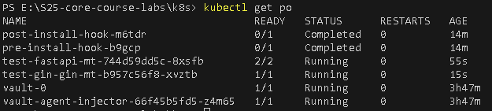
- Included into `deployment.yml`: ```yaml
                                  {{- include "fastapi-mt.envVars" . | nindent 10 }} # For fastapi (python) web app
                                  {{- include "gin-mt.envVars" . | nindent 10 }} # For gin (go) web app
                                  ```
- Included into `values.yaml`: ```yaml
                               resources:
                                 requests:
                                   cpu: "250m"
                                   memory: "128Mi"
                                 limits:
                                   cpu: "500m"
                                   memory: "256Mi"
                               ```
- Included into `_helpers.tpl`: ```yaml
                                {{- define "gin-mt.envVars" -}} # And {{- define "fastapi-mt.envVars" -}} for the second
                                env:
                                  - name: ENV_MODE
                                    value: "development"
                                  - name: Vault_Password
                                    value: "/vault/secrets/password"
                                  - name: Vault_Key
                                    value: "/vault/secrets/unique-key"
                                {{- end }}
                                ```
- Result 1: (got via `kubectl describe pod $(kubectl get pod -l app.kubernetes.io/name=fastapi-mt -o jsonpath="{.items[0].metadata.name}")`)
  - 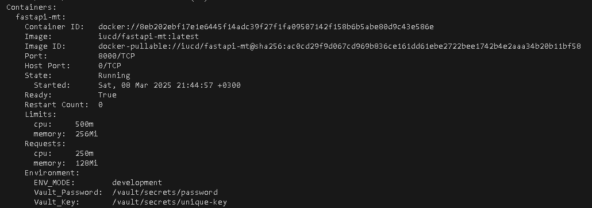
- Result 2: (got via `kubectl describe pod $(kubectl get pod -l app.kubernetes.io/name=gin-mt -o jsonpath="{.items[0].metadata.name}")`)
  - 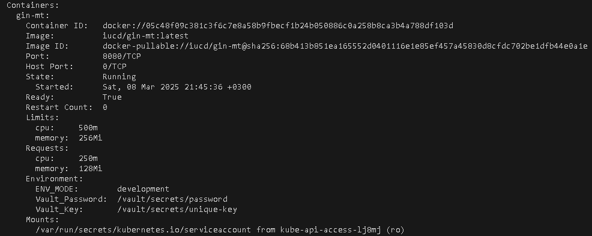