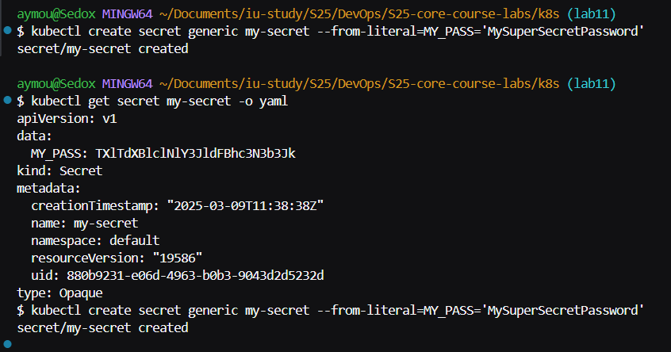
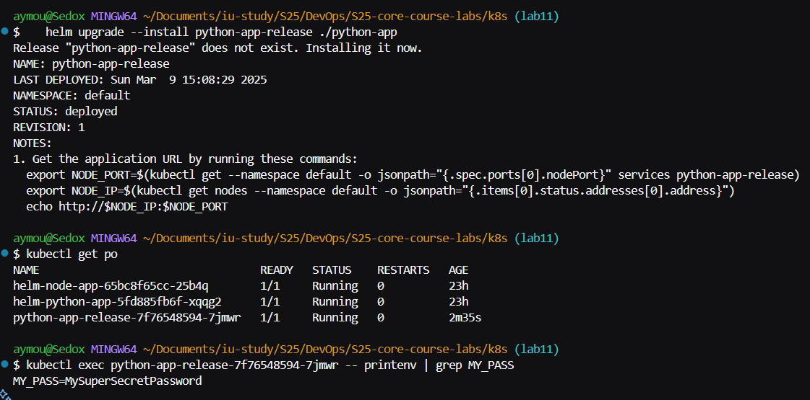
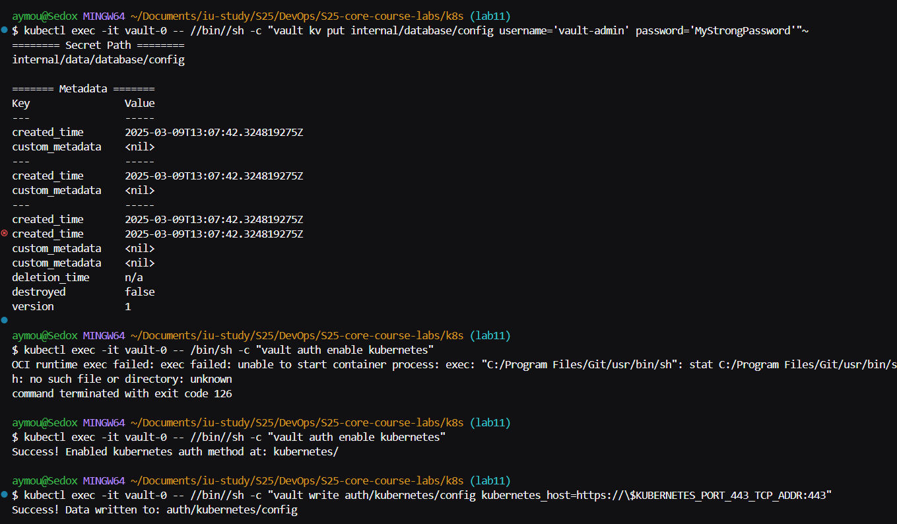
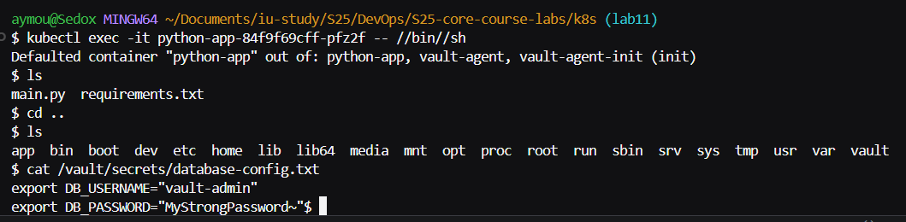
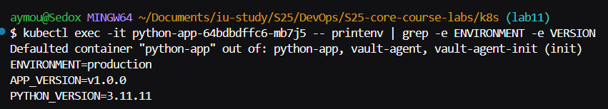

## Task 1: Kubernetes Secrets and Resource Management

### Step 1.1: Create and Verify a Secret Using kubectl

1. **Create a Secret**  
   Use the following command to create a secret containing a sample password:
   ```bash
   kubectl create secret generic my-secret --from-literal=MY_PASS='MySuperSecretPassword'
   ```
   output:
   ```
   secret/my-secret created
   ```
   
2. **Verify and Decode the Secret**  
   To view the secret in encoded form:
   ```bash
   kubectl get secret my-secret -o yaml
   ```
   To decode the secret value:
   ```bash
   kubectl get secret my-secret -o jsonpath="{.data.MY_PASS}" | base64 --decode
   ```
   
   

### Step 1.2: Manage Secrets with Helm

1. **Create a `secrets.yaml` Template**  
   In your Helm chart’s templates folder (for example, in `python-app/templates`), create a file named `secrets.yaml`:
   ```yaml
   apiVersion: v1
   kind: Secret
   metadata:
     name: {{ include "python-app.fullname" . }}-secret
   type: Opaque
   data:
     # Encode the value in base64. For example, echo -n "SuperSecretPassword" | base64
     MY_PASS: {{ .Values.secret.myPass | b64enc }}
   ```
2. **Update Your `values.yaml`**  
   In your chart’s `values.yaml`, add a section for the secret:
   ```yaml
   secret:
     myPass: "MySuperSecretPassword"
   ```
3. **Inject the Secret into the Deployment**  
   Edited to the Deployment template and added an environment variable that references the secret in (`python-app/templates/deployment.yaml`):
   ```yaml
        env:
        - name: MY_PASS
            valueFrom:
            secretKeyRef:
                name: {{ include "python-app.fullname" . }}-secret
                key: MY_PASS
   ```
4. **Deploy and Verify**  
   Install or upgrade your Helm release:
   ```bash
   helm upgrade --install python-app-release ./python-app
   ```
   Then we check the pods:
   ```bash
   kubectl get po
   ```
   we verify the secret inside the pod:
   ```bash
   kubectl exec <pod-name> -- printenv | grep MY_PASS
   ```
    )

5. **Resource Management – Configure CPU and Memory Limits**  
   In our Deployment manifest, we add resource requests and limits under the container spec (python-app/values.yaml).
   ```yaml
    resources:
    requests:
        memory: "256Mi"
        cpu: "250m"
    limits:
        memory: "512Mi"
        cpu: "500m"
   ```

---

## Task 2: Vault Secret Management System

### Step 2.1: Install Vault Using Helm Chart

1. **Add the Vault Helm Repository:**
   ```bash
   helm repo add hashicorp https://helm.releases.hashicorp.com
   helm repo update
   ```

2. **Install Vault:**  
   Deploy Vault on your cluster (using Minikube) with:
   ```bash
   helm install vault hashicorp/vault --set "server.dev.enabled=true"
   ```
   [Vault](./screenshots/vault1.png)

### Step 2.2: Configure Vault and Kubernetes Authentication

1. **Creating a Secret in Vault**

Enable the kv-v2 secrets engine:

```bash
kubectl exec -it vault-0 -- /bin/sh -c "vault secrets enable -path=internal kv-v2"
```

Output:
```
Success! Enabled the kv-v2 secrets engine at: internal/
```

```bash
kubectl exec -it vault-0 -- /bin/sh -c "vault kv put internal/database/config username='db-admin' password='db-password-123'"
```

Output:
```
======== Secret Path ========
internal/data/database/config

======= Metadata =======
Key                Value
---                -----
created_time       2025-03-09T13:07:42.324819275Z
custom_metadata    <nil>
deletion_time      n/a
destroyed          false
version            1
```

2. **Activating Kubernetes Auth**

```bash
kubectl exec -it vault-0 -- /bin/sh -c "vault auth enable kubernetes"
```

Output:
```
Success! Enabled kubernetes auth method at: kubernetes/
```

3. **Configuing Kubernetes Auth**

```bash
kubectl exec -it vault-0 -- /bin/sh -c "vault write auth/kubernetes/config kubernetes_host=https://\$KUBERNETES_PORT_443_TCP_ADDR:443"
```

Output:
```
Success! Data written to: auth/kubernetes/config
```


4. **Making a Vault Policy**

Created a policy file `python-app-policy.hcl`:

```hcl
path "internal/data/database/config" {
  capabilities = ["read"]
}
```

Applied the policy:

```bash
kubectl exec -it vault-0 -- vault policy write internal-app - <<EOF
path "internal/data/database/config" {
   capabilities = ["read"]
}
EOF
```

Output:
```
Success! Uploaded policy: internal-app
```

5. **Adding a K8S Auth Role**

```bash
kubectl exec -it vault-0 -- vault write auth/kubernetes/role/python-app bound_service_account_names=python-app bound_service_account_namespaces=default policies=internal-app ttl=24h
```

Output:
```
Success! Data written to: auth/kubernetes/role/python-app
```

6. **Vault Annotations addition to values.yaml**

```yaml
vaultEnabled: true
vaultAgent:
  enabled: true
  role: "python-app"

podAnnotations:
  vault.hashicorp.com/agent-inject: "true"
  vault.hashicorp.com/role: "python-app"
  vault.hashicorp.com/agent-inject-secret-database-config.txt: "internal/data/database/config"
  vault.hashicorp.com/agent-inject-template-database-config.txt: |
    {{- with secret "internal/data/database/config" -}}
    export DB_USERNAME="{{ .Data.data.username }}"
    export DB_PASSWORD="{{ .Data.data.password }}"
    {{- end -}}
```
7. **Update Deployment**

```bash
helm upgrade --install python-app ./python-app
```

7. **Check Pod Status**

```bash
kubectl get pods
```
Output:
```
NAME                                    READY   STATUS     RESTARTS   AGE
helm-node-app-65bc8f65cc-25b4q          1/1     Running    0          24h
helm-python-app-5fd885fb6f-xqqg2        1/1     Running    0          24h
python-app-84f9f69cff-pfz2f             2/2     Running    0          31s
vault-0                                 1/1     Running    0          78m
vault-agent-injector-66f45b5fd5-4zvwg   1/1     Running    0          78m
```

7. **Secret Injection Verification**



Output:
```
export DB_USERNAME="vault-admin"
export DB_PASSWORD="MyStrongPassword
```

8. **Checking Disk Usage**

```bash
kubectl exec -it python-app-84f9f69cff-pfz2f -c python-app -- df -h
```

Output:
```
Filesystem      Size  Used Avail Use% Mounted on
overlay        1007G   22G  935G   3% /
tmpfs            64M     0   64M   0% /dev
tmpfs           7.7G     0  7.7G   0% /sys/fs/cgroup
shm              64M   16K   64M   1% /dev/shm
/dev/sdd       1007G   22G  935G   3% /etc/hosts
tmpfs           640M  4.0K  640M   1% /vault/secrets
tmpfs           640M   12K  640M   1% /run/secrets/kubernetes.io/serviceaccount
tmpfs           7.7G     0  7.7G   0% /proc/acpi
tmpfs           7.7G     0  7.7G   0% /sys/firmware
``` 

## Bonus Task: Resource Management and Environment Variables

### Step 3.1: Set CPU and Memory Requests/Limits for Both Helm Charts

1. **Edit the Deployment Template:**  
   In our Deployment manifest, we add resource requests and limits under the container spec (node-app/values.yaml).
   ```yaml
   resources:
     requests:
       memory: "256Mi"
       cpu: "250m"
     limits:
       memory: "512Mi"
       cpu: "500m"
   ```

### Step 3.2: Add Environment Variables Using Named Templates

1. **Define Environment Variables in _helpers.tpl:**  
   in `_helpers.tpl` in both our Python and Node.js Helm charts, we created a section for common environment variables:
   ```yaml
   {{- define "python-app.envVars" -}}
   - name: ENVIRONMENT
     value: "production"
   - name: APP_VERSION
     value: "v1.0.0"
   {{- end -}}
   ```
2. **Reference the Named Template in the Deployment:**  
   In the Deployment template, modify the environment section:
   ```yaml
          env:
            - name: MY_PASS
              valueFrom:
                secretKeyRef:
                  name: {{ include "python-app.fullname" . }}-secret
                  key: MY_PASS
            {{- include "python-app.envVars" . | nindent 12 }}
   ```
3. **Deploy and Verify:**  
   Upgrade your Helm release:
   ```bash
   helm upgrade --install python-app-release ./python-app
   ```

   Verify that the environment variables are set:
   ```bash
   kubectl exec -it python-app-64bdbdffc6-mb7j5 -- printenv | grep -e ENVIRONMENT -e VERSION
   ```

  

  The same applies to Node.js Helm chart


