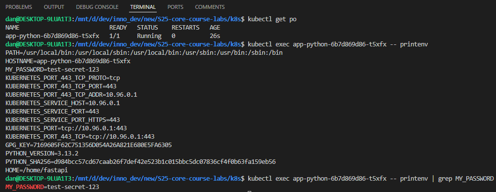
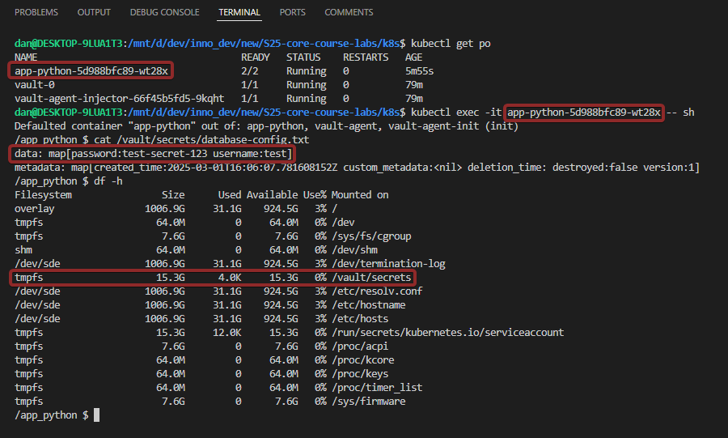

# Kubernetes Secrets and Hashicorp Vault

## Task 1: Kubernetes Secrets and Resource Management

### Using kubectl

Firstly, I have created a Secret using `kubectl`.

```bash
> kubectl create secret generic db-user-pass \
    --from-literal=username=test \
    --from-literal=password='test-secret-123'

secret/db-user-pass created
```

Then, I verified the secret. In the output, we can see the `db-user-pass` secret, and old secrets from the previous lab.

```bash
> kubectl get secrets

NAME                                          TYPE                 DATA   AGE  
db-user-pass                                  Opaque               2      2m13s
sh.helm.release.v1.app-python-1740602511.v1   helm.sh/release.v1   1      2d14h
sh.helm.release.v1.helm-hooks.v1              helm.sh/release.v1   1      2d14h
```

```bash
> kubectl describe secret db-user-pass

Name:         db-user-pass
Namespace:    default     
Labels:       <none>      
Annotations:  <none>      

Type:  Opaque

Data
====
password:  15 bytes       
username:  4 bytes
```

Then, let's decode it.

```bash
> kubectl get secret db-user-pass -o jsonpath='{.data}'

{"password":"dGVzdC1zZWNyZXQtMTIz","username":"dGVzdA=="}
```

We can see that it is decoded in Base64, let's decode the data.

```bash
> echo 'dGVzdA==' | base64 --decode

test

> echo 'dGVzdC1zZWNyZXQtMTIz' | base64 --decode

test-secret-123
```

### Using Helm

I have updated my Helm deployment as instructed in the video. In my case, the name of secret is `MY_PASSWORD`.

At the moment I installed my Helm deployment, the name of pod was `app-python-6b7d869d86-t5xfx`.

Output of `kubectl get po`:

```bash
> kubectl get po

NAME                          READY   STATUS    RESTARTS   AGE        
app-python-6b7d869d86-t5xfx   1/1     Running   0          26s
```

Let's verify the secret inside this pod.

Output:

```bash
> kubectl exec app-python-6b7d869d86-t5xfx -- printenv | grep MY_PASSWORD

MY_PASSWORD=test-secret-123
```



## Task 2: Vault Secret Management System

I have installed Vault and followed the Tutorial to adapt it to work with my Helm chart.

Let's get the list of pods:
```bash
> kubectl get po

NAME                                    READY   STATUS    RESTARTS   AGE
app-python-5d988bfc89-wt28x             2/2     Running   0          5m55s
vault-0                                 1/1     Running   0          79m
vault-agent-injector-66f45b5fd5-9kqht   1/1     Running   0          79m
```

Then let's test to ensure that my credentials are injected successfully.
I used `test` and `test-secret-123` as the credentials.

```bash
> kubectl exec -it app-python-5d988bfc89-wt28x -- sh


Defaulted container "app-python" out of: app-python, vault-agent, vault-agent-init (init)
/app_python $ cat /vault/secrets/database-config.txt

data: map[password:test-secret-123 username:test]
metadata: map[created_time:2025-03-01T16:06:07.781608152Z custom_metadata:<nil> deletion_time: destroyed:false version:1]

/app_python $ df -h

Filesystem                Size      Used Available Use% Mounted on
overlay                1006.9G     31.1G    924.5G   3% /
tmpfs                    64.0M         0     64.0M   0% /dev
tmpfs                     7.6G         0      7.6G   0% /sys/fs/cgroup
shm                      64.0M         0     64.0M   0% /dev/shm
/dev/sde               1006.9G     31.1G    924.5G   3% /dev/termination-log
tmpfs                    15.3G      4.0K     15.3G   0% /vault/secrets
/dev/sde               1006.9G     31.1G    924.5G   3% /etc/resolv.conf
/dev/sde               1006.9G     31.1G    924.5G   3% /etc/hostname
/dev/sde               1006.9G     31.1G    924.5G   3% /etc/hosts
tmpfs                    15.3G     12.0K     15.3G   0% /run/secrets/kubernetes.io/serviceaccount
tmpfs                     7.6G         0      7.6G   0% /proc/acpi
tmpfs                    64.0M         0     64.0M   0% /proc/kcore
tmpfs                    64.0M         0     64.0M   0% /proc/keys
tmpfs                    64.0M         0     64.0M   0% /proc/timer_list
tmpfs                     7.6G         0      7.6G   0% /sys/firmware
```

