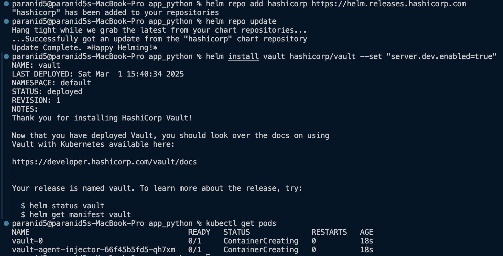
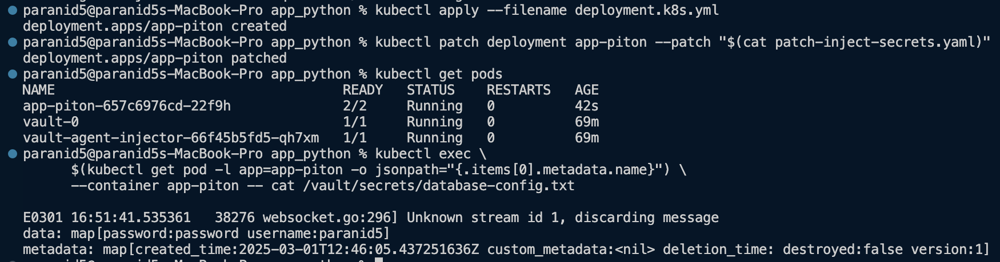

# Secret Managements

## Manage secrets via Kubernetes

## Manage secrets via Helm

skabbard2@skabard2:~/PROGRAMMING/devops/real/paranid5-devops-devops/k8s/app_python$ helm secrets install app-piton app-piton -f secrets.yml

W0301 15:02:28.483725  859364 warnings.go:70] unknown field "spec.servicename"
NAME: app-piton
LAST DEPLOYED: Sat Mar  1 15:02:05 2025
NAMESPACE: default
STATUS: deployed
REVISION: 1
NOTES:
1. Get the application URL by running these commands:
  export NODE_PORT=$(kubectl get --namespace default -o jsonpath="{.spec.ports[0].nodePort}" services app-piton)
  export NODE_IP=$(kubectl get nodes --namespace default -o jsonpath="{.items[0].status.addresses[0].address}")
  echo http://$NODE_IP:$NODE_PORT

skabbard2@skabard2:~/PROGRAMMING/devops/real/paranid5-devops-devops/k8s/app_python$ kubectl get pods

NAME                          READY   STATUS    RESTARTS   AGE
app-flutter-546744886-kdbwg   1/1     Running   0          41m
app-piton-796497c97d-wfvkp    1/1     Running   0          107s
nginx-statefulset-0           1/1     Running   0          107s

skabbard2@skabard2:~/PROGRAMMING/devops/real/paranid5-devops-devops/k8s/app_python$ kubectl exec app-piton-796497c97d-wfvkp -- printenv | grep TGID

TGID=paranid5

## Vault Setup

* Install vault

* Create secrets

* Authentication

* Service account

* Helm chart

* Inject secrets into pod

