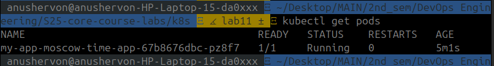

## Task1 : Kubernetes Secrets and Resource Management

1. Creating a secret with teh `kubectl`: 

2. Confirm and Describe the secret: 

3. Decode secret : 

4. Reinstall application: 

5. Get Pods: 

6. Get Secret: 

## Task 2: Vault Secret Management System

1. Install Vault Using Helm Chart: 

2. Set secret with authentication: 

3. Implement Vault Secrets in Helm Chart:

