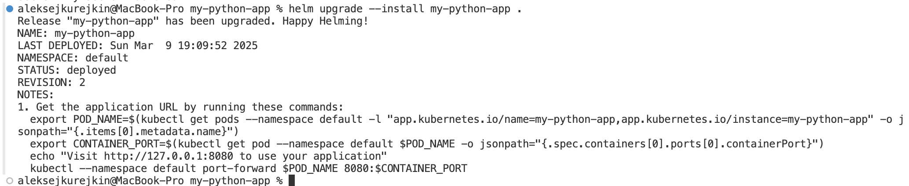

# Kubernetes Secrets and Hashicorp Vault

## 1. Creating Secret via kubectl

```sh
kubectl create secret generic test --from-literal=SOME_SECRET=P@ssw0rd
kubectl get secrets
kubectl describe secret test
kubectl get secret test -o jsonpath='{.data}'
echo "UEBzc3cwcmQ=" | base64 --decode
```


## Secrets with Helm

### Create `secrets.yaml`
```sh
vim helm-python/templates/secrets.yaml
```
```yaml
apiVersion: v1
kind: Secret
metadata:
  name: some-secret
data:
  SOME_SECRET: {{ .Values.secrets.SOME_SECRET | quote | b64enc }}
```

### Add env into Deployment
```sh
vim helm-python/templates/deployment.yaml
```
```yaml
env:
  - name: SOME_SECRET
    valueFrom:
      secretKeyRef:
        name: some-secret
        key: SOME_SECRET
```

### Edit `values.yaml`
```sh
vim helm-python/values.yaml
```
```yaml
secrets:
  SOME_SECRET: "P@ssw0rd"
```

### Helm Upgrade
```bash
helm upgrade --install helm-secrets ./helm-python/
kubectl get pods,svc
```


### Pod Verification
```bash
kubectl exec pod/helm-secrets-helm-python-84f9c74747-scc9f -- printenv | grep SOME_SECRET
```


## Vault Secret Management System
### Install Vault
```sh
helm repo add hashicorp https://helm.releases.hashicorp.com
helm repo update
helm install vault hashicorp/vault --set "server.dev.enabled=true"
kubectl get pods
```


### Vault Configuration
#### Enable KV-v2 Secrets
```sh
kubectl exec -it vault-0 -- /bin/sh
vault secrets enable -path=internal kv-v2
vault kv put secret/database/config username="dbuser" password="somepassword"
vault kv get secret/database/config
exit
```



#### Enable Kubernetes Auth
```sh
kubectl exec -it vault-0 -- /bin/sh
vault auth enable kubernetes
vault write auth/kubernetes/config kubernetes_host="https://$KUBERNETES_PORT_443_TCP_ADDR:443"
```

#### Create a Policy for read access to secret
```sh
vault policy write internal-app - << EOF
path "internal/data/database/config" {
   capabilities = ["read"]
}
EOF
```

#### Create vault policy
```sh
vault write auth/kubernetes/role/internal-app \
  bound_service_account_names=internal-app \
  bound_service_account_namespaces=default \
  policies=internal-app \
  ttl=24h
exit
```


#### Check result
```sh
kubectl create sa internal-app
kubectl get serviceaccounts
```


```sh
kubectl annotate serviceaccount internal-app \
    meta.helm.sh/release-name=helm-secrets \
    meta.helm.sh/release-namespace=default -n default
```

```sh
kubectl label serviceaccount internal-app \
    app.kubernetes.io/managed-by=Helm -n default
helm install helm-secrets ./helm-python
```

```sh
vim helm-python/values.yaml
helm upgrade --install helm-secrets ./helm-python
kubectl get po
```


```sh
kubectl exec -it helm-secrets-helm-python-6dbb75d64f-r4ww9 --container helm-python -- sh 
```


### Resource Management
```yaml
resources:
  limits:
    cpu: 200m
    memory: 256Mi
  requests:
    cpu: 100m
    memory: 128Mi
```