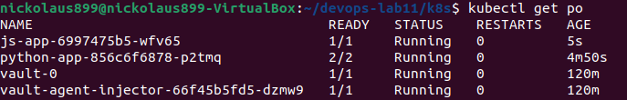

# Secrets management


## Creting secret with `kubectl` (opaque)
We can create some test secret 
```
kubectl create secret generic test-secret --from-literal=password=12345
```

After that, we can verify that the secret was created


The password `12345` was successfully stored and then decoded

## Creating secrets with `Helm`

I've created `secrets.yaml` in the templates. After that, I 
generated a key with the use of `gpg`:
```
gpg --gen-key
```

To view keys we can use
```
gpg --list-keys
```

After encrypting a secret, we can see the output:


File `secrets.enc.yaml` I saved in k8s directory under the name `secrets.yaml`

#### Now, we can run application

```
helm secrets install python-app ./python-app -n default -f secrets.yaml
```


# Vault

Firstly, I followed the guide to install Vault and set the secret


### We can set a secret 

```
$ kubectl exec -it vault-0 -- /bin/sh
/ $ vault secrets enable -path=internal kv-v2
Success! Enabled the kv-v2 secrets engine at: internal/
/ $ vault kv put internal/database/config username="vault" password="secret"
======== Secret Path ========
internal/data/database/config

======= Metadata =======
Key                Value
---                -----
created_time       2025-03-05T07:43:05.440191674Z
custom_metadata    <nil>
deletion_time      n/a
destroyed          false
version            1
/ $ vault kv get internal/database/config
======== Secret Path ========
internal/data/database/config

======= Metadata =======
Key                Value
---                -----
created_time       2025-03-05T07:43:05.440191674Z
custom_metadata    <nil>
deletion_time      n/a
destroyed          false
version            1

====== Data ======
Key         Value
---         -----
password    secret
username    vault
/ $ exit
```

### Authentication

```
$ kubectl exec -it vault-0 -- /bin/sh
/ $ vault auth enable kubernetes
Success! Enabled kubernetes auth method at: kubernetes/
/ $ vault write auth/kubernetes/config \
>       kubernetes_host="https://$KUBERNETES_PORT_443_TCP_ADDR:443"
Success! Data written to: auth/kubernetes/config
/ $ vault policy write internal-app - <<EOF
> path "internal/data/database/config" {
>    capabilities = ["read"]
> }
> EOF
Success! Uploaded policy: internal-app
/ $ vault write auth/kubernetes/role/internal-app \
>       bound_service_account_names=internal-app \
>       bound_service_account_namespaces=default \
>       policies=internal-app \
>       ttl=24h
Success! Data written to: auth/kubernetes/role/internal-app
/ $ exit
```

### Creating service account


After that, I created `patch-inject.yaml` and patched it with the command:

```
kubectl patch deployment python-app --patch-file=python-app/patch-inject.yaml
```


Secret was injected successfully

# Resources

I added resoureces limits to `values.yaml` in both apps, the did `helm install`

#### View deployment of python-app:

```
$ kubectl describe deployments.apps python-app
Name:                   python-app
Namespace:              default
CreationTimestamp:      Wed, 05 Mar 2025 12:17:52 +0300
Labels:                 app.kubernetes.io/instance=python-app
                        app.kubernetes.io/managed-by=Helm
                        app.kubernetes.io/name=python-app
                        app.kubernetes.io/version=1.16.0
                        helm.sh/chart=python-app-0.1.0
Annotations:            deployment.kubernetes.io/revision: 1
                        meta.helm.sh/release-name: python-app
                        meta.helm.sh/release-namespace: default
Selector:               app.kubernetes.io/instance=python-app,app.kubernetes.io/name=python-app
Replicas:               1 desired | 1 updated | 1 total | 1 available | 0 unavailable
StrategyType:           RollingUpdate
MinReadySeconds:        0
RollingUpdateStrategy:  25% max unavailable, 25% max surge
Pod Template:
  Labels:           app.kubernetes.io/instance=python-app
                    app.kubernetes.io/managed-by=Helm
                    app.kubernetes.io/name=python-app
                    app.kubernetes.io/version=1.16.0
                    helm.sh/chart=python-app-0.1.0
  Annotations:      vault.hashicorp.com/agent-inject: true
                    vault.hashicorp.com/agent-inject-secret-database-config.txt: internal/data/database/config
                    vault.hashicorp.com/role: internal-app
  Service Account:  internal-app
  Containers:
   python-app:
    Image:      nickolaus899/python-msk-time:latest
    Port:       5000/TCP
    Host Port:  0/TCP
    Limits:
      cpu:     100m
      memory:  128Mi
    Requests:
      cpu:      100m
      memory:   128Mi
    Liveness:   http-get http://:http/ delay=0s timeout=1s period=10s #success=1 #failure=3
    Readiness:  http-get http://:http/ delay=0s timeout=1s period=10s #success=1 #failure=3
    Environment:
      MY_PASSWORD:  <set to the key 'password' in secret 'credentials'>  Optional: false
    Mounts:         <none>
  Volumes:          <none>
  Node-Selectors:   <none>
  Tolerations:      <none>
Conditions:
  Type           Status  Reason
  ----           ------  ------
  Available      True    MinimumReplicasAvailable
  Progressing    True    NewReplicaSetAvailable
OldReplicaSets:  <none>
NewReplicaSet:   python-app-55b65db58d (1/1 replicas created)
Events:
  Type    Reason             Age   From                   Message
  ----    ------             ----  ----                   -------
  Normal  ScalingReplicaSet  92s   deployment-controller  Scaled up replica set python-app-55b65db58d from 0 to 1
```

#### View deployment of js-app:

```
$ kubectl describe deployments.apps js-app
Name:                   js-app
Namespace:              default
CreationTimestamp:      Wed, 05 Mar 2025 12:18:55 +0300
Labels:                 app.kubernetes.io/instance=js-app
                        app.kubernetes.io/managed-by=Helm
                        app.kubernetes.io/name=js-app
                        app.kubernetes.io/version=1.16.0
                        helm.sh/chart=js-app-0.1.0
Annotations:            deployment.kubernetes.io/revision: 1
                        meta.helm.sh/release-name: js-app
                        meta.helm.sh/release-namespace: default
Selector:               app.kubernetes.io/instance=js-app,app.kubernetes.io/name=js-app
Replicas:               1 desired | 1 updated | 1 total | 0 available | 1 unavailable
StrategyType:           RollingUpdate
MinReadySeconds:        0
RollingUpdateStrategy:  25% max unavailable, 25% max surge
Pod Template:
  Labels:           app.kubernetes.io/instance=js-app
                    app.kubernetes.io/managed-by=Helm
                    app.kubernetes.io/name=js-app
                    app.kubernetes.io/version=1.16.0
                    helm.sh/chart=js-app-0.1.0
  Service Account:  js-app
  Containers:
   js-app:
    Image:      nickolaus899/js-cities-dist:latest
    Port:       3000/TCP
    Host Port:  0/TCP
    Limits:
      cpu:     100m
      memory:  128Mi
    Requests:
      cpu:         100m
      memory:      128Mi
    Liveness:      http-get http://:http/ delay=0s timeout=1s period=10s #success=1 #failure=3
    Readiness:     http-get http://:http/ delay=0s timeout=1s period=10s #success=1 #failure=3
    Environment:   <none>
    Mounts:        <none>
  Volumes:         <none>
  Node-Selectors:  <none>
  Tolerations:     <none>
Conditions:
  Type           Status  Reason
  ----           ------  ------
  Available      False   MinimumReplicasUnavailable
  Progressing    True    ReplicaSetUpdated
OldReplicaSets:  <none>
NewReplicaSet:   js-app-69964f5f6d (1/1 replicas created)
Events:
  Type    Reason             Age   From                   Message
  ----    ------             ----  ----                   -------
  Normal  ScalingReplicaSet  70s   deployment-controller  Scaled up replica set js-app-69964f5f6d from 0 to 1
```

# ENV

I have expanded `values.yaml`. `_helpers.tpl`, `deployment.yaml`. The entries I have added:

```
HELLO: world
COURSE: devops
```

#### python-app
```
$ kubectl exec -it python-app-856c6f6878-p2tmq -- env
Defaulted container "python-app" out of: python-app, vault-agent, vault-agent-init (init)
PATH=/usr/local/bin:/usr/local/sbin:/usr/local/bin:/usr/sbin:/usr/bin:/sbin:/bin
HOSTNAME=python-app-856c6f6878-p2tmq
TERM=xterm
MY_PASSWORD=hello_world
HELLO=world
COURSE=devops
VAULT_AGENT_INJECTOR_SVC_SERVICE_PORT_HTTPS=443
KUBERNETES_SERVICE_PORT=443
PYTHON_APP_SERVICE_PORT=5000
PYTHON_APP_PORT=tcp://10.96.126.155:5000
VAULT_AGENT_INJECTOR_SVC_SERVICE_PORT=443
VAULT_AGENT_INJECTOR_SVC_PORT_443_TCP=tcp://10.106.180.175:443
VAULT_SERVICE_PORT=8200
VAULT_PORT_8200_TCP_PROTO=tcp
KUBERNETES_SERVICE_HOST=10.96.0.1
VAULT_PORT_8201_TCP_ADDR=10.106.60.87
VAULT_PORT_8200_TCP_PORT=8200
PYTHON_APP_PORT_5000_TCP_PORT=5000
VAULT_PORT_8200_TCP=tcp://10.106.60.87:8200
VAULT_PORT_8200_TCP_ADDR=10.106.60.87
KUBERNETES_PORT_443_TCP_PORT=443
PYTHON_APP_PORT_5000_TCP=tcp://10.96.126.155:5000
VAULT_AGENT_INJECTOR_SVC_PORT_443_TCP_PROTO=tcp
KUBERNETES_SERVICE_PORT_HTTPS=443
VAULT_SERVICE_PORT_HTTP=8200
VAULT_AGENT_INJECTOR_SVC_PORT=tcp://10.106.180.175:443
KUBERNETES_PORT_443_TCP_ADDR=10.96.0.1
VAULT_SERVICE_HOST=10.106.60.87
VAULT_PORT_8201_TCP=tcp://10.106.60.87:8201
VAULT_PORT_8201_TCP_PROTO=tcp
KUBERNETES_PORT_443_TCP_PROTO=tcp
PYTHON_APP_PORT_5000_TCP_PROTO=tcp
VAULT_AGENT_INJECTOR_SVC_SERVICE_HOST=10.106.180.175
VAULT_AGENT_INJECTOR_SVC_PORT_443_TCP_PORT=443
VAULT_AGENT_INJECTOR_SVC_PORT_443_TCP_ADDR=10.106.180.175
VAULT_PORT_8201_TCP_PORT=8201
PYTHON_APP_SERVICE_PORT_HTTP=5000
KUBERNETES_PORT_443_TCP=tcp://10.96.0.1:443
PYTHON_APP_SERVICE_HOST=10.96.126.155
PYTHON_APP_PORT_5000_TCP_ADDR=10.96.126.155
VAULT_SERVICE_PORT_HTTPS_INTERNAL=8201
VAULT_PORT=tcp://10.106.60.87:8200
KUBERNETES_PORT=tcp://10.96.0.1:443
LANG=C.UTF-8
GPG_KEY=A035C8C19219BA821ECEA86B64E628F8D684696D
PYTHON_VERSION=3.10.16
PYTHON_SHA256=bfb249609990220491a1b92850a07135ed0831e41738cf681d63cf01b2a8fbd1
HOME=/nonexistent
```

#### js-app

```
$ kubectl exec -it js-app-6997475b5-wfv65 -- env
PATH=/usr/local/sbin:/usr/local/bin:/usr/sbin:/usr/bin:/sbin:/bin
HOSTNAME=js-app-6997475b5-wfv65
TERM=xterm
HELLO=world
COURSE=devops
VAULT_PORT_8200_TCP_PROTO=tcp
VAULT_PORT_8201_TCP_ADDR=10.106.60.87
KUBERNETES_SERVICE_HOST=10.96.0.1
KUBERNETES_PORT=tcp://10.96.0.1:443
KUBERNETES_PORT_443_TCP_PORT=443
PYTHON_APP_SERVICE_PORT_HTTP=5000
VAULT_SERVICE_PORT_HTTPS_INTERNAL=8201
VAULT_PORT_8200_TCP=tcp://10.106.60.87:8200
VAULT_PORT_8200_TCP_PORT=8200
PYTHON_APP_PORT=tcp://10.96.126.155:5000
PYTHON_APP_PORT_5000_TCP=tcp://10.96.126.155:5000
VAULT_AGENT_INJECTOR_SVC_SERVICE_PORT_HTTPS=443
JS_APP_PORT=tcp://10.104.234.102:3000
JS_APP_PORT_3000_TCP_PROTO=tcp
PYTHON_APP_PORT_5000_TCP_PROTO=tcp
PYTHON_APP_PORT_5000_TCP_PORT=5000
JS_APP_SERVICE_HOST=10.104.234.102
JS_APP_SERVICE_PORT=3000
KUBERNETES_PORT_443_TCP_PROTO=tcp
VAULT_PORT_8201_TCP=tcp://10.106.60.87:8201
VAULT_PORT_8201_TCP_PORT=8201
JS_APP_PORT_3000_TCP=tcp://10.104.234.102:3000
JS_APP_PORT_3000_TCP_PORT=3000
KUBERNETES_SERVICE_PORT_HTTPS=443
VAULT_AGENT_INJECTOR_SVC_SERVICE_HOST=10.106.180.175
VAULT_AGENT_INJECTOR_SVC_PORT_443_TCP=tcp://10.106.180.175:443
VAULT_AGENT_INJECTOR_SVC_PORT_443_TCP_PORT=443
KUBERNETES_PORT_443_TCP_ADDR=10.96.0.1
PYTHON_APP_SERVICE_PORT=5000
JS_APP_PORT_3000_TCP_ADDR=10.104.234.102
KUBERNETES_SERVICE_PORT=443
KUBERNETES_PORT_443_TCP=tcp://10.96.0.1:443
VAULT_SERVICE_HOST=10.106.60.87
VAULT_PORT_8200_TCP_ADDR=10.106.60.87
VAULT_PORT_8201_TCP_PROTO=tcp
JS_APP_SERVICE_PORT_HTTP=3000
PYTHON_APP_SERVICE_HOST=10.96.126.155
VAULT_AGENT_INJECTOR_SVC_SERVICE_PORT=443
VAULT_AGENT_INJECTOR_SVC_PORT=tcp://10.106.180.175:443
VAULT_AGENT_INJECTOR_SVC_PORT_443_TCP_PROTO=tcp
VAULT_PORT=tcp://10.106.60.87:8200
PYTHON_APP_PORT_5000_TCP_ADDR=10.96.126.155
VAULT_AGENT_INJECTOR_SVC_PORT_443_TCP_ADDR=10.106.180.175
VAULT_SERVICE_PORT=8200
VAULT_SERVICE_PORT_HTTP=8200
NODE_VERSION=16.20.2
YARN_VERSION=1.22.19
HOME=/home/appuser
```

### Checking `kubectl get po`



