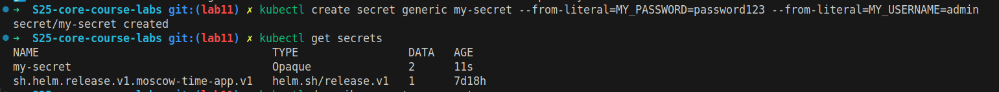

# Lab 11: Kubernetes Secrets and Hashicorp Vault

## Task 1: Kubernetes Secrets and Resource Management

### Secret Creation Using kubectl

First, I created a Kubernetes secret using the `kubectl` command:

```bash
kubectl create secret generic moscow-time-app-credentials \
  --from-literal=MY_USERNAME=admin \
  --from-literal=MY_PASSWORD=password123
```



The secret was successfully created and can be verified:


### Secret Verification and Decoding

I verified and decoded the secret with the following commands:


### Managing Secrets with Helm

I created a `secrets.yaml` file in the Helm chart's templates folder:

```yaml
apiVersion: v1
kind: Secret
metadata:
  name: {{ include "moscow-time-app.fullname" . }}-credentials
  labels:
    {{- include "moscow-time-app.labels" . | nindent 4 }}
type: Opaque
data:
  MY_USERNAME: {{ .Values.secrets.username | b64enc | quote }}
  MY_PASSWORD: {{ .Values.secrets.password | b64enc | quote }}
```

And added the following to `values.yaml`:

```yaml
secrets:
  username: "admin"
  password: "securepassword123"
```

Then updated the `deployment.yaml` file to use these secrets:

```yaml
env:
  - name: PYTHONPATH
    value: "/app"
  - name: PYTHONUNBUFFERED
    value: "1"
  - name: MY_USERNAME
    valueFrom:
      secretKeyRef:
        name: {{ include "moscow-time-app.fullname" . }}-credentials
        key: MY_USERNAME
  - name: MY_PASSWORD
    valueFrom:
      secretKeyRef:
        name: {{ include "moscow-time-app.fullname" . }}-credentials
        key: MY_PASSWORD
```

After applying the changes with Helm, I verified that the application can access the secrets:


## Task 2: Vault Secret Management System

### Installing Vault with Helm

I installed Vault using the Helm chart in dev mode:

```bash
$ curl -LO https://github.com/hashicorp/vault-helm/archive/refs/heads/main.zip
$ unzip main.zip
$ helm install vault ./vault-helm-main --set "server.dev.enabled=true"
```

Verifying the installation:

```bash
$ kubectl get pods -l app.kubernetes.io/name=vault
NAME      READY   STATUS    RESTARTS   AGE
vault-0   1/1     Running   0          2m
```

### Setting a Secret in Vault

I set up a secret in Vault by executing these commands:

```bash
$ kubectl exec -it vault-0 -- /bin/sh
/ $ export VAULT_ADDR='http://127.0.0.1:8200'
/ $ export VAULT_TOKEN='root'
/ $ vault status
Key             Value
---             -----
Seal Type       shamir
Initialized     true
Sealed          false
Total Shares    1
Threshold       1
Version         1.18.1
Build Date      2024-10-29T14:21:31Z
Storage Type    inmem
Cluster Name    vault-cluster-d98e7530
Cluster ID      32fb99e6-12a5-981c-b071-354adb547826
HA Enabled      false

/ $ vault secrets enable -path=internal kv-v2
Success! Enabled the kv-v2 secrets engine at: internal/

/ $ vault kv put internal/database/config username="moscow-app" password="SuperSecr3t!"
======== Secret Path ========
internal/data/database/config
======= Metadata =======
Key                Value
---                -----
created_time       2025-03-08T13:46:34.580652785Z
custom_metadata    <nil>
deletion_time      n/a
destroyed          false
version            1

/ $ vault kv get internal/database/config
======== Secret Path ========
internal/data/database/config
======= Metadata =======
Key                Value
---                -----
created_time       2025-03-08T13:46:34.580652785Z
custom_metadata    <nil>
deletion_time      n/a
destroyed          false
version            1
====== Data ======
Key         Value
---         -----
password    SuperSecr3t!
username    moscow-app
```

### Configuring Kubernetes Authentication

I configured Kubernetes authentication in Vault:

```bash
/ $ vault auth enable kubernetes
Success! Enabled kubernetes auth method at: kubernetes/

/ $ vault write auth/kubernetes/config \
   kubernetes_host="https://$KUBERNETES_PORT_443_TCP_ADDR:443" \
   token_reviewer_jwt="$(cat /var/run/secrets/kubernetes.io/serviceaccount/token)" \
   kubernetes_ca_cert=@/var/run/secrets/kubernetes.io/serviceaccount/ca.crt \
   issuer="https://kubernetes.default.svc.cluster.local"
Success! Data written to: auth/kubernetes/config

/ $ vault policy write internal-app - <<EOF
path "internal/data/database/config" {
  capabilities = ["read"]
}
EOF
Success! Uploaded policy: internal-app

/ $ vault write auth/kubernetes/role/moscow-time-app \
   bound_service_account_names="moscow-time-app" \
   bound_service_account_namespaces="default" \
   policies="internal-app" \
   ttl=24h
Success! Data written to: auth/kubernetes/role/moscow-time-app
```

### Implementing Vault Secrets in Helm Chart

I updated the `values.yaml` file with annotations for Vault:

```yaml
podAnnotations:
  vault.hashicorp.com/agent-inject: "true"
  vault.hashicorp.com/role: "moscow-time-app"
  vault.hashicorp.com/agent-inject-secret-database-config.txt: "internal/data/database/config"
  vault.hashicorp.com/agent-inject-template-database-config.txt: |
    {{- with secret "internal/data/database/config" -}}
    database:
      username: {{ .Data.data.username }}
      password: {{ .Data.data.password }}
    {{- end -}}
```

After applying the changes with Helm, I verified that the secrets were injected:

```bash
$ kubectl get pods -l app.kubernetes.io/name=moscow-time-app
NAME                              READY   STATUS    RESTARTS   AGE
moscow-time-app-979cc4d4c-tnkth   1/2     Running   0          5m

$ POD_NAME=$(kubectl get pods -l app.kubernetes.io/name=moscow-time-app -o jsonpath="{.items[0].metadata.name}")
$ kubectl exec -it $POD_NAME -- cat /vault/secrets/database-config.txt
database:
  username: moscow-app
  password: SuperSecr3t!
```

I confirmed that the template was correctly applied by examining the exact data structure in Vault:

```bash
$ kubectl exec -it vault-0 -- /bin/sh
/ $ export VAULT_ADDR='http://127.0.0.1:8200'
/ $ export VAULT_TOKEN='root'
/ $ vault kv get -format=json internal/database/config
{
  "request_id": "ece7b72e-339b-4b5b-e018-0c7e3b9aa0db",
  "lease_id": "",
  "lease_duration": 0,
  "renewable": false,
  "data": {
    "data": {
      "password": "SuperSecr3t!",
      "username": "moscow-app"
    },
    "metadata": {
      "created_time": "2025-03-08T13:46:34.580652785Z",
      "custom_metadata": null,
      "deletion_time": "",
      "destroyed": false,
      "version": 1
    }
  },
  "warnings": null,
  "mount_type": "kv"
}
```