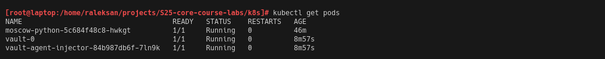

# Lab 11

## Task 1: Kubernetes Secrets and Resource Management

### 1. Create a Secret Using kubectl:

Firstly I start `minikube` with 

```bash
[root@laptop:/home/raleksan/projects/S25-core-course-labs/k8s]# minikube start --force
😄  minikube v1.34.0 on Nixos 24.11
    ▪ MINIKUBE_WANTUPDATENOTIFICATION=false
❗  minikube skips various validations when --force is supplied; this may lead to unexpected behavior
✨  Using the docker driver based on existing profile
🛑  The "docker" driver should not be used with root privileges. If you wish to continue as root, use --force.
💡  If you are running minikube within a VM, consider using --driver=none:
📘    https://minikube.sigs.k8s.io/docs/reference/drivers/none/
💡  Tip: To remove this root owned cluster, run: sudo minikube delete
👍  Starting "minikube" primary control-plane node in "minikube" cluster
🚜  Pulling base image v0.0.45 ...
🏃  Updating the running docker "minikube" container ...
🐳  Preparing Kubernetes v1.31.0 on Docker 27.2.0 ...
    ▪ Generating certificates and keys ...
    ▪ Booting up control plane ...
    ▪ Configuring RBAC rules ...
🔗  Configuring bridge CNI (Container Networking Interface) ...
🔎  Verifying Kubernetes components...
    ▪ Using image gcr.io/k8s-minikube/storage-provisioner:v5
🌟  Enabled addons: storage-provisioner, default-storageclass
🏄  Done! kubectl is now configured to use "minikube" cluster and "default" namespace by default
```

Create secret with:

```bash
kubectl create secret generic my-secret \
  --from-literal=username=admin \
  --from-literal=password=raleksan_admin_password
```


### 2. Verify and Decode Your Secret:

- Get secret

```bash
kubectl get secret my-secret -o yaml
```


- Decode secret

```bash
echo "<base64-encoded-password>" | base64 --decode
# or 
echo "cmFsZWtzYW5fYWRtaW5fcGFzc3dvcmQ=" | base64 --decode
```


### 3. Manage Secrets with Helm:

To manage secrets with `Helm` I created following `templates/secrets.yaml`

```yaml
apiVersion: v1
kind: Secret
metadata:
  name: my-helm-secret
type: Opaque
data:
  username: {{ .Values.secret.username | b64enc }}
  password: {{ .Values.secret.password | b64enc }}
```

and extend `templates/deployment.yaml`

```yaml
# Beginning part of config
env:
- name: MY_USERNAME
    valueFrom:
    secretKeyRef:
        name: my-helm-secret
        key: username
- name: MY_PASS
    valueFrom:
    secretKeyRef:
        name: my-helm-secret
        key: password
```

Now I can deploy `Helm` Chart:

```bash
helm install moscow-python moscow-time-python/ --set secret.username=$(echo -n "raleksan" | base64) --set secret.password=$(echo -n "are_you_sure" | base64)
```


Extract `PASS` from deployment:

- Find pod name:

```bash
kubectl get pods
```

- Extract value

```bash
kubectl exec <pod-name> -- printenv | grep MY_PASS
# or
kubectl exec moscow-python-5c684f48c8-hwkgt -- printenv | grep MY_PASS
```


## Task 2: Vault Secret Management System

### 1. Install Vauilt

To install `Vault` to `Helm`:

- Add repo to `Helm`

```bash
helm repo add hashicorp https://helm.releases.hashicorp.com
```

- Install `Vault`:

```bash
helm install vault hashicorp/vault --set server.dev.enabled=true
```

Run commands:


Show running pods:




### 2. Follow the Tutorial with Your Helm Chart:

Add a secret to `Vault`

```bash
kubectl exec -it vault-0 -- vault kv put secret/my-secret username=raleksan password=are_you_sure
```

and configure authentication

```bash
kubectl exec -it vault-0 -- vault auth enable kubernetes
```

Run commands:


### 3. Implement Vault Secrets in Your Helm Chart:

To integrate `Vault` into `Helm` Chart:

- Update `values.yaml`:

```yaml
vault:
  enabled: true
  path: secret/my-secret
```

- Update `secrets.yaml`:

```yaml
apiVersion: v1
kind: Secret
metadata:
  name: vault-secrets
  annotations:
    vault.hashicorp.com/agent-inject: "true"
    vault.hashicorp.com/role: "internal-app"
    vault.hashicorp.com/agent-inject-secret-my-secret: "secret/my-secret"
    vault.hashicorp.com/agent-inject-secret-database-config.txt: "internal/data/database/config"
type: Opaque
data: {}
```

- Update `templates/deployment.yaml`:

```yaml
metadata:
  name: {{ .Release.Name }}
  labels:
    {{ include "my-library.labels" . | nindent 4 }}
  annotations:
    vault.hashicorp.com/agent-inject: "true"
    vault.hashicorp.com/agent-inject-secret-my-secret: "secret/my-secret"
```

- _Optional_: update `Helm` deployment:

```bash
helm upgrade moscow-python moscow-time-python/
```

- Explore vault inside pod:

```bash
kubectl exec -it <pod-name> -- cat /vault/secrets/my-secret
# or
kubectl exec -it moscow-python-5ccd578cbc-6qcp8 -- cat /vault/secrets/my-secret
```

I decided login to pods and run commands:

```bash
[root@laptop:/home/raleksan/projects/S25-core-course-labs/k8s]# kubectl exec -it moscow-python-6575f74bc9-6v7f5 -- /bin/sh
Defaulted container "moscow-python" out of: moscow-python, vault-agent, vault-agent-init (init)

/moscow_python $ df -h
Filesystem                Size      Used Available Use% Mounted on
overlay                 451.7G     89.0G    339.7G  21% /
tmpfs                    64.0M         0     64.0M   0% /dev
tmpfs                   256.0M      4.0K    256.0M   0% /vault/secrets
/dev/sda3               451.7G     89.0G    339.7G  21% /dev/termination-log
/dev/sda3               451.7G     89.0G    339.7G  21% /etc/resolv.conf
/dev/sda3               451.7G     89.0G    339.7G  21% /etc/hostname
/dev/sda3               451.7G     89.0G    339.7G  21% /etc/hosts
shm                      64.0M         0     64.0M   0% /dev/shm
tmpfs                   256.0M     12.0K    256.0M   0% /run/secrets/kubernetes.io/serviceaccount
tmpfs                     7.8G         0      7.8G   0% /proc/asound
tmpfs                     7.8G         0      7.8G   0% /proc/acpi
tmpfs                    64.0M         0     64.0M   0% /proc/kcore
tmpfs                    64.0M         0     64.0M   0% /proc/keys
tmpfs                    64.0M         0     64.0M   0% /proc/timer_list
tmpfs                     7.8G         0      7.8G   0% /proc/scsi
tmpfs                     7.8G         0      7.8G   0% /sys/firmware

/moscow_python $ cat /vault/secrets/my-secret
username=raleksan
password=are_you_sure

```

## Bonus Task: Resource Management and Environment Variables

