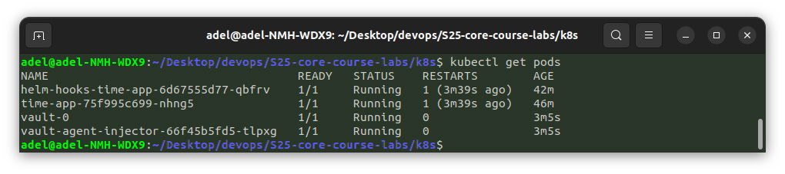

# Lab 11: Kubernetes Secrets and Hashicorp Vault

## Task 1

The following screenshot demonstates that I successfully created and read the secret from
Kubernetes Secrets using `kubectl`:

## Managing secrets with Helm

The following screenshot demonstates that I successfully created and read the secret from Pod
using `kubectl` and Helm:

## Task 2: Vault Secret Management System

The following screenshots demonstrate that I successfully installed and configured Vault using Helm Chart

Screenshots demonstrate k8s pods for my `time-app` and `vault-0`, containers for `time-app` and `vault-0` inside application pod and secrets data from application container shell.

