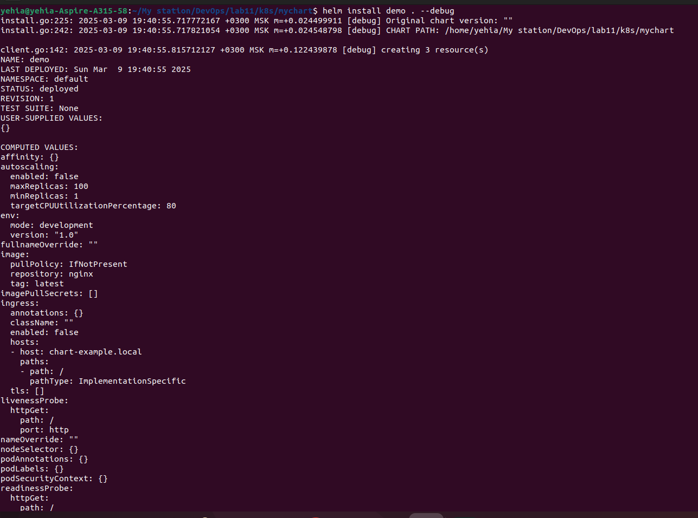
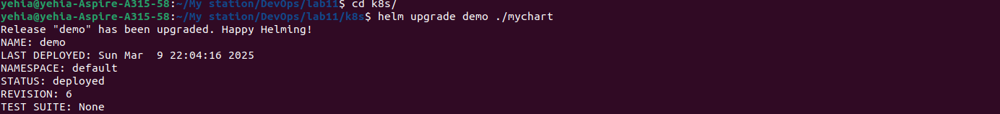

# Lab 11: Kubernetes Secrets and Hashicorp Vault

## Task 1: Kubernetes Secrets and Resource Management

### 1. Create a Secret Using `kubectl`
```bash
kubectl create secret generic app-secret \
  --from-literal=MY_PASS=admin123 \
  --namespace=default
```

### 2. Verify and Decode the Secret
#### Command Output:
```bash
kubectl get secret app-secret -o yaml
```
#### Output:
```yaml
apiVersion: v1
data:
  MY_PASS: YWRtaW4xMjM=
kind: Secret
metadata:
  name: app-secret
  namespace: default
```
#### Decode the Secret:
```bash
echo "YWRtaW4xMjM=" | base64 -d  # Output: admin123
```

### 3. Manage Secrets with Helm
#### `secrets.yaml` in templates:
```yaml
apiVersion: v1
kind: Secret
metadata:
  name: {{ .Release.Name }}-secret
  labels:
    app: {{ .Release.Name }}
type: Opaque
data:
  MY_PASS: {{ .Values.secrets.password | b64enc }}
```

#### Updated `deployment.yaml` to reference the secret:
```yaml
env:
  - name: MY_PASSWORD
    valueFrom:
      secretKeyRef:
        name: {{ .Release.Name }}-secret
        key: MY_PASS
```

#### Verify Pod and Secret Injection:
```bash
kubectl get pods -l app=demo
# Output: demo-mychart-64f9b689b-x8684   1/1     Running   0          34s

kubectl exec demo-mychart-64f9b689b-x8684 -- printenv | grep MY_PASSWORD
# Output: MY_PASSWORD=admin123
```





---

## Task 2: Vault Secret Management System

### 1. Install Vault Using Helm
```bash
helm repo add hashicorp https://helm.releases.hashicorp.com
helm install vault hashicorp/vault \
  --set server.dev.enabled=true \
  --set server.dev.devRootToken=root
```

### 2. Configure Vault and Kubernetes Authentication
#### Enable KV Secret Engine:
```bash
vault secrets enable -path=secret kv-v2
```
#### Write a Secret:
```bash
vault kv put secret/demo-secret password="vaultpassword123"
```

#### Configure Kubernetes Auth:
```bash
vault auth enable kubernetes
vault write auth/kubernetes/config \
  kubernetes_host="https://$KUBERNETES_SERVICE_HOST:$KUBERNETES_SERVICE_PORT"
```

#### Create Policy and Role:
```bash
vault policy write demo-policy - <<EOF
path "secret/data/demo-secret" {
  capabilities = ["read"]
}
EOF

vault write auth/kubernetes/role/demo-role \
  bound_service_account_names=demo-sa \
  bound_service_account_namespaces=default \
  policies=demo-policy \
  ttl=24h
```

### 3. Inject Vault Secrets into Pod
#### Updated Deployment Annotations:
```yaml
annotations:
  vault.hashicorp.com/agent-inject: "true"
  vault.hashicorp.com/agent-inject-secret-db-secret: "secret/data/demo-secret"
  vault.hashicorp.com/role: "demo-role"
```

#### Verify Secret Injection:
```bash
kubectl exec demo-mychart-5f9768cbb5-mj59g -- cat /vault/secrets/db-secret
# Output: vaultpassword123

kubectl exec demo-mychart-5f9768cbb5-mj59g -- df -h | grep vault
# Output: tmpfs           7.6G  4.0K  7.6G   1% /vault/secrets
```


---

## Bonus Task: Resource Management and Environment Variables

### 1. Resource Requests/Limits in `values.yaml`
```yaml
resources:
  limits:
    cpu: 500m
    memory: 256Mi
  requests:
    cpu: 250m
    memory: 128Mi
```
#### Verify Resource Allocation:
```bash
kubectl get pod -l app=demo -o jsonpath='{.items[*].spec.containers[?(@.name=="mychart")].resources}'
# Output: {"limits":{"cpu":"500m","memory":"256Mi"},"requests":{"cpu":"250m","memory":"128Mi"}}
```

### 2. Environment Variables in Helm
#### Added to `values.yaml`:
```yaml
env:
  mode: "production"
  version: "2.0"
```
#### Verify Environment Variables:
```bash
kubectl exec demo-mychart-9758c7b7c-zbsg2 -- printenv ENV_MODE APP_VERSION
# Output:
# production
# 2.0
```



---

## Required Files
### `secrets.yaml`
```yaml
apiVersion: v1
kind: Secret
metadata:
  name: {{ .Release.Name }}-secret
  labels:
    app: {{ .Release.Name }}
type: Opaque
data:
  MY_PASS: {{ .Values.secrets.password | b64enc }}
```

