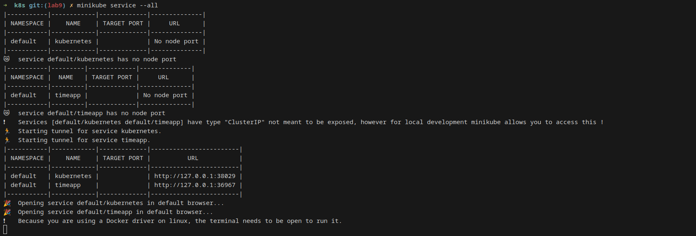

# Kubernetes Secrets and Resource Management

In this task we are creating and managing Kubernetes secrets using both `kubectl` and Helm. We created a secret, verified and decoded it, and then managed it through a Helm chart. 

**Creating a Secret Using kubectl:**

   - **Action:** We create a secret using the `kubectl` command.

     ```bash
     kubectl create secret generic user-pass     --from-literal=username=admin     --from-literal=password='12345'
     ```

     

   - **Verification:** Then we run `kubectl get secrets user-pass -o yaml` to check the secret.

        
   
    
**Verifying and Decoding Secret:**

   - **Verification:** After we use the following commands to decode the secret:

     
     
     


## Helm Secret

Next, we follow the steps in the provided guide

**To securely encrypt secrets, we first need to generate a GPG key:**


**To verify the encryption, we view the contents using Helm Secrets:**


**Create a Helm Chart and Deploy Secrets**

As in the previous lab, we create a Helm chart named python-app:


Edit files according to the guide and also using our python app:

We modify `values.yaml`:
```yaml
image:
  repository: twentythree3/flask-app
  tag: "latest"
 
service:
  type: ClusterIP
  port: 5001
```

We create `secrets.yaml` inside template folder:
```yaml
apiVersion: v1
kind: Secret
metadata:
  name: credentials
  labels:
    app: python-app
    chart: '{{ .Chart.Name }}-{{ .Chart.Version }}'
    release: '{{ .Release.Name }}'
    heritage: '{{ .Release.Service }}'
type: Opaque
data:
  password: {{ .Values.password | b64enc | quote }}
```

In addition, we edit the `deployment.yaml`:

```yaml
 env:
    - name: MY_PASSWORD
    valueFrom:
        secretKeyRef:
        name: credentials
        key: password
```

After all these modifications, we deploy the Helm chart with encrypted secrets:




**Verifying the Secret in Kubernetes**


**Verifying Secret in a Running Pod**


# Vault

### Installing Vault Using Helm Chart

Firstly, we are adding the HashiCorp Helm repository:

   ```sh
   helm repo add hashicorp https://helm.releases.hashicorp.com
   helm repo update
   ```
Then, we are installing Vault using Helm:

   ```sh
   helm install vault hashicorp/vault --set "server.dev.enabled=true"
   ```

   
   
  

### Following the Tutorial with Helm Chart

**Setting a secret in Vault**

   ```sh
   askar@askar-VirtualBox:~/l11/k8s/enc/python-app$ kubectl exec -it vault-0 -- /bin/sh
   / $ vault secrets enable -path=internal kv-v2
   Success! Enabled the kv-v2 secrets engine at: internal/
   / $ vault kv put internal/database/config username="eas" password="ww"
    ======== Secret Path ========
    internal/data/database/config

    ======= Metadata =======
    Key                Value
    ---                -----
    created_time       2025-03-06T14:02:00.735997856Z
    custom_metadata    <nil>
    deletion_time      n/a
    destroyed          false
    version            2
    / $ vault kv get internal/database/config
    ======== Secret Path ========
    internal/data/database/config

    ======= Metadata =======
    Key                Value
    ---                -----
    created_time       2025-03-06T14:02:00.735997856Z
    custom_metadata    <nil>
    deletion_time      n/a
    destroyed          false
    version            2

    ====== Data ======
    Key         Value
    ---         -----
    password    ww
    username    eas
    / $ exit
   ```
**Configuring Kubernetes Authentication**

   ```sh
   askar@askar-VirtualBox:~/l11/k8s/enc/python-app$ kubectl exec -it vault-0 -- /bin/sh
   / $ vault auth enable kubernetes
   Success! Enabled kubernetes auth method at: kubernetes/
   / $ vault write auth/kubernetes/config \
   kubernetes_host="https://$KUBERNETES_PORT_443_TCP_ADDR:443"
    Success! Data written to: auth/kubernetes/config
    / $ 
    / $ vault policy write internal-app - <<EOF
    > path "internal/data/database/config" {
    >    capabilities = ["read"]
    > }
    > EOF
    Success! Uploaded policy: internal-app
    / $ vault write auth/kubernetes/role/internal-app \
    >       bound_service_account_names=internal-app \
    >       bound_service_account_namespaces=default \
    >       policies=internal-app \
    >       ttl=24h
    Success! Data written to: auth/kubernetes/role/internal-app
    / $ exit
   ```
   
**Process of creating account**

```sh
askar@askar-VirtualBox:~/l11/k8s/enc$ kubectl create sa internal-app
serviceaccount/internal-app created
askar@askar-VirtualBox:~/l11/k8s/enc$ kubectl get serviceaccounts
NAME                   SECRETS   AGE
default                0         39h
internal-app           0         14s
python-app             0         38h
vault                  0         21m
vault-agent-injector   0         21m
```


Next step, I created a patch-inject.yaml:

```yaml
spec:
   template:
      metadata:
        annotations:
          vault.hashicorp.com/agent-inject: 'true'
          vault.hashicorp.com/agent-inject-status: 'update'
          vault.hashicorp.com/role: 'internal-app'
          vault.hashicorp.com/agent-inject-secret-database-config.txt: 'internal/data/database/config'
          vault.hashicorp.com/agent-inject-template-database-config.txt: |
              {{- with secret "internal/data/database/config" -}}
              postgresql://{{ .Data.data.username }}:{{ .Data.data.password }}@postgres:5432/wizard
              {{- end -}}
```

And used the command:

```sh
kubectl patch deployment python-app  --patch "$(cat patch-inject.yaml)"
```

```sh
askar@askar-VirtualBox:~/l11/k8s/enc/python-app$ kubectl patch deployment python-app --patch "$(cat patch-inject.yaml)"
deployment.apps/python-app patched
```


**Secret injection**


The secret was successfully added.

## Resource Management

  Firstly, I created node app in the same steps as for the python app

  

  We modify `values.yaml`:
  ```yaml
  image:
    repository: twentythree3/my-app
    tag: "latest"
  
  service:
    type: ClusterIP
    port: 3001
  ```

  After that, in `values.yaml` of both apps we added resource limits

  ```yaml
  resources: 
  limits:
    cpu: 100m
    memory: 128Mi
  requests:
    cpu: 100m
    memory: 128Mi
  ```

**Python-App**

  ```sh
  askar@askar-VirtualBox:~/l11/k8s/enc$ kubectl describe deployments.apps python-app
  Name:                   python-app
  Namespace:              default
  CreationTimestamp:      Tue, 04 Mar 2025 22:32:17 +0300
  Labels:                 app.kubernetes.io/instance=python-app
                          app.kubernetes.io/managed-by=Helm
                          app.kubernetes.io/name=python-app
                          app.kubernetes.io/version=1.16.0
                          helm.sh/chart=python-app-0.1.0
  Annotations:            deployment.kubernetes.io/revision: 11
                          meta.helm.sh/release-name: python-app
                          meta.helm.sh/release-namespace: default
  Selector:               app.kubernetes.io/instance=python-app,app.kubernetes.io/name=python-app
  Replicas:               1 desired | 1 updated | 1 total | 1 available | 0 unavailable
  StrategyType:           RollingUpdate
  MinReadySeconds:        0
  RollingUpdateStrategy:  25% max unavailable, 25% max surge
  Pod Template:
    Labels:           app.kubernetes.io/instance=python-app
                      app.kubernetes.io/managed-by=Helm
                      app.kubernetes.io/name=python-app
                      app.kubernetes.io/version=1.16.0
                      helm.sh/chart=python-app-0.1.0
    Annotations:      kubectl.kubernetes.io/restartedAt: 2025-03-06T17:11:44+03:00
                      vault.hashicorp.com/agent-inject: true
                      vault.hashicorp.com/agent-inject-secret-config.txt: internal/data/database/config
                      vault.hashicorp.com/agent-inject-secret-database-config.txt: internal/data/database/config
                      vault.hashicorp.com/agent-inject-status: update
                      vault.hashicorp.com/agent-inject-template-config.txt:
                        {{- with secret "internal/data/database/config" -}}
                        username={{ .Data.data.username }}
                        password={{ .Data.data.password }}
                        {{- end }}
                      vault.hashicorp.com/agent-inject-template-database-config.txt:
                        {{- with secret "internal/data/database/config" -}}
                        postgresql://{{ .Data.data.username }}:{{ .Data.data.password }}@postgres:5432/wizard
                        {{- end -}}
                      vault.hashicorp.com/role: internal-app
Service Account:  internal-app
Containers:
python-app:
  Image:      twentythree3/flask-app:latest
  Port:       5001/TCP
  Host Port:  0/TCP
  Limits:
    cpu:     100m
    memory:  128Mi
  Requests:
    cpu:      100m
    memory:   128Mi
  Liveness:   http-get http://:http/ delay=0s timeout=1s period=10s #success=1 #failure=3
  Readiness:  http-get http://:http/ delay=0s timeout=1s period=10s #success=1 #failure=3
  Environment:
    MY_PASSWORD:  <set to the key 'password' in secret 'credentials'>  Optional: false
    DEVOPS:       homework
    NAME:         askar
  Mounts:         <none>
Volumes:          <none>
Node-Selectors:   <none>
Tolerations:      <none>
Conditions:
Type           Status  Reason
----           ------  ------
Progressing    True    NewReplicaSetAvailable
Available      True    MinimumReplicasAvailable
OldReplicaSets:  python-app-85b4dd9699 (0/0 replicas created), python-app-d7cb785bf (0/0 replicas created), python-app-5d7d699b7f (0/0 replicas created), python-app-76568989c7 (0/0 replicas created), python-app-6f455f8b45 (0/0 replicas created), python-app-54f68d6869 (0/0 replicas created), python-app-6bc984586d (0/0 replicas created), python-app-58458bb54c (0/0 replicas created), python-app-c88d4c656 (0/0 replicas created)
NewReplicaSet:   python-app-776d699cc9 (1/1 replicas created)
Events:          <none>
```

**Node-app**

```sh
askar@askar-VirtualBox:~/l11/k8s/enc$ kubectl describe deployments.apps my-app
Name:                   my-app
Namespace:              default
CreationTimestamp:      Thu, 06 Mar 2025 17:28:17 +0300
Labels:                 app.kubernetes.io/instance=my-app
                        app.kubernetes.io/managed-by=Helm
                        app.kubernetes.io/name=my-app
                        app.kubernetes.io/version=1.16.0
                        helm.sh/chart=my-app-0.1.0
Annotations:            deployment.kubernetes.io/revision: 1
                        meta.helm.sh/release-name: my-app
                        meta.helm.sh/release-namespace: default
Selector:               app.kubernetes.io/instance=my-app,app.kubernetes.io/name=my-app
Replicas:               1 desired | 1 updated | 1 total | 1 available | 0 unavailable
StrategyType:           RollingUpdate
MinReadySeconds:        0
RollingUpdateStrategy:  25% max unavailable, 25% max surge
Pod Template:
  Labels:           app.kubernetes.io/instance=my-app
                    app.kubernetes.io/managed-by=Helm
                    app.kubernetes.io/name=my-app
                    app.kubernetes.io/version=1.16.0
                    helm.sh/chart=my-app-0.1.0
  Service Account:  my-app
  Containers:
   my-app:
    Image:      twentythree3/myapp:latest
    Port:       3001/TCP
    Host Port:  0/TCP
    Limits:
      cpu:     100m
      memory:  128Mi
    Requests:
      cpu:      100m
      memory:   128Mi
    Liveness:   http-get http://:http/ delay=0s timeout=1s period=10s #success=1 #failure=3
    Readiness:  http-get http://:http/ delay=0s timeout=1s period=10s #success=1 #failure=3
    Environment:
      DEVOPS:      homework
      NAME:        askar
    Mounts:        <none>
  Volumes:         <none>
  Node-Selectors:  <none>
  Tolerations:     <none>
Conditions:
  Type           Status  Reason
  ----           ------  ------
  Progressing    True    NewReplicaSetAvailable
  Available      True    MinimumReplicasAvailable
OldReplicaSets:  <none>
NewReplicaSet:   my-app-758bc66778 (1/1 replicas created)
Events:
  Type    Reason             Age   From                   Message
  ----    ------             ----  ----                   -------
  Normal  ScalingReplicaSet  113m  deployment-controller  Scaled up replica set my-app-758bc66778 from 0 to 1
askar@askar-VirtualBox:~/l11/k8s/enc$ 
```


## Environment Variables

In both apps we modify files `values.yaml.`, `_helpers.tpl`, `deployment.yaml`

In `valyes.yaml`:

```yaml
env:
  DEVOPS: homework
  NAME: askar 
```

In `_helpers.tpl`:

```tpl
{{- define "common.env" }}
- name: DEVOPS
  value: {{ .Values.env.DEVOPS | quote }}
- name: NAME
  value: {{ .Values.env.NAME | quote }}
{{ end }}
```

In `deployment.yaml`:

```yaml
env:
  {{ include "common.env" . | nindent 12 }}
```

**For python-app**


**For node app**


## Verifying that everything works by `kubectl get po`


