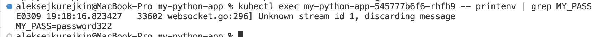
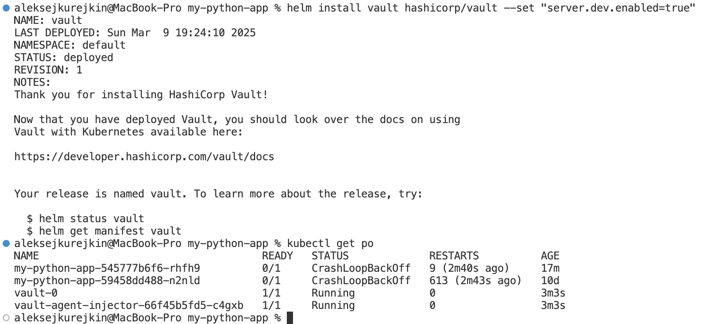
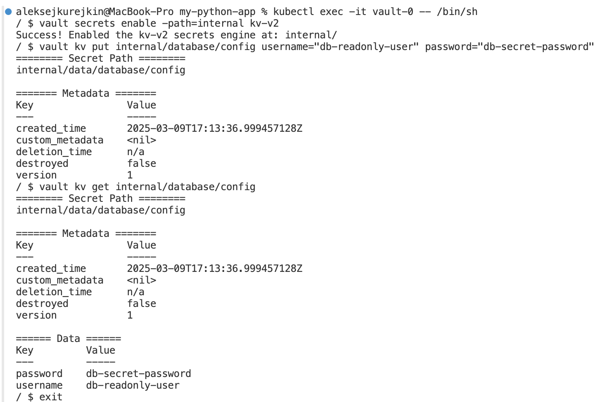

# Task 1:
## Confirming and decoding the secret:


## Upgrading Helm:


## Retrieving the list of pods:


## Verifying the secret inside the pod:


# Task 2:
## Installing Vault:





## Checking result with command:
```bash
kubectl exec -it my-python-app-6c6cf585d8-t6jzn -- cat /vault/secrets/database-config.txt
```

## Output:
```
export DB_USER="db-readonly-user"
export DB_PASS="db-secret-password"
```

## Command:
```bash
kubectl exec -it my-python-app-6c6cf585d8-t6jzn -- df -h
```

## Output:
```
Filesystem      Size  Used Avail Use% Mounted on
overlay          80G   17G   63G  21% /
tmpfs            64M     0   64M   0% /dev
tmpfs           2.0G     0  2.0G   0% /sys/fs/cgroup
tmpfs           2.0G   16K  2.0G   1% /vault/secrets
/dev/sda1        80G   17G   63G  21% /etc/hosts
shm              64M     0   64M   0% /dev/shm
tmpfs           2.0G     0  2.0G   0% /proc/acpi
tmpfs           2.0G     0  2.0G   0% /sys/firmware
```
