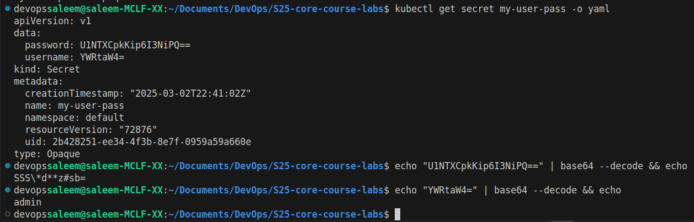

# Kubernetes Secrets and Hashicorp Vault

## Table of Contents

- [Kubernetes Secrets and Hashicorp Vault](#kubernetes-secrets-and-hashicorp-vault)
  - [Table of Contents](#table-of-contents)
  - [Managing Secrets using Kubectl](#managing-secrets-using-kubectl)
  - [Managing Secrets using Helm](#managing-secrets-using-helm)
  - [Vault Secrets Management](#vault-secrets-management)
    - [Installation](#installation)
    - [Set a Secret in Vault](#set-a-secret-in-vault)
    - [Configure Kubernetes Authentication](#configure-kubernetes-authentication)
    - [Creating Service Account](#creating-service-account)
    - [Injecting Vault Secrets](#injecting-vault-secrets)
  - [Resource Management](#resource-management)
  - [Environment Variables and Named Templates](#environment-variables-and-named-templates)

## Managing Secrets using Kubectl

- Using command line `kubectl create secret`, we can create secrets-
  - 

- To view the secret, use `kubectl get secret`-
  - 

- It is possible to get the base64 encoded value of the secret using kubectl get secret my-user-pass -o yaml-
  - 

- Using command line `kubectl describe secret db-user-pass`, we can see the sercet details
  -   


## Managing Secrets using Helm

- ```bash
  > helm plugin install https://github.com/jkroepke/helm-secrets
  > curl -LO https://github.com/getsops/sops/releases/download/v3.8.1/sops-v3.8.1.linux.amd64
  > sudo mv sops-v3.8.1.linux.amd64 /usr/local/bin/sops
  > sudo chmod +x /usr/local/bin/sops
  ```

- Then I generated GPG key using `gpg --gen-key` and `encrypt secrets.yaml`
  - ```bash
      > helm secrets encrypt secrets.yaml
        password: ENC[AES256_GCM,data:kiZ/kKZ7ErE8xis=,iv:994y3uT/2MvsTnDKnHFEaXps/Pz1Qe0KzYjgQe0bhGo=,tag:EYXCd6nbmrHTEQ6UdVUYYQ==,type:int]
    sops:
        kms: []
        gcp_kms: []
        azure_kv: []
        hc_vault: []
        age: []
        lastmodified: "2025-03-02T23:17:24Z"
        mac: ENC[AES256_GCM,data:dLS2wEmtflc3u25XKDAGF5wTuE+iG1lxkzHggeKkJIk6hDZxxpXHQREqIURqMGLmmYotD9uFrPEkR9LXID8OoLdhGpmXEJG0qDKWRbmCvSrqlURyFzQJQB12hEaZXSw8JNnVsfA3x4yEp5yktCmnBWDmJoW2n/5NQTGxpUpP0ss=,iv:enFppNhMUWXRxIop4vmxVNOfeJb1hjmL1Pv5V3dmMV8=,tag:0nR/iQNABaVXTlIqpIjQUw==,type:str]
        pgp:
            - created_at: "2025-03-02T23:15:43Z"
              enc: |-
                -----BEGIN PGP MESSAGE-----

                hQGMAzMJMCEpGa+iAQv/RMB4X4rxuhlTiaze/so0fezqp8QE6JyJ/3msZ0008Vzm
                /boSU6n9PQ93oPp/1yVCaigNaV4OJmCYzv8jrq++IMTd1nYwBWJ0XmbGZu5IzPil
                hDyayACUZC90HvtQiOfTtsVR+MO16eYuW3wAAGql3Nu5KcT9kIw6zGolcOzI9GqN
                4gSsrrhgUAI8xD+qxJ3g7D3DcQaWKqmIQwnnojDA7hLts1OyHSBjYy54gfOgd9lq
                121MthcrZjDWAwFopPNRd/4dkXwm+/65vyVNT3gGqNilTHcZOsbIzixL6qUTM666
                xzOhwQFpb5PlxFL6NRJjtb/stZJs35zVIo6VFugi9Frzp2myuL67xGeO3m9X8wBb
                yYzNvmEmDNPvgulHotKRafEDYq9lS4pxYBV7l7Cw6MNA0Yf7YqTshg5aP92n8utP
                dYMbcAXw5ZR+70KC9SJW3522cAbALnpC4VbvpybGl0yEHjfIUjidY8ve+3Ewn/mI
                NDmAikcaK+0rVJR/yHBw0l4BTmDxmUf7cDU8hOhR82rRsu1M0X1KORjwfvFgLeiR
                Keu96TR+BAZNqf8/x4ylgNFanhdAfGuUnvPKDD0VQq9+rFghIh4jFO+z1FodM5JK
                eh0DKNYGxjZ/rVttRQFj
                =uJAG
                -----END PGP MESSAGE-----
              fp: 48EE32B39B0F6F6FD21541ED478880E20B596C72
        unencrypted_suffix: _unencrypted
        version: 3.8.1
    ```

- Saving the data into `secrets.yaml`, we can decrypt the data using `helm secrets decrypt`-

  - 

- Then I configured the `app-python/templates/deployment.yaml` and `app-python/secrets.yaml` to use the secret.
  - 
  - 


## Vault Secrets Management

### Installation
  - 

  - 


### Set a Secret in Vault
  - 


### Configure Kubernetes Authentication

```bash
/ $ vault auth enable kubernetes
```

**Output:**

```log
Success! Enabled kubernetes auth method at: kubernetes/
```

```bash
/ $ vault write auth/kubernetes/config \
>       kubernetes_host="https://$KUBERNETES_PORT_443_TCP_ADDR:443"
```

**Output:**

```log
Success! Data written to: auth/kubernetes/config
```

I then created a policy and role for the internal app:

```bash
/ $ vault policy write internal-app - <<EOF
> path "internal/data/database/config" {
>    capabilities = ["read"]
> }
> EOF
```

**Output:**

```log
Success! Uploaded policy: internal-app
```

```bash
/ $ vault write auth/kubernetes/role/internal-app \
>       bound_service_account_names=internal-app \
>       bound_service_account_namespaces=default \
>       policies=internal-app \
>       ttl=24h
```

**Output:**

```log
Success! Data written to: auth/kubernetes/role/internal-app
```

### Creating Service Account
  - 


### Injecting Vault Secrets
  - To inject vault secrets, I made the following changes `app-python/values.yaml`-

  - ```yaml
      serviceAccount:
      # Specifies whether a service account should be created
      create: false
      # Automatically mount a ServiceAccount's API credentials?
      automount: true
      # Annotations to add to the service account
      annotations: {}
      # The name of the service account to use.
      # If not set and create is true, a name is generated using the fullname template
      name: "internal-app"

    podAnnotations:          
      vault.hashicorp.com/agent-inject: 'true'
      vault.hashicorp.com/role: 'internal-app'
      vault.hashicorp.com/agent-inject-secret-database-config.txt: 'internal/data/database/config'
    podLabels: {}
    ```
  - After running the chart, we can verify if the secrets were injected using kubectl exec-

  - 
  - 

## Resource Management + Environment Variables 

  - I verified the resource configurations:
  - 

  - I added environment variables for my name and email to both the app-go and app-python deployments:

  - ```bash 
    devopssaleem@saleem-MCLF-XX:~/Documents/DevOps/S25-core-course-labs/k8s$ kubectl exec -it app-python-58f6f76566-xzwnx -- printenv
    Defaulted container "app-python" out of: app-python, vault-agent, vault-agent-init (init)
    PATH=/usr/local/bin:/usr/local/sbin:/usr/local/bin:/usr/sbin:/usr/bin:/sbin:/bin
    HOSTNAME=app-python-58f6f76566-xzwnx
    APP_TIMEZONE=Europe/Paris
    ```