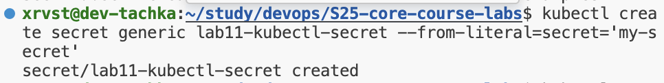

# Lab 11: Kubernetes Secrets and Hashicorp Vault

## Task 1: Kubernetes Secrets and Resource Management

## Using Kubernetes Secrets with `kubectl`

I created and read the secret `lab11-kubectl-secret`:

## Managing secrets with Helm

I created and read the secret 'MY_SECRET' from Pod:

