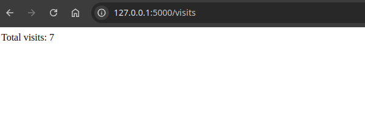

# Lab 12: Kubernetes ConfigMaps


## 1. **Upgrade Application for Persistence**
   - Added a counter logic to track the number of times the application is accessed.
   - Saved the counter value in a `visits.txt` file.
   - Introduced a new `/visits` endpoint to display the total number of visits.
   - Updated the `docker-compose.yml` file to include a volume for the `visits.txt` file.
   - Verified that the enhancements work as expected by checking the `visits.txt` file on the host machine.
   - Updated the `README.md` file to document the new features.



---

## **Task 2: ConfigMap Implementation**

### **Step 1: Create `config.json`**

1. Create a `files` folder and add a `config.json` file:
   ```bash
    "first_name": "Nuhibullo",
    "last_name": "Khujabekov",
    "email": "m.khujabekov@innopolis.university",
    "message": "Hello, World!"
   ```

---

### **Step 2: Create a ConfigMap Manifest**

1. Add a `configMap.yaml` file in the `templates` folder of your Helm chart:
   ```yaml
   # templates/configMap.yaml
   apiVersion: v1
   kind: ConfigMap
   metadata:
     name: my-config
   data:
     config.json: |-
       {{ .Files.Get "files/config.json" | nindent 4 }}
   ```

---

### **Step 3: Update `deployment.yaml`**

1. Add `volumes` and `volumeMounts` to your `deployment.yaml`:
   ```yaml
   # templates/deployment.yaml
   apiVersion: apps/v1
   kind: Deployment
   metadata:
     name: demo
   spec:
     template:
       spec:
         containers:
           - name: python-app
             image: dockerhub/path
             volumeMounts:
               - name: config-volume
                 mountPath: /config
         volumes:
           - name: config-volume
             configMap:
               name: my-config
   ```

---

### **Step 4: Install the Updated Helm Chart**

1. Install or upgrade the Helm chart:
   ```bash
   helm upgrade --install python-app ./python-app
   ```

2. Verify the pod is running:
   ```bash
   kubectl get pods
   ```

   Output:
   ```
   NAME                    READY   STATUS    RESTARTS   AGE
   python-app-5bb576c45-tk2bl   1/1     Running   0          109s
   ```

3. Check the ConfigMap inside the pod:
   ```bash
   kubectl exec python-app-5bb576c45-tk2bl -- cat /app/config.json
   ```

   Output:
   ```
    "first_name": "Nuhibullo",
    "last_name": "Khujabekov",
    "email": "m.khujabekov@innopolis.university",
    "message": "Hello, World!"
   ```

---

