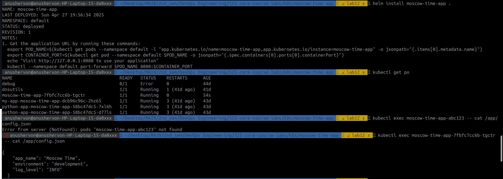

# Lab 12: Kubernetes ConfigMaps
### Task 2: ConfigMap Implementation

The following screenshots demonstrate that I successfully added ConfigMap configuration to my Helm Chart template with configuration variables read from ``files/config.json``

