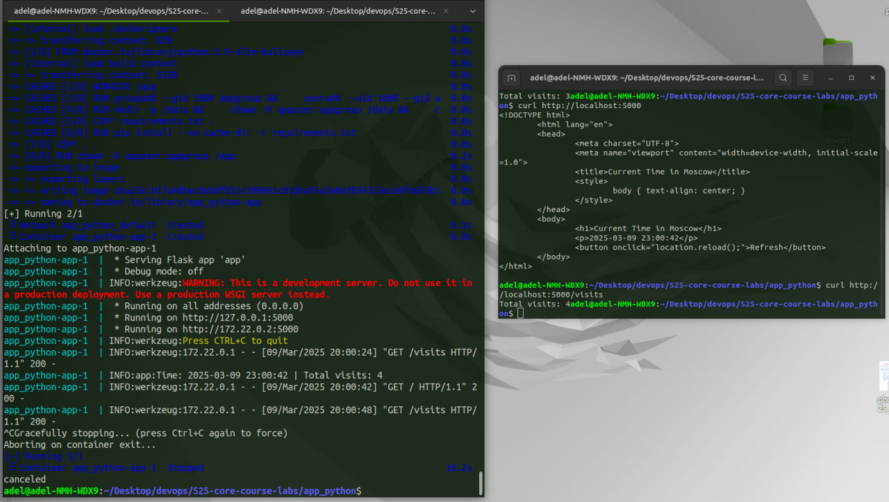
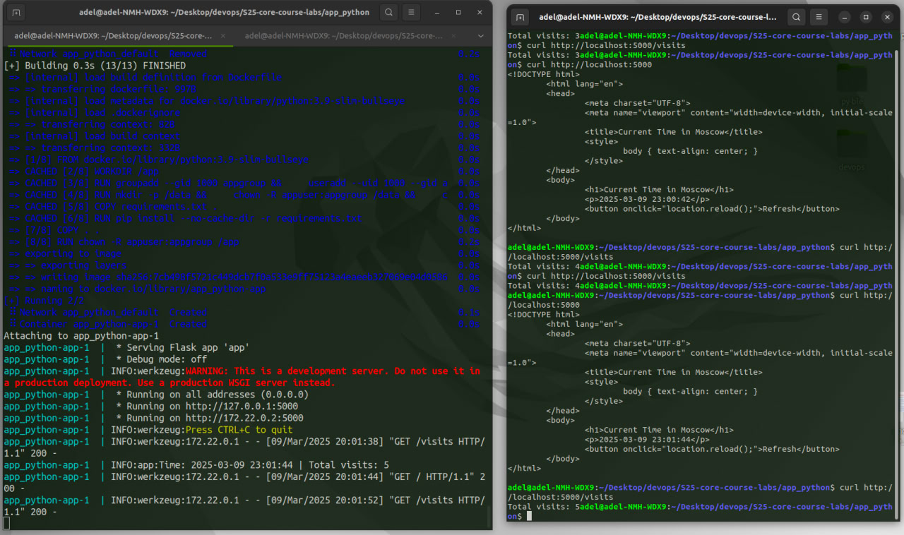
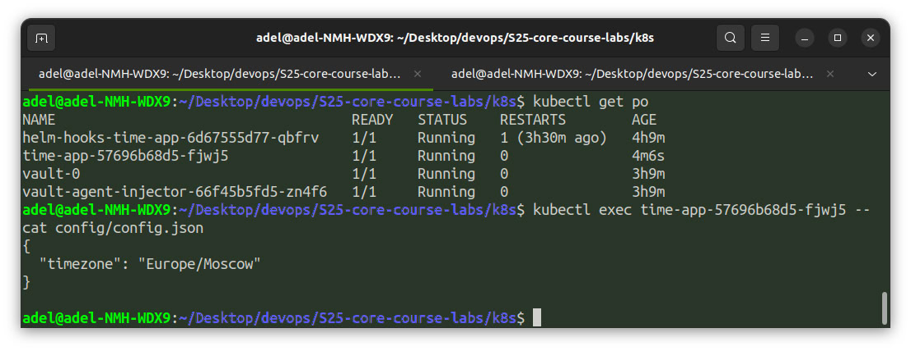

# Moscow Time Web Application

## Task1: Visits Counter

The number of application accesses is persistently stored.
You can access the visits counter using `GET /visits` endpoint.

Proof of persistent visits storage:

## Task 2

Following screenshot demonstrate implementations of requirements:

