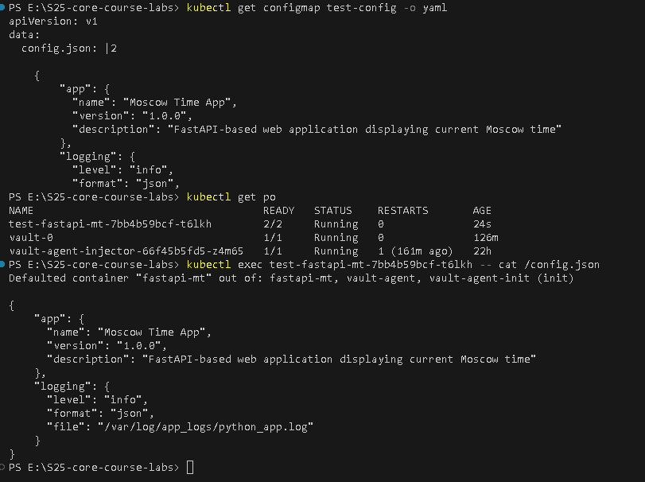
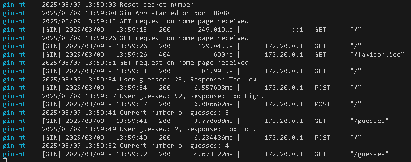
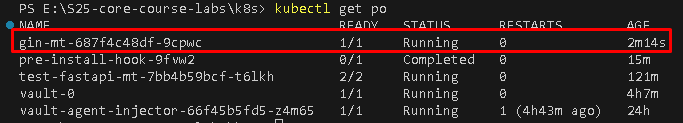
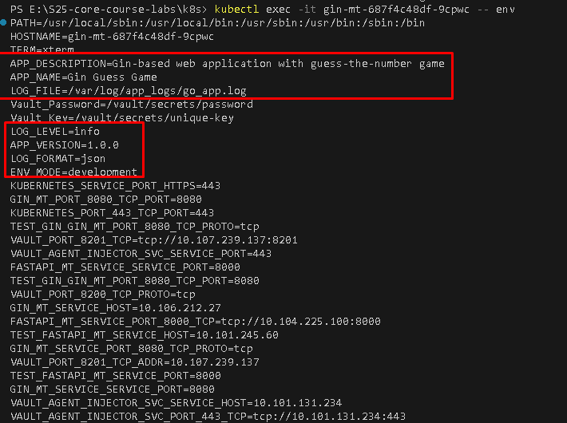

# Lab 12: Application Persistence and ConfigMap Implementation

## Task 1: Upgrade Application for Persistence

### **Application Modifications**
- Implemented a counter logic to track the number of times `/` (main) page is accessed
- Counter number is being saved into `app_data/visits.txt` file which is mounted on the host machine to `app_python/app_data/visits.txt`
- Endpoint `/visits` is introduced to check the current number of counted visits

### **Testing and Verification**
0. **Updated FastAPI web app to create new endpoint**:
    ```python
    def read_visits():
    """Read the visit count from the file"""
    if not os.path.exists(VISITS_FILE):
        return 0
    try:
        with open(VISITS_FILE, "r") as f:
            return int(f.read().strip())
    except ValueError:
        return 0

    def write_visits(count):
        """Write the updated visit count to the file"""
        with open(VISITS_FILE, "w") as f:
            f.write(str(count))


    @app.get("/visits")
    def get_visits():
        """Endpoint to retrieve the visit count"""
        visit_count = read_visits()
        return {"visits": visit_count}
    ```
1. **Updated `docker-compose.yml` to include a new volume**:
    ```yaml
    services:
      fastapi_app:
        image: iucd/fastapi-mt:latest
        container_name: fastapi-mt
        user: "1000:1000"
        ports:
          - "8000:8000"
        environment:
          - LOG_LEVEL=info
        command: ["uvicorn", "main:app", "--host", "0.0.0.0", "--port", "8000"]
        volumes:
          - ./app_data:/app_data
        restart: unless-stopped
    ```
2. **Verified enhancements**:
    - Accessed the application multiple times.
    - Checked `visits` persistence:
    ```sh
    $ curl http://localhost:8000/visits
    {"visits":1}
    $ curl http://localhost:8000
    $ curl http://localhost:8000/visits
    {"visits":2}

    $ docker-compose down
    $ docker-compose up -d

    $ curl http://localhost:8000/visits
    {"visits":2}
    ```

3. **Updated `README.md`**

---

## Task 2: ConfigMap Implementation

### **Config File Creation and Mounting**
1. **Created `k8s/fastapi-mt/files/config.json`**:
    ```json
    {
        "app": {
        "name": "Moscow Time App",
        "version": "1.0.0",
        "description": "FastAPI-based web application displaying current Moscow time"
        },
        "logging": {
        "level": "info",
        "format": "json",
        "file": "/var/log/app_logs/python_app.log"
        }
    }
    ```

2. **ConfigMap Manifest (`k8s/fastapi-mt/templates/configMap.yaml`)**:
    ```yaml
    apiVersion: v1
    kind: ConfigMap
    metadata:
      name: test-config
    data:
      config.json: |
        {{ .Files.Get "files/config.json" | nindent 4 }}
    ```

3. **Updated `deployment.yaml` with Volumes and VolumeMounts**:
    ```yaml
    # ...
    volumes:
        - name: config-volume
          configMap:
            name: test-config
      {{- with .Values.volumes }}
      volumes:
        {{- toYaml . | nindent 8 }}
      {{- end }}
    #...

    containers:
      - name: {{ .Chart.Name }}
      # ...
        volumeMounts:
            - name: config-volume
              mountPath: /config.json
              subPath: config.json
          {{- with .Values.volumeMounts }}
          volumeMounts:
            {{- toYaml . | nindent 12 }}
          {{- end }}
    ```

### **Helm Installation and Verification**
1. **Installed (upgraded) Helm chart**:
    ```sh
    helm upgrade --install test ./k8s/fastapi-mt
    ```
2. **Verified deployment & ConfigMap inside the pod**:
    ```sh
    kubectl get configmap test-config -o yaml
    kubectl get po
    kubectl exec test-fastapi-mt-7bb4b59bcf-t6lkh -- can /config.json
    ```
    Output:
    

## Bonus Task
### **Upgrade Bonus App: Implement persistence logic in your bonus app**
#### **Application Modifications**
- Implemented a counter logic to track the number of guesses made
- Counter number is being saved into `app_data/guesses.txt` file which is mounted on the host machine to `app_go/app_data/guesses.txt`
- Endpoint `/guesses` is introduced to check the current number of counted guesses

#### **Testing and Verification**
0. **Updated gin web app to create new endpoint**:
    ```go
    func setupRouter() *gin.Engine {
    // ...
      r.GET("/guesses", func(c *gin.Context) {
        guesses := getGuesses()
        logger.Printf("Current number of guesses: %d", guesses)
        c.JSON(http.StatusOK, gin.H{"guesses": guesses})
      })
    // ...
    }

    func getGuesses() int {
      if _, err := os.Stat(guessesFile); os.IsNotExist(err) {
        return 0
      }

      data, err := os.ReadFile(guessesFile)
      if err != nil {
        logger.Println("Error reading file:", err)
        return 0
      }

      count, err := strconv.Atoi(strings.TrimSpace(string(data)))
      if err != nil {
        return 0
      }

      return count
    }

    func setGuesses(guesses int) {
      err := os.WriteFile(guessesFile, []byte(strconv.Itoa(guesses)), 0644)
      if err != nil {
        logger.Println("Error writing to file:", err)
      }
    }
    ```
1. **Updated `docker-compose.yml` to include a new volume**:
    ```yaml
    services:
      fastapi_app:
        image: iucd/gin-mt:latest
        container_name: gin-mt
        user: "1000:1000"
        ports:
          - "8080:8080"
        environment:
          - LOG_LEVEL=info
        command: ["./app"]
        volumes:
          - ./app_data:/app_data
        restart: unless-stopped
        ```
2. **Verified enhancements**:
    - Accessed the application multiple times.
    - Checked `guesses` persistence:
      - 

### **ConfigMap via Environment Variables**
#### **Utilize ConfigMap via environment variables in a running container using the envFrom property**
1. Created `configMap.yaml`:  
```yaml
apiVersion: v1
kind: ConfigMap
metadata:
  name: gin-config
data:
  APP_NAME: "Gin Guess Game"
  APP_VERSION: "1.0.0"
  APP_DESCRIPTION: "Gin-based web application with guess-the-number game"
  LOG_LEVEL: "info"
  LOG_FORMAT: "json"
  LOG_FILE: "/var/log/app_logs/go_app.log"
```
2. Added `envFrom` to `deployment.yaml`:  
```yaml
# ...
containers:
  - name: {{ .Chart.Name }}
    {{- include "gin-mt.envVars" . | nindent 10 }}
    envFrom:
      - configMapRef:
          name: gin-config
    {{- with .Values.securityContext }}
# ...
```
3. Upgraded container:
- 
4. Proof:
- 
