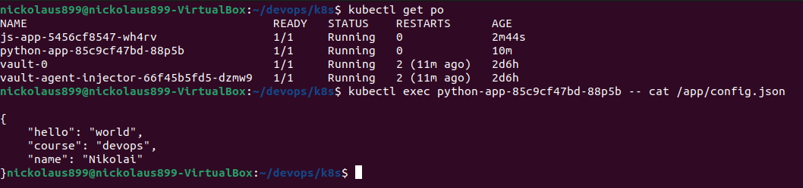

# Configmap

I have created `congig.json` and mounted it with the use of settings in `values.yaml`

```
$ kubectl get po
NAME                                    READY   STATUS    RESTARTS        AGE
python-app-85c9cf47bd-88p5b             1/1     Running   0               69s
vault-0                                 1/1     Running   2 (2m12s ago)   2d6h
vault-agent-injector-66f45b5fd5-dzmw9   1/1     Running   2 (2m13s ago)   2d6h
```

```
$ kubectl exec python-app-85c9cf47bd-88p5b -- cat /app/config.json

{
    "hello": "world",
    "course": "devops",
    "name": "Nikolai"
}
```

And as a screenshot:



### Now, the same for the bonus app:

```
$ kubectl get po
NAME                                    READY   STATUS    RESTARTS        AGE
js-app-5456cf8547-wh4rv                 1/1     Running   0               46s
python-app-85c9cf47bd-88p5b             1/1     Running   0               8m38s
vault-0                                 1/1     Running   2 (9m41s ago)   2d6h
vault-agent-injector-66f45b5fd5-dzmw9   1/1     Running   2 (9m42s ago)   2d6h
```

```
$ kubectl exec js-app-5456cf8547-wh4rv -- cat /app/config.json

{
    "hello": "world",
    "course": "devops",
    "language": "JavaScript"
}
```

