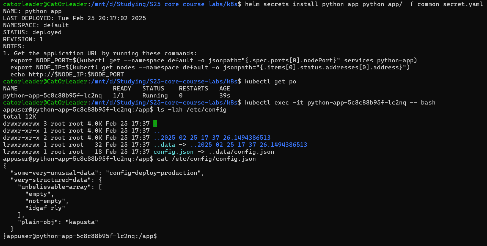

# Helm

---

## Config Map

* _P.S: `files/config.json` placed under the `python-app` directory_


* Firstly, I created `config-map.yaml`. Beforehand I tried to create it in the common library, but this was so hard
  in terms of the file access restrictions, therefore I just stick to the default way to implementing

```yaml
apiVersion: v1
kind: ConfigMap
metadata:
  name: {{ printf "config-map-%s" .Chart.Name }}
data:
  config.json: |-
{{ .Files.Get  .Values.config.path | indent 4 }}
```

* Also, I changed volume-related values in the `values.yaml`

```yaml
# Additional volumes on the output Deployment definition.
volumes:
  - name: config-volume
    configMap:
      name: config-map-python-app

# Additional volumeMounts on the output Deployment definition.
volumeMounts:
  - name: config-volume
    mountPath: /etc/config
    readOnly: true
```

* And add the envFrom to the `deployment.yaml` itself

```yaml
...
          envFrom:
            - configMapRef:
                name: config-map-python-app
...
```

* There is a result



* And additionally, the direct continuation to get `config.json` as env variable (in the same container)


