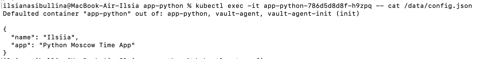
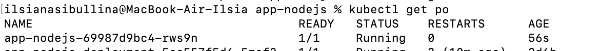
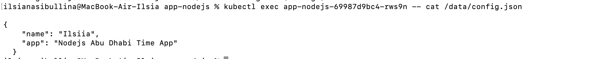
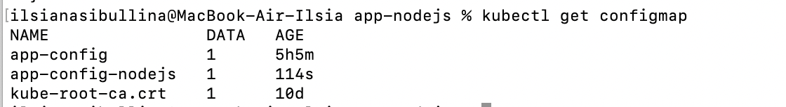

# Kubernetes ConfigMaps

## Python App

The result of `kubectl get po`:

```bash
kubectl get po                                           
NAME                                     READY   STATUS    RESTARTS      AGE
app-python-786d5d8d8f-h9zpq              2/2     Running   0             6m49s
app-python-deployment-68f5f57668-6ct69   1/1     Running   1 (47m ago)   2d17h
app-python-deployment-68f5f57668-bzd5l   1/1     Running   1 (47m ago)   2d17h
app-python-deployment-68f5f57668-zvbzz   1/1     Running   1 (47m ago)   2d17h
app-python-library-5b687748cd-l99nw      1/1     Running   3 (47m ago)   8d
vault-0                                  1/1     Running   1 (47m ago)   2d18h
vault-agent-injector-66f45b5fd5-njvbf    1/1     Running   1 (47m ago)   2d18h
```

The result of command `kubectl exec -it app-python-786d5d8d8f-h9zpq  -- cat /data/config.json`:



```bash
kubectl describe configmaps app-config       
Name:         app-config
Namespace:    default
Labels:       app.kubernetes.io/managed-by=Helm
Annotations:  meta.helm.sh/release-name: app-python
              meta.helm.sh/release-namespace: default

Data
====
config.json:
----

{
  "name": "Ilsiia",
  "app": "Python Moscow Time App"
}


BinaryData
====

Events:  <none>
```

## Second App

The name of `app-nodejs` pod:



The result of command `kubectl exec -it app-nodejs  -- cat /data/config.json`:



The output of `kubectl describe configmap app-config-nodejs`:

```bash
kubectl describe configmaps app-config-nodejs
Name:         app-config-nodejs
Namespace:    default
Labels:       app.kubernetes.io/managed-by=Helm
Annotations:  meta.helm.sh/release-name: app-nodejs
              meta.helm.sh/release-namespace: default

Data
====
config.json:
----

{
    "name": "Ilsiia",
    "app": "Nodejs Abu Dhabi Time App"
  }


BinaryData
====

Events:  <none>
```

A list of configmaps:



## envFrom

The result of implementing `envFrom`:

```bash

kubectl exec app-python-786d5d8d8f-h9zpq -- printenv config.json
Defaulted container "app-python" out of: app-python, vault-agent, vault-agent-init (init)

{
  "name": "Ilsiia",
  "app": "Python Moscow Time App"
}

kubectl exec app-nodejs-69987d9bc4-rws9n -- printenv config.json 

{
    "name": "Ilsiia",
    "app": "Nodejs Abu Dhabi Time App"
  }

```
