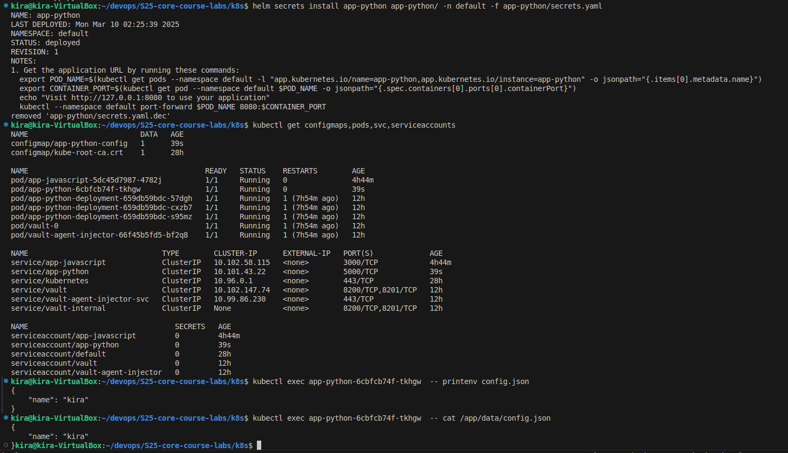
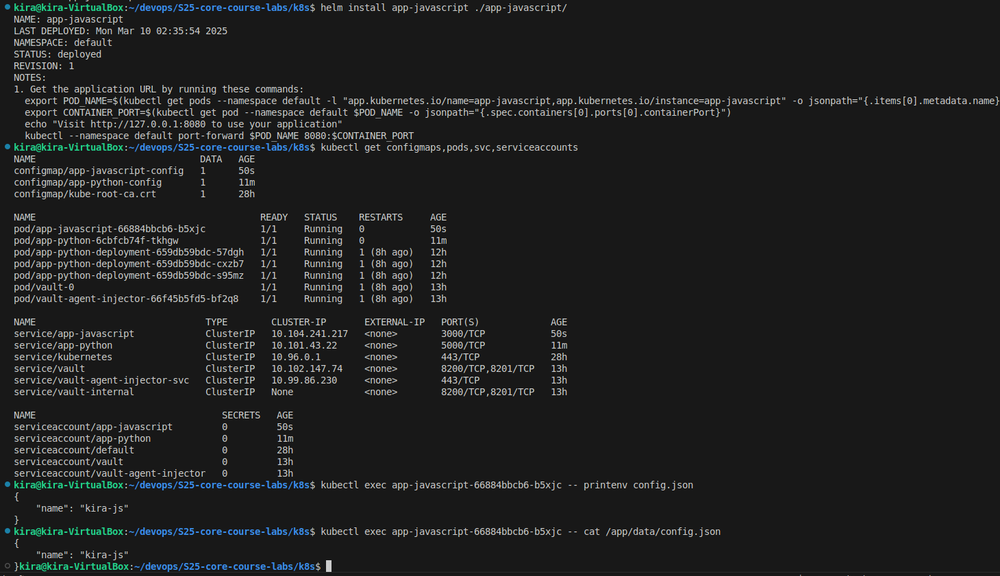

# Lab 12

## Task 2

I added `config.json` and `configmap.yaml`, edited the volumes in values.yaml for python app. Installed the helm again and verify that everything was correctly done.



## Bonus Task

I completed the same as task1 and task2 for app_javascript. Similar to task 1 the visits logic is described in JAVASCRIPT.md.



### ConfigMap via Environment Variables

Utilize ConfigMap via environment variables in a running container using the envFrom property:
I added the following property in deployment.yaml for both of my charts.

```yaml
envFrom:
           - configMapRef:
               name: app-python-config
```

```yaml
envFrom:
           - configMapRef:
               name: app-javascript-config
```

#### Output of env command:

```sh
kubectl exec app-python-6cbfcb74f-tkhgw  -- env
PATH=/usr/local/bin:/usr/local/sbin:/usr/local/bin:/usr/sbin:/usr/bin:/sbin:/bin
HOSTNAME=app-python-6cbfcb74f-tkhgw
config.json={
    "name": "kira"
}
MY_PASSWORD=mySecretPassword354
APP_NAME=app_python
MY_NAME=Kira
VAULT_AGENT_INJECTOR_SVC_PORT_443_TCP_PROTO=tcp
APP_PYTHON_PORT_5000_TCP_PORT=5000
KUBERNETES_SERVICE_PORT=443
KUBERNETES_PORT_443_TCP_PORT=443
VAULT_AGENT_INJECTOR_SVC_SERVICE_PORT=443
VAULT_AGENT_INJECTOR_SVC_PORT=tcp://10.99.86.230:443
VAULT_SERVICE_PORT_HTTP=8200
VAULT_PORT_8201_TCP_PORT=8201
APP_JAVASCRIPT_SERVICE_PORT=3000
APP_JAVASCRIPT_SERVICE_PORT_HTTP=3000
APP_PYTHON_SERVICE_PORT=5000
KUBERNETES_PORT_443_TCP_PROTO=tcp
VAULT_SERVICE_HOST=10.102.147.74
VAULT_PORT_8200_TCP=tcp://10.102.147.74:8200
VAULT_PORT_8200_TCP_ADDR=10.102.147.74
VAULT_PORT_8201_TCP_PROTO=tcp
APP_JAVASCRIPT_PORT_3000_TCP_PORT=3000
APP_PYTHON_SERVICE_HOST=10.101.43.22
KUBERNETES_SERVICE_HOST=10.96.0.1
VAULT_AGENT_INJECTOR_SVC_PORT_443_TCP_PORT=443
VAULT_PORT_8201_TCP=tcp://10.102.147.74:8201
VAULT_PORT_8201_TCP_ADDR=10.102.147.74
APP_PYTHON_SERVICE_PORT_HTTP=5000
APP_PYTHON_PORT_5000_TCP_PROTO=tcp
APP_PYTHON_PORT_5000_TCP_ADDR=10.101.43.22
VAULT_PORT=tcp://10.102.147.74:8200
APP_JAVASCRIPT_PORT=tcp://10.102.58.115:3000
VAULT_SERVICE_PORT=8200
VAULT_PORT_8200_TCP_PROTO=tcp
VAULT_PORT_8200_TCP_PORT=8200
VAULT_SERVICE_PORT_HTTPS_INTERNAL=8201
KUBERNETES_PORT_443_TCP_ADDR=10.96.0.1
VAULT_AGENT_INJECTOR_SVC_SERVICE_HOST=10.99.86.230
VAULT_AGENT_INJECTOR_SVC_SERVICE_PORT_HTTPS=443
VAULT_AGENT_INJECTOR_SVC_PORT_443_TCP_ADDR=10.99.86.230
APP_PYTHON_PORT_5000_TCP=tcp://10.101.43.22:5000
KUBERNETES_SERVICE_PORT_HTTPS=443
VAULT_AGENT_INJECTOR_SVC_PORT_443_TCP=tcp://10.99.86.230:443
APP_JAVASCRIPT_SERVICE_HOST=10.102.58.115
APP_JAVASCRIPT_PORT_3000_TCP=tcp://10.102.58.115:3000
APP_JAVASCRIPT_PORT_3000_TCP_ADDR=10.102.58.115
APP_PYTHON_PORT=tcp://10.101.43.22:5000
APP_JAVASCRIPT_PORT_3000_TCP_PROTO=tcp
KUBERNETES_PORT=tcp://10.96.0.1:443
KUBERNETES_PORT_443_TCP=tcp://10.96.0.1:443
LANG=C.UTF-8
GPG_KEY=7169605F62C751356D054A26A821E680E5FA6305
PYTHON_VERSION=3.12.9
PYTHON_SHA256=7220835d9f90b37c006e9842a8dff4580aaca4318674f947302b8d28f3f81112
HOME=/root
```

```sh
kubectl exec app-python-6cbfcb74f-tkhgw  -- env
PATH=/usr/local/bin:/usr/local/sbin:/usr/local/bin:/usr/sbin:/usr/bin:/sbin:/bin
HOSTNAME=app-python-6cbfcb74f-tkhgw
config.json={
    "name": "kira"
}
MY_PASSWORD=mySecretPassword354
APP_NAME=app_python
MY_NAME=Kira
VAULT_AGENT_INJECTOR_SVC_PORT_443_TCP_PROTO=tcp
APP_PYTHON_PORT_5000_TCP_PORT=5000
KUBERNETES_SERVICE_PORT=443
KUBERNETES_PORT_443_TCP_PORT=443
VAULT_AGENT_INJECTOR_SVC_SERVICE_PORT=443
VAULT_AGENT_INJECTOR_SVC_PORT=tcp://10.99.86.230:443
VAULT_SERVICE_PORT_HTTP=8200
VAULT_PORT_8201_TCP_PORT=8201
APP_JAVASCRIPT_SERVICE_PORT=3000
APP_JAVASCRIPT_SERVICE_PORT_HTTP=3000
APP_PYTHON_SERVICE_PORT=5000
KUBERNETES_PORT_443_TCP_PROTO=tcp
VAULT_SERVICE_HOST=10.102.147.74
VAULT_PORT_8200_TCP=tcp://10.102.147.74:8200
VAULT_PORT_8200_TCP_ADDR=10.102.147.74
VAULT_PORT_8201_TCP_PROTO=tcp
APP_JAVASCRIPT_PORT_3000_TCP_PORT=3000
APP_PYTHON_SERVICE_HOST=10.101.43.22
KUBERNETES_SERVICE_HOST=10.96.0.1
VAULT_AGENT_INJECTOR_SVC_PORT_443_TCP_PORT=443
VAULT_PORT_8201_TCP=tcp://10.102.147.74:8201
VAULT_PORT_8201_TCP_ADDR=10.102.147.74
APP_PYTHON_SERVICE_PORT_HTTP=5000
APP_PYTHON_PORT_5000_TCP_PROTO=tcp
APP_PYTHON_PORT_5000_TCP_ADDR=10.101.43.22
VAULT_PORT=tcp://10.102.147.74:8200
APP_JAVASCRIPT_PORT=tcp://10.102.58.115:3000
VAULT_SERVICE_PORT=8200
VAULT_PORT_8200_TCP_PROTO=tcp
VAULT_PORT_8200_TCP_PORT=8200
VAULT_SERVICE_PORT_HTTPS_INTERNAL=8201
KUBERNETES_PORT_443_TCP_ADDR=10.96.0.1
VAULT_AGENT_INJECTOR_SVC_SERVICE_HOST=10.99.86.230
VAULT_AGENT_INJECTOR_SVC_SERVICE_PORT_HTTPS=443
VAULT_AGENT_INJECTOR_SVC_PORT_443_TCP_ADDR=10.99.86.230
APP_PYTHON_PORT_5000_TCP=tcp://10.101.43.22:5000
KUBERNETES_SERVICE_PORT_HTTPS=443
VAULT_AGENT_INJECTOR_SVC_PORT_443_TCP=tcp://10.99.86.230:443
APP_JAVASCRIPT_SERVICE_HOST=10.102.58.115
APP_JAVASCRIPT_PORT_3000_TCP=tcp://10.102.58.115:3000
APP_JAVASCRIPT_PORT_3000_TCP_ADDR=10.102.58.115
APP_PYTHON_PORT=tcp://10.101.43.22:5000
APP_JAVASCRIPT_PORT_3000_TCP_PROTO=tcp
KUBERNETES_PORT=tcp://10.96.0.1:443
KUBERNETES_PORT_443_TCP=tcp://10.96.0.1:443
LANG=C.UTF-8
GPG_KEY=7169605F62C751356D054A26A821E680E5FA6305
PYTHON_VERSION=3.12.9
PYTHON_SHA256=7220835d9f90b37c006e9842a8dff4580aaca4318674f947302b8d28f3f81112
HOME=/root
kira@kira-VirtualBox:~/devops/S25-core-course-labs/k8s$ kubectl exec app-javascript-66884bbcb6-b5xjc -- env
PATH=/usr/local/sbin:/usr/local/bin:/usr/sbin:/usr/bin:/sbin:/bin
HOSTNAME=app-javascript-66884bbcb6-b5xjc
config.json={
    "name": "kira-js"
}
APP_NAME=app_javascript
MY_NAME=Kira
KUBERNETES_SERVICE_HOST=10.96.0.1
KUBERNETES_SERVICE_PORT_HTTPS=443
VAULT_AGENT_INJECTOR_SVC_PORT_443_TCP_ADDR=10.99.86.230
VAULT_PORT_8201_TCP_PORT=8201
APP_JAVASCRIPT_PORT=tcp://10.104.241.217:3000
APP_JAVASCRIPT_PORT_3000_TCP_ADDR=10.104.241.217
APP_PYTHON_PORT_5000_TCP_PORT=5000
KUBERNETES_PORT=tcp://10.96.0.1:443
KUBERNETES_PORT_443_TCP_PROTO=tcp
VAULT_AGENT_INJECTOR_SVC_PORT_443_TCP_PROTO=tcp
VAULT_SERVICE_PORT=8200
VAULT_PORT_8200_TCP_PORT=8200
VAULT_PORT_8201_TCP=tcp://10.102.147.74:8201
APP_PYTHON_SERVICE_PORT_HTTP=5000
KUBERNETES_SERVICE_PORT=443
KUBERNETES_PORT_443_TCP=tcp://10.96.0.1:443
VAULT_AGENT_INJECTOR_SVC_SERVICE_HOST=10.99.86.230
VAULT_AGENT_INJECTOR_SVC_SERVICE_PORT_HTTPS=443
VAULT_SERVICE_PORT_HTTP=8200
APP_JAVASCRIPT_SERVICE_PORT_HTTP=3000
APP_PYTHON_PORT=tcp://10.101.43.22:5000
KUBERNETES_PORT_443_TCP_PORT=443
VAULT_AGENT_INJECTOR_SVC_PORT=tcp://10.99.86.230:443
VAULT_SERVICE_HOST=10.102.147.74
VAULT_PORT=tcp://10.102.147.74:8200
VAULT_PORT_8200_TCP_PROTO=tcp
APP_JAVASCRIPT_PORT_3000_TCP_PROTO=tcp
APP_PYTHON_PORT_5000_TCP_PROTO=tcp
APP_PYTHON_PORT_5000_TCP_ADDR=10.101.43.22
VAULT_AGENT_INJECTOR_SVC_PORT_443_TCP=tcp://10.99.86.230:443
APP_PYTHON_PORT_5000_TCP=tcp://10.101.43.22:5000
VAULT_AGENT_INJECTOR_SVC_SERVICE_PORT=443
VAULT_PORT_8200_TCP=tcp://10.102.147.74:8200
VAULT_PORT_8201_TCP_PROTO=tcp
APP_PYTHON_SERVICE_PORT=5000
KUBERNETES_PORT_443_TCP_ADDR=10.96.0.1
VAULT_AGENT_INJECTOR_SVC_PORT_443_TCP_PORT=443
VAULT_PORT_8200_TCP_ADDR=10.102.147.74
APP_JAVASCRIPT_SERVICE_HOST=10.104.241.217
APP_JAVASCRIPT_SERVICE_PORT=3000
VAULT_SERVICE_PORT_HTTPS_INTERNAL=8201
VAULT_PORT_8201_TCP_ADDR=10.102.147.74
APP_JAVASCRIPT_PORT_3000_TCP=tcp://10.104.241.217:3000
APP_JAVASCRIPT_PORT_3000_TCP_PORT=3000
APP_PYTHON_SERVICE_HOST=10.101.43.22
NODE_VERSION=16.20.2
YARN_VERSION=1.22.19
HOME=/root
```