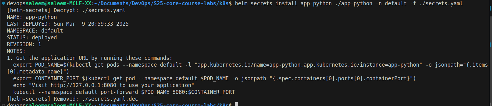

# Kubernetes ConfigMaps

## Task 2

- For this task, I needed to change volumes and volumeMounts inside values.yaml file. I added the following code:
- created config.json with some key-value pairs, created configmap.yaml, and updated accordingly values.yaml and deployment.yaml files

- 

-   ```bash
    kubectl exec app-python-654966cd9c-hfh7h -- cat /config.json

    {
    "name": "Saleem Asekrea",
    "email": "s.asekrea@innopolis.university"
    }
    ```
- ```bash
    devopssaleem@saleem-MCLF-XX:~/Documents/DevOps/S25-core-course-labs/k8s$ kubectl exec app-python-654966cd9c-hfh7h -- printenv
    PATH=/usr/local/bin:/usr/local/sbin:/usr/local/bin:/usr/sbin:/usr/bin:/sbin:/bin
  HOSTNAME=app-python-654966cd9c-hfh7h
  config.json=
  {
    "name": "Saleem Asekrea",
    "email": "s.asekrea@innopolis.university"
  }
  MY_PASS=15321598753
  AUTHOR=saleem
  ....
  ```
## And the same foe the Go app 
- ```bash 
        devopssaleem@saleem-MCLF-XX:~/Documents/DevOps/S25-core-course-labs/k8s$ kubectl get pods
        NAME                                    READY   STATUS              RESTARTS      AGE
        app-go-59fc744f59-wlz4p                 0/1     ContainerCreating   0             9s
        vault-0                                 1/1     Running             1 (59m ago)   5h5m
        vault-agent-injector-66f45b5fd5-brht5   1/1     Running             1 (59m ago)   5h5m
        devopssaleem@saleem-MCLF-XX:~/Documents/DevOps/S25-core-course-labs/k8s$ 
    ```

- ```bash
    devopssaleem@saleem-MCLF-XX:~/Documents/DevOps/S25-core-course-labs/k8s$ kubectl exec app-go-59fc744f59-wlz4p -- cat /config.json

    {
    "name" :"saleem asekrea",
    "email":"s.asekrea@innopolis.university",
    }
  ```
- ```bash
    devopssaleem@saleem-MCLF-XX:~/Documents/DevOps/S25-core-course-labs/k8s$ kubectl exec app-go-59fc744f59-wlz4p  -- printenv
    PATH=/usr/local/sbin:/usr/local/bin:/usr/sbin:/usr/bin:/sbin:/bin
    HOSTNAME=app-go-59fc744f59-wlz4p
    config.json=
    {
        "name":"saleem asekrea",
        "email":"s.asekrea@innopolis.university"
    }
    APP_TIMEZONE=Europe/Paris
    VISITS_FILE=/app/data/visits.txt
    APP_GO_PORT=tcp://10.102.156.131:80
    APP_PYTHON_SERVICE_PORT_HTTP=8000
    APP_PYTHON_PORT=tcp://10.111.24.72:8000
    KUBERNETES_SERVICE_HOST=10.96.0.1
    VAULT_AGENT_INJECTOR_SVC_PORT_443_TCP_PROTO=tcp
    APP_GO_SERVICE_PORT=80
    KUBERNETES_SERVICE_PORT=443
    KUBERNETES_PORT_443_TCP_ADDR=10.96.0.1
    VAULT_PORT_8200_TCP_PORT=8200
    VAULT_PORT_8201_TCP_ADDR=10.111.114.30
    VAULT_AGENT_INJECTOR_SVC_PORT_443_TCP_ADDR=10.98.209.177
    KUBERNETES_PORT=tcp://10.96.0.1:443
    VAULT_PORT_8201_TCP_PORT=8201
    APP_GO_SERVICE_HOST=10.102.156.131
    APP_GO_PORT_80_TCP_PORT=80
    APP_PYTHON_SERVICE_HOST=10.111.24.72
    VAULT_PORT_8201_TCP_PROTO=tcp
    VAULT_AGENT_INJECTOR_SVC_SERVICE_PORT_HTTPS=443
    VAULT_AGENT_INJECTOR_SVC_PORT=tcp://10.98.209.177:443
    APP_GO_PORT_80_TCP_PROTO=tcp
    APP_PYTHON_PORT_8000_TCP=tcp://10.111.24.72:8000
    VAULT_SERVICE_HOST=10.111.114.30
    VAULT_PORT_8201_TCP=tcp://10.111.114.30:8201
    VAULT_AGENT_INJECTOR_SVC_SERVICE_HOST=10.98.209.177
    VAULT_AGENT_INJECTOR_SVC_PORT_443_TCP_PORT=443
    APP_GO_PORT_80_TCP_ADDR=10.102.156.131
    APP_PYTHON_PORT_8000_TCP_PORT=8000
    VAULT_SERVICE_PORT_HTTPS_INTERNAL=8201
    VAULT_PORT_8200_TCP_PROTO=tcp
    APP_PYTHON_PORT_8000_TCP_PROTO=tcp
    KUBERNETES_SERVICE_PORT_HTTPS=443
    KUBERNETES_PORT_443_TCP_PROTO=tcp
    VAULT_SERVICE_PORT=8200
    VAULT_SERVICE_PORT_HTTP=8200
    VAULT_PORT=tcp://10.111.114.30:8200
    APP_GO_SERVICE_PORT_HTTP=80
    APP_GO_PORT_80_TCP=tcp://10.102.156.131:80
    APP_PYTHON_SERVICE_PORT=8000
    APP_PYTHON_PORT_8000_TCP_ADDR=10.111.24.72
    KUBERNETES_PORT_443_TCP=tcp://10.96.0.1:443
    KUBERNETES_PORT_443_TCP_PORT=443
    VAULT_PORT_8200_TCP=tcp://10.111.114.30:8200
    VAULT_PORT_8200_TCP_ADDR=10.111.114.30
    VAULT_AGENT_INJECTOR_SVC_SERVICE_PORT=443
    VAULT_AGENT_INJECTOR_SVC_PORT_443_TCP=tcp://10.98.209.177:443
    NGINX_VERSION=1.16.0
    NJS_VERSION=0.3.1
    PKG_RELEASE=1~stretch
    HOME=/root
  ```