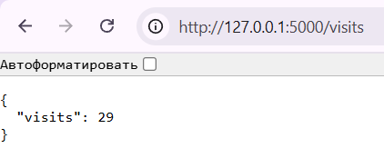

# Lab 12: Kubernetes ConfigMaps

## Task 1: Upgrade Application for Persistence

### Update the application

New endpoint `/visits` was added to the application. It displays the number of times the app is accessed.
Visits info is stored in `visits.txt` file, which is mounted to the container as a volume.



### Update the `docker-compose.yml`

```yaml
  app_python:
    image: anyarylova/app_python
    ports:
      - "5000:5000"
    networks:
      - loki
    volumes:
      - visits:/app_python
```

## Task 2: ConfigMap Implementation

### Create `config.json`

```json
  {
    "app_name": "Moscow Time",
    "version": "1.0"
  }
```

### Create `configMap`

```yaml
  apiVersion: v1
  kind: ConfigMap
  metadata:
    name: {{ include "app-python-helm.fullname" . }}-config
    labels:
      {{- include "app-python-helm.labels" . | nindent 4 }}
  data:
    config.json: |-
      {{ .Files.Get "files/config.json" | nindent 4 }}
```

### Update `deployment.yaml`

```yaml
  ...
          volumeMounts:
            - name: config-volume
              mountPath: /config.json
              subPath: config.json
      volumes:
        - name: config-volume
          configMap:
            name: {{ include "app-python-helm.fullname" . }}-config
```

### Install the updated Helm chart and verify success

```bash
  > kubectl get pods

  NAME                                         READY   STATUS      RESTARTS   AGE
  app-python-helm-5c5b7644d8-gfmcs             1/1     Running     0          2m35s
  app-python-helm-postinstall                  0/1     Completed   0          5h17m
  app-python-helm-preinstall                   0/1     Completed   0          5h17m
  helm-hooks-app-python-helm-6b964dfd8-s5ksb   1/1     Running     0          5h20m
  vault-0                                      1/1     Running     0          4h47m
  vault-agent-injector-66f45b5fd5-x6ckc        1/1     Running     0          4h47m
```

```bash
  > kubectl exec app-python-helm-5c5b7644d8-gfmcs -- cat /config.json

  {
    "app_name": "Moscow Time",
    "version": "1.0"
  }
```
