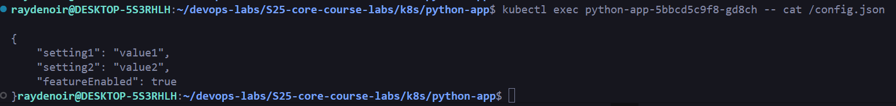

# Lab 12 Report

```bash
kubectl get pod

Output:
NAME                                     READY   STATUS      RESTARTS     AGE
python-app-5bbcd5c9f8-gd8ch              1/1     Running     0            2m11s
python-app-5bbcd5c9f8-lvsqm              1/1     Running     0            2m12s
python-app-5bbcd5c9f8-s8xvf              1/1     Running     0            2m9s
vault-0                                  1/1     Running     0            150m
vault-agent-injector-66f45b5fd5-6r77d    1/1     Running     0            150m
```

```bash
kubectl exec python-app-5bbcd5c9f8-gd8ch -- cat /config.json

Output:
{
    "setting1": "value1",
    "setting2": "value2",
    "featureEnabled": true
}
```
