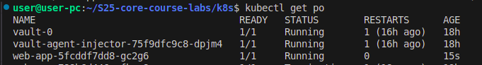
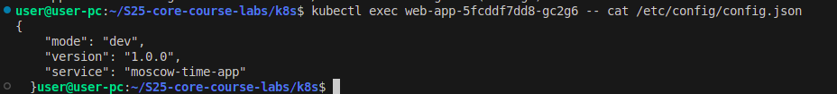

# Lab 12: ConfigMap Implementation

## Overview

This lab demonstrates how to use **Kubernetes ConfigMaps** to provide configuration data to containers in a Helm-managed deployment. We use a `config.json` file mounted into the pod using a ConfigMap created via Helm.

---

## Config File (`files/config.json`)

The `config.json` file was created inside the `files` folder and contains sample structured data in JSON format:

```json
{
    "mode": "dev",
    "version": "1.0.0",
    "service": "moscow-time-app"
  }
```

---

## ⚙️ Helm ConfigMap Template

In the Helm chart, a `ConfigMap` manifest was created at `templates/configmap.yaml` using `.Files.Get` to embed `config.json`:

```yaml
apiVersion: v1
kind: ConfigMap
metadata:
  name: app-config
data:
  config.json: |-
    {{ .Files.Get "files/config.json" | indent 4 }}
```

---

## Volume and VolumeMounts

The following section was added to the deployment in `deployment.yaml`:

### Volumes:

```yaml
volumes:
  - name: config-volume
    configMap:
      name: app-config
```

### VolumeMounts:

```yaml
volumeMounts:
  - name: config-volume
    mountPath: "/etc/config"
    readOnly: true
```

---

## Deployment Output

After deploying the updated chart:

```bash
helm upgrade --install web-app ./web-app
```

---

## Verification

### Get Pods

```bash
kubectl get po
```



### Check ConfigMap inside the Pod

```bash
kubectl exec web-app-5fcddf7dd8-gc2g6 -- cat /etc/config/config.json
```

