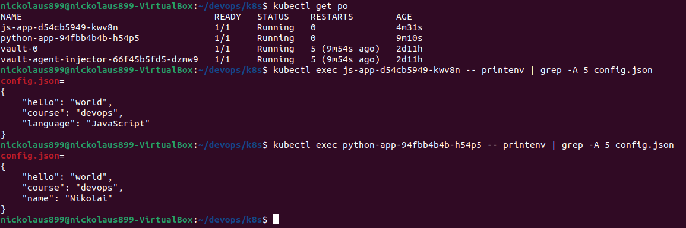

# Configmap

I have created `congig.json` and mounted it with the use of settings in `values.yaml`

```
$ kubectl get po
NAME                                    READY   STATUS    RESTARTS        AGE
python-app-85c9cf47bd-88p5b             1/1     Running   0               69s
vault-0                                 1/1     Running   2 (2m12s ago)   2d6h
vault-agent-injector-66f45b5fd5-dzmw9   1/1     Running   2 (2m13s ago)   2d6h
```

```
$ kubectl exec python-app-85c9cf47bd-88p5b -- cat /app/config.json

{
    "hello": "world",
    "course": "devops",
    "name": "Nikolai"
}
```

And as a screenshot:


### Now, the same for the bonus app:

```
$ kubectl get po
NAME                                    READY   STATUS    RESTARTS        AGE
js-app-5456cf8547-wh4rv                 1/1     Running   0               46s
python-app-85c9cf47bd-88p5b             1/1     Running   0               8m38s
vault-0                                 1/1     Running   2 (9m41s ago)   2d6h
vault-agent-injector-66f45b5fd5-dzmw9   1/1     Running   2 (9m42s ago)   2d6h
```

```
$ kubectl exec js-app-5456cf8547-wh4rv -- cat /app/config.json

{
    "hello": "world",
    "course": "devops",
    "language": "JavaScript"
}
```

# Configmap with ENV

I have used `envFrom` in the `deployments.yaml` to address configmap

```
$ kubectl get po
NAME                                    READY   STATUS    RESTARTS      AGE
js-app-5456cf8547-wh4rv                 1/1     Running   3 (96s ago)   4h44m
python-app-94fbb4b4b-h54p5              1/1     Running   0             52s
vault-0                                 1/1     Running   5 (96s ago)   2d11h
vault-agent-injector-66f45b5fd5-dzmw9   1/1     Running   5 (96s ago)   2d11h
```

```
$ kubectl exec python-app-94fbb4b4b-h54p5 -- printenv
PATH=/usr/local/bin:/usr/local/sbin:/usr/local/bin:/usr/sbin:/usr/bin:/sbin:/bin
HOSTNAME=python-app-94fbb4b4b-h54p5
config.json=
{
    "hello": "world",
    "course": "devops",
    "name": "Nikolai"
}
MY_PASSWORD=hello_world
HELLO=world
COURSE=devops
JS_APP_SERVICE_PORT=3000

...
```

As we can see, `config.json` is presented here


## Same steps for the bonus task

```
$ kubectl get po
NAME                                    READY   STATUS    RESTARTS        AGE
js-app-d54cb5949-kwv8n                  1/1     Running   0               20s
python-app-94fbb4b4b-h54p5              1/1     Running   0               4m59s
vault-0                                 1/1     Running   5 (5m43s ago)   2d11h
vault-agent-injector-66f45b5fd5-dzmw9   1/1     Running   5 (5m43s ago)   2d11h
```

```
$ kubectl exec js-app-d54cb5949-kwv8n -- printenv
PATH=/usr/local/sbin:/usr/local/bin:/usr/sbin:/usr/bin:/sbin:/bin
HOSTNAME=js-app-d54cb5949-kwv8n
config.json=
{
    "hello": "world",
    "course": "devops",
    "language": "JavaScript"
}
HELLO=world
COURSE=devops
KUBERNETES_PORT_443_TCP_PORT=443

...
```

### Result for `envFrom` in one screenshot



