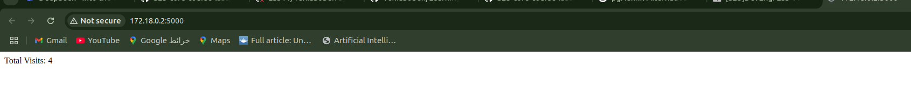
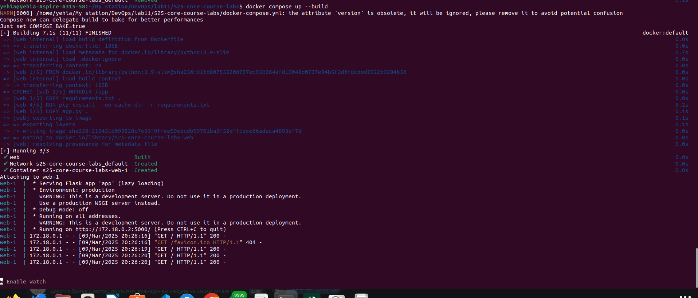
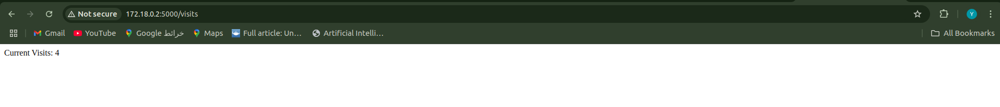
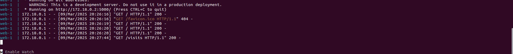
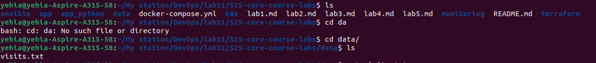
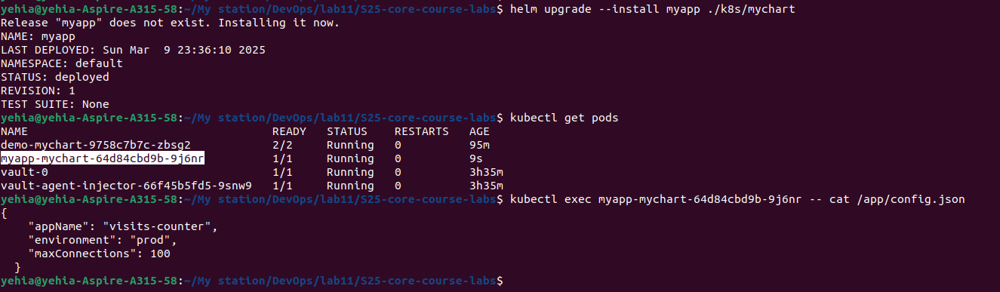
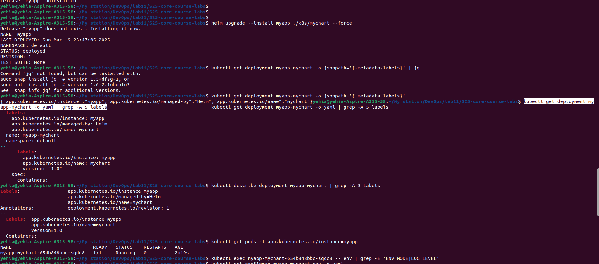
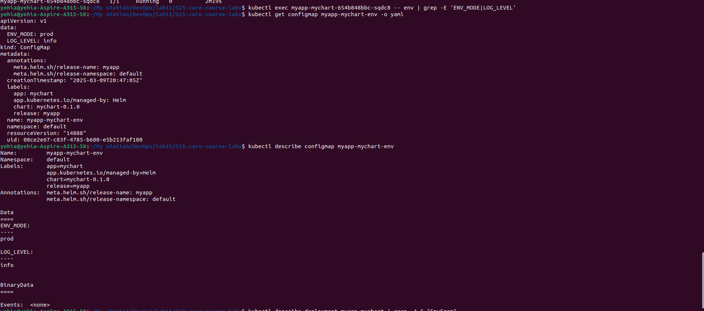

# Lab 12: Kubernetes ConfigMaps Documentation

## Task 1: Application Persistence Verification

### 1. Docker Compose Test
```bash
docker compose up --build
```
Expected Output:
```bash
web-1  | * Running on http://0.0.0.0:5000/
web-1  | 172.18.0.1 - GET /visits → 200 OK
```

### 2. Verify Visits File
```bash
cat ./data/visits.txt
```
Output:
```bash
5  # Number increments with each visit
```

## Task 2: ConfigMap Implementation

### 1. Pod List
```bash
kubectl get pods -l app.kubernetes.io/instance=myapp
```
Expected Output:
```bash
NAME                            READY   STATUS    RESTARTS   AGE
myapp-mychart-654b848bbc-sqdc8   1/1     Running   0          2m19s
```

### 2. ConfigMap Content in Pod
```bash
kubectl exec myapp-mychart-654b848bbc-sqdc8 -- cat /app/config.json
```
Expected Output:
```json
{
  "appName": "visits-counter",
  "environment": "prod",
  "maxConnections": 100
}
```

### 3. Required Files
```
k8s/
├── mychart/
│   ├── files/config.json
│   ├── templates/
│   │   ├── configmap.yaml
│   │   └── deployment.yaml (with volume mounts)
```

## Bonus Task: Environment Variables from ConfigMap

### 1. Verify Environment Variables
```bash
kubectl exec myapp-mychart-654b848bbc-sqdc8 -- env | grep -E 'ENV_MODE|LOG_LEVEL'
```
Expected Output:
```bash
ENV_MODE=prod
LOG_LEVEL=info
```

### 2. ConfigMap YAML
```yaml
# k8s/mychart/templates/configmap-env.yaml
apiVersion: v1
kind: ConfigMap
metadata:
  name: {{ include "mychart.fullname" . }}-env
data:
  ENV_MODE: "prod"
  LOG_LEVEL: "info"
```

### 3. Deployment Update
```yaml
# In deployment.yaml
envFrom:
  - configMapRef:
      name: {{ include "mychart.fullname" . }}-env
```









