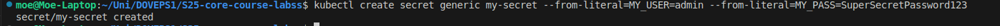

# Lab 12: Kubernetes ConfigMaps Documentation

## **Task 2: ConfigMap Implementation**

---

### **1️⃣ Created `config.json` file**

Located inside `k8s/files/` directory with the following contents:

```json
{
  "app_name": "PythonApp",
  "version": "1.0.0",
  "environment": "production"
}

```



### **2️⃣ Created ConfigMap Manifest**

Located inside `k8s/python-app/templates/configmap.yaml`:

```yaml
apiVersion: v1
kind: ConfigMap
metadata:
  name: python-app-config
  labels:
    app: python-app

data:
  config.json: |
    {
      "app_name": "PythonApp",
      "version": "1.0.0",
      "environment": "production"
    }

```


### **3️⃣ Updated `deployment.yaml` to Mount ConfigMap**

Located inside `k8s/python-app/templates/deployment.yaml`:

```yaml
volumeMounts:
  - name: config-volume
    mountPath: "/config"
    readOnly: true

volumes:
  - name: config-volume
    configMap:
      name: python-app-config

```


### **4️⃣ Installed the Updated Helm Chart**

Deployed using:

```bash
helm upgrade --install python-app ./k8s/python-app

```

### **5️⃣ Verified Deployment**

- Checked pod status:
    
    ```bash
    kubectl get po
    
    ```
    
- Retrieved the pod name and verified the ConfigMap:
**Output:**
    
    ```json
    {
      "app_name": "PythonApp",
      "version": "1.0.0",
      "environment": "production"
    }
    
    ```
    

---

##