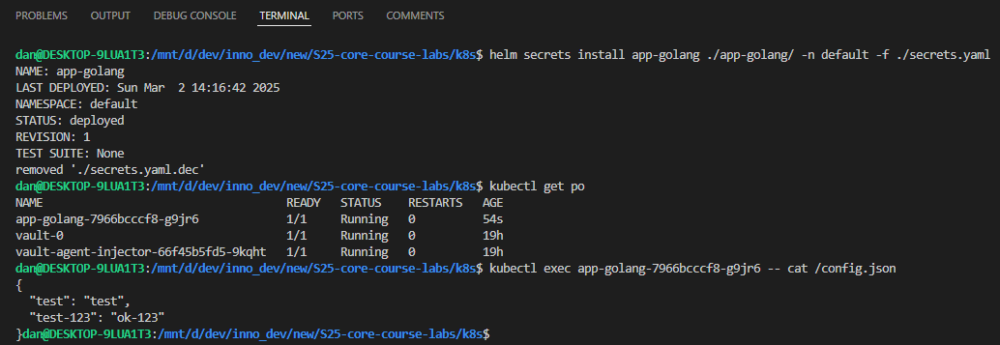
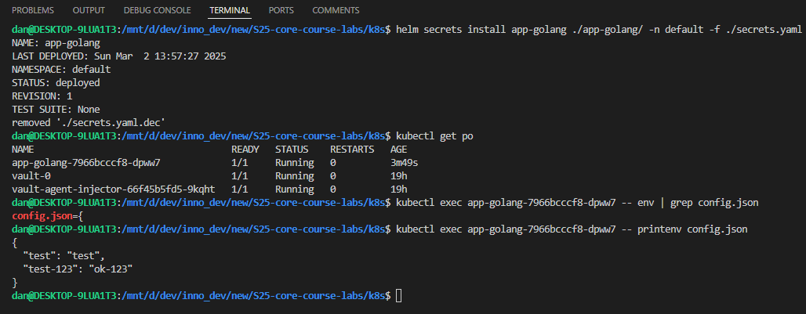

# Kubernetes ConfigMaps

## Task 2: ConfigMap Implementation

I decided to keep the same configuration (with secrets), so I did not change commands for installing.

Installation output:

```bash
> helm secrets install app-python ./app-python/ -n default -f ./secrets.yaml

NAME: app-python
LAST DEPLOYED: Sat Mar  1 23:41:31 2025
NAMESPACE: default
STATUS: deployed
REVISION: 1
TEST SUITE: None
removed './secrets.yaml.dec'
```

Output of `kubectl get po`:

```bash
> kubectl get po

NAME                                    READY   STATUS    RESTARTS   AGE
app-python-66b694cdd8-zd42k             1/1     Running   0          77s
vault-0                                 1/1     Running   0          5h19m
vault-agent-injector-66f45b5fd5-9kqht   1/1     Running   0          5h19m
```

Checking the ConfigMap inside the pod:

```bash
> kubectl exec app-python-66b694cdd8-zd42k -- cat /config.json

{
  "test": "test",
  "test-123": "ok-123"
}
```




Therefore, the configuration works correctly, and we can get configuration data from ConfigMap.
Hence, the task is accomplished.

## Bonus Task: ConfigMap via Environment Variables

### Upgrade Bonus App

I have implemented persistence logic in my bonus app (decided to keep the number of visits as in Python app) and updated README.md of both apps.
So, now it has a new `visits` endpoint that returns the number of visits.

### ConfigMap via Environment Variables

I have utilized ConfigMap via environment variables using `envFrom` property for both applications.

Let's see if the config is loaded inside my container:




The `config.json` is present in environment variables. Hence, the ConfigMap is utilized via environment variables.
Therefore, the bonus task is accomplished.
