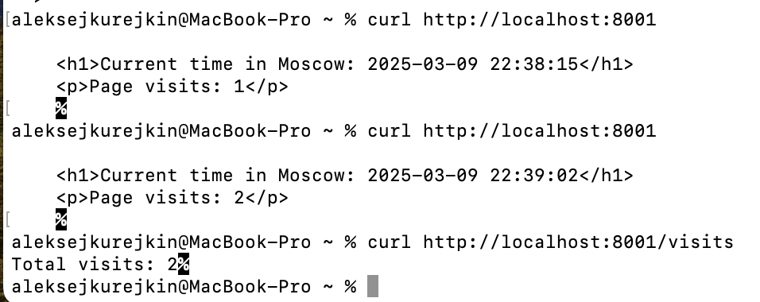

# Task 1:
## Testing new endpoint /visits:


# Task 2:
## Restarting helm after adding ConfigMap:
```bash
kubectl get po
```

## Output:
```bash
NAME                             READY   STATUS    RESTARTS   AGE
my-python-app-6b6fb4c67f-f89b7   1/1     Running   0          2m15s
```

## Checking the ConfigMap inside the pod:
```bash
kubectl exec my-python-app-6b6fb4c67f-f89b7 -- cat /app/config.json
```

## Output:
```bash
{
  "app_name": "Time App",
  "log_level": "info",
  "max_connections": 100
}
```
