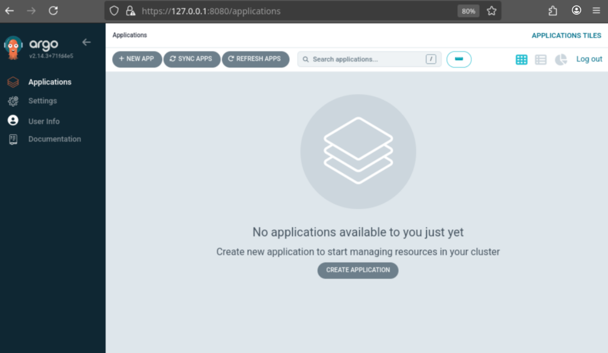
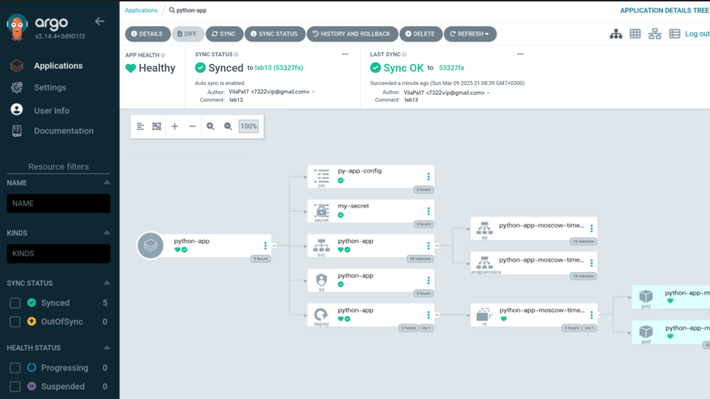
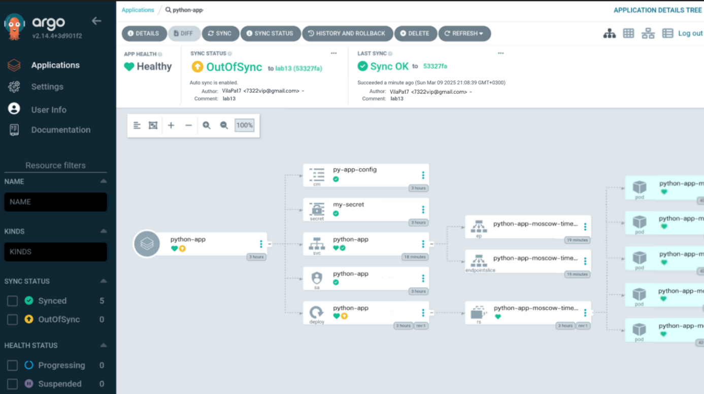
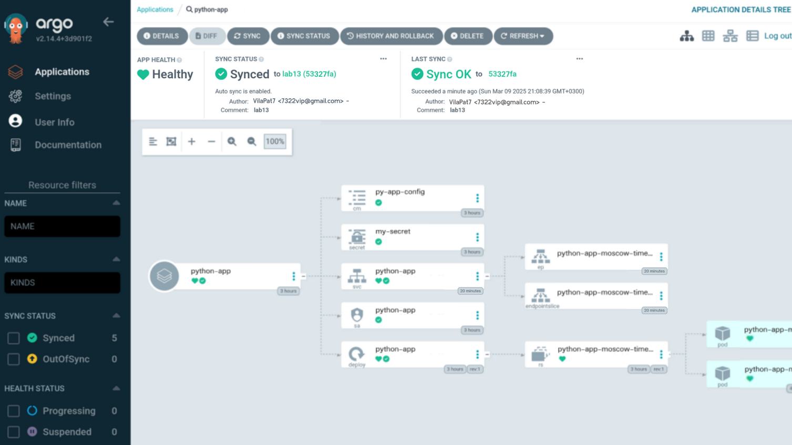

# ArgoCD for GitOps Deployment

## Task 1

Install **ArgoCD** (Commands and outputs):
```bash
➞ helm repo add argo https://argoproj.github.io/argo-helm
"argo" has been added to your repositories

➞ helm install argo argo/argo-cd --namespace argocd --create-namespace
NAME: argo
LAST DEPLOYED: Sun Mar  9 12:46:34 2025
NAMESPACE: argocd
STATUS: deployed
REVISION: 1
TEST SUITE: None
NOTES:
In order to access the server UI you have the following options:

1. kubectl port-forward service/argo-argocd-server -n argocd 8080:443

    and then open the browser on http://localhost:8080 and accept the certificate

2. enable ingress in the values file `server.ingress.enabled` and either
      - Add the annotation for ssl passthrough: https://argo-cd.readthedocs.io/en/stable/operator-manual/ingress/#option-1-ssl-passthrough
      - Set the `configs.params."server.insecure"` in the values file and terminate SSL at your ingress: https://argo-cd.readthedocs.io/en/stable/operator-manual/ingress/#option-2-multiple-ingress-objects-and-hosts


After reaching the UI the first time you can login with username: admin and the random password generated during the installation. You can find the password by running:

kubectl -n argocd get secret argocd-initial-admin-secret -o jsonpath="{.data.password}" | base64 -d

(You should delete the initial secret afterwards as suggested by the Getting Started Guide: https://argo-cd.readthedocs.io/en/stable/getting_started/#4-login-using-the-cli)

➞ kubectl wait --for=condition=ready pod -l app.kubernetes.io/name=argocd-server -n argocd --timeout=90s
pod/argo-argocd-server-435893hj78-6dwefd condition met
```

Install **ArgoCD CLI** (Commands and outputs):
```bash
➞ argocd version
argocd: v2.12.6
  BuildDate: unknown
  GitCommit: v2.12.6
  GitTreeState: clean
  GitTag: v2.12.6
  GoVersion: go1.23.2
  Compiler: gc
  Platform: linux/amd64
FATA[0000] Argo CD server address unspecified        
```

To access the **ArgoCD UI** use command:
```bash
kubectl port-forward service/argo-argocd-server -n argocd 8080:443 > /dev/null 2>&1 &
```

ArgoCD UI:


Configure Python App Sync (Command and output):
```bash
➞ kubectl apply -f ArgoCD/argocd-python-app.yaml
application.argoproj.io/moscow-time-py created

➞ argocd app sync argocd/python-app
TIMESTAMP                  GROUP     KIND           NAMESPACE    NAME                          STATUS    HEALTH  HOOK     MESSAGE
2025-9-03T16:32:14+03:00             ConfigMap      default      python-app-config             Synced                       
2025-9-03T16:32:14+03:00             Service        default      python-app-moscow-time-python Synced    Healthy              
2025-9-03T16:32:14+03:00             ServiceAccount default      internal-app                  Synced                       
2025-9-03T16:32:14+03:00   apps      Deployment     default      python-app                    Synced    Healthy              
2025-9-03T16:32:14+03:00   batch     Job            default      pre-install-hook                                 
2025-9-03T16:32:14+03:00   batch     Job            default      pre-install-hook              Running   Synced  PreSync  job.batch/pre-install-hook created
2025-9-03T16:32:14+03:00   batch     Job            default      pre-install-hook              Succeeded Synced  PreSync  Reached expected number of succeeded pods
2025-9-03T16:32:14+03:00             ServiceAccount default      internal-app                  Synced                     serviceaccount/internal-app unchanged
2025-9-03T16:32:14+03:00             ConfigMap      default      python-app-config             Synced                     configmap/python-app-config unchanged
2025-9-03T16:32:14+03:00             Service        default      python-app-moscow-time-python Synced    Healthy          service/python-app-moscow-time-python unchanged
2025-9-03T16:32:14+03:00   apps      Deployment     default      python-app                    Synced    Healthy          deployment.apps/python-app unchanged
2025-9-03T16:32:14+03:00   batch     Job            default      post-install-hook             Running   Synced  PostSync job.batch/post-install-hook created
2025-9-03T16:32:14+03:00   batch     Job            default      post-install-hook             Succeeded Synced  PostSync Reached expected number of succeeded pods

Name:               argocd/python-app
Project:            default
Server:             https://kubernetes.default.svc
Namespace:          default
URL:                https://argocd.example.com/applications/argocd/python-app
Source:
- Repo:             https://github.com/VilaPat7/S25-core-course-labs.git
  Target:           lab13
  Path:             k8s/app-python
  Helm Values:      values.yaml
SyncWindow:         Sync Allowed
Sync Policy:        Automated
Sync Status:        Synced to lab13 (27aceeb)
Health Status:      Healthy

Operation:          Sync
Sync Revision:      52343ynbfdjd456839hfjr73hdt4hhfi5hfj7hsd8
Phase:              Succeeded
Start:              2025-9-03 16:32:14 +0300 MSK
Finished:           2025-9-03 16:32:14 +0300 MSK
Duration:           53s
Message:            successfully synced (no more tasks)

GROUP  KIND            NAMESPACE  NAME                           STATUS     HEALTH   HOOK      MESSAGE
batch  Job             default    pre-install-hook               Succeeded           PreSync   Reached expected number of succeeded pods
       ServiceAccount  default    internal-app                   Synced                        serviceaccount/internal-app unchanged
       ConfigMap       default    python-app-config              Synced                        configmap/python-app-config unchanged
       Service         default    python-app-moscow-time-python  Synced     Healthy            service/python-app-moscow-time-python unchanged
apps   Deployment      default    python-app                     Synced     Healthy            deployment.apps/python-app unchanged
batch  Job             default    post-install-hook              Succeeded           PostSync  Reached expected number of succeeded pods
```

ArgoCD UI:


## Task 2

### Test 1: Manual Override of Replica Count

1) Before changing replicas (Synced & Healthy)


2) After increasing replicas to 5 (OutOfSync)


3) ArgoCD auto-reverts to 3 (Synced again) (after increasing to 5):


### Test 2: Delete a Pod (Replica)

1) Output before **pod deletion** (Command output):
```bash
NAME                                            READY   STATUS    RESTARTS   AGE
python-app-moscow-time-python-7354gfh26-j8fg3   1/1     Running   0          32m
python-app-moscow-time-python-7354gfh26-65ssh   1/1     Running   0          32m
```

2) Output after **pod deletion** (Command output):
```bash
NAME                                            READY   STATUS    RESTARTS   AGE
python-app-moscow-time-python-7354gfh26-j8fg3   1/1     Running   0          28s
python-app-moscow-time-python-7354gfh26-65ssh   1/1     Running   0          28s
```

ArgoCD UI:


- **Configuration Drift**:  
  - Occurs when manual changes differ from the state defined in Git.  
  - ArgoCD detects this, marks the application as **OutOfSync**, and automatically reverts the change if auto-sync is enabled.  

- **Runtime Events**:  
  - Temporary changes do not affect the desired state.  
  - Kubernetes self-heals by recreating pods.  
  - ArgoCD does not interfere, as the overall configuration remains unchanged.
