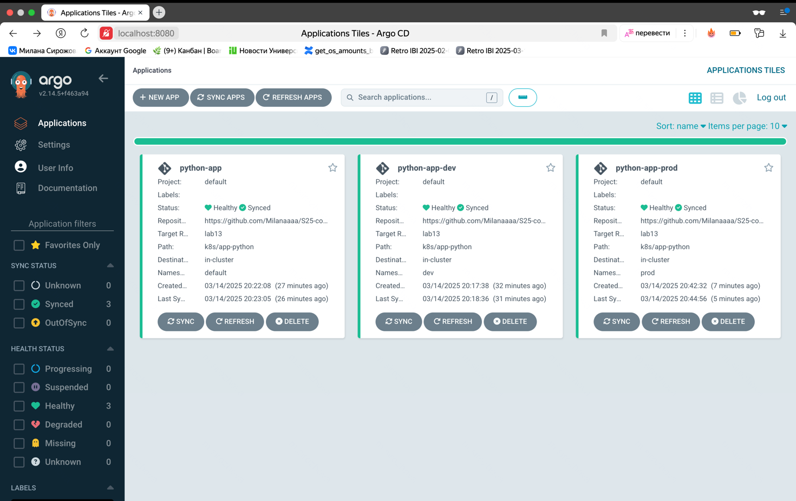

# Deploy and Configure ArgoCD

## Task 1

Check `sync` for the running app:
```
nikita@LAPTOP-DOBKKTS4:~/S25-core-course-labs/k8s$ argocd app sync python-app
TIMESTAMP  GROUP        KIND   NAMESPACE                  NAME    STATUS   HEALTH        HOOK  MESSAGE
2025-03-13T23:44:44+03:00         ServiceAccount     default          internal-app   Running   Synced              serviceaccount/internal-app created
2025-03-13T23:44:44+03:00            Service         default            python-app   Running   Synced              service/python-app created
2025-03-13T23:44:44+03:00   apps  Deployment         default            python-app   Running   Synced              deployment.apps/python-app created

Name:               argocd/python-app
Project:            default
Server:             https://kubernetes.default.svc
Namespace:          default
URL:                https://argocd.example.com/applications/python-app
Source:
- Repo:             https://github.com/Dyddxd/S25-core-course-labs.git
  Target:           lab13
  Path:             k8s/python-app
  Helm Values:      values.yaml
SyncWindow:         Sync Allowed
Sync Policy:        Automated
Sync Status:        Unknown
Health Status:      Progressing

Operation:          Sync
Sync Revision:      3e913b41adf593aad2086eb4f4d2a1f528629732
Phase:              Succeeded
Start:              2025-03-13 23:44:44 +0300 MSK
Finished:           2025-03-13 23:44:44 +0300 MSK
Duration:           0s
Message:            successfully synced (all tasks run)

GROUP  KIND            NAMESPACE  NAME          STATUS   HEALTH       HOOK  MESSAGE
       ServiceAccount  default    internal-app  Unknown                     serviceaccount/internal-app created
       Service         default    python-app    Unknown  Healthy            service/python-app created
apps   Deployment      default    python-app    Unknown  Progressing        deployment.apps/python-app created
```

```
Name:               argocd/python-app
Project:            default
Server:             https://kubernetes.default.svc
Namespace:          default
URL:                https://argocd.example.com/applications/python-app
Source:
- Repo:             https://github.com/Dyddxd/S25-core-course-labs.git
  Target:           lab13
  Path:             k8s/python-app
  Helm Values:      values.yaml
SyncWindow:         Sync Allowed
Sync Policy:        Automated
Sync Status:        Synced to lab13 (0b20bd1)
Health Status:      Healthy

GROUP  KIND            NAMESPACE  NAME          STATUS  HEALTH   HOOK  MESSAGE
       ServiceAccount  default    internal-app  Synced                 serviceaccount/internal-app created
       Service         default    python-app    Synced  Healthy        service/python-app created
apps   Deployment      default    python-app    Synced  Healthy        deployment.apps/python-app created
```


## Task 2

