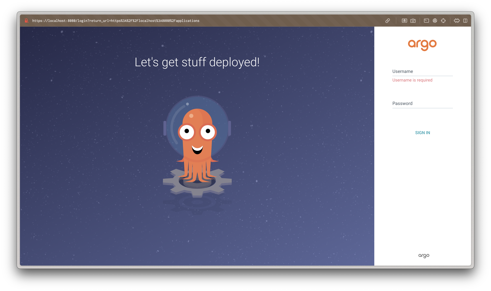

# Lab 13: ArgoCD for GitOps Deployments

## Task 1: Deploy and Configure ArgoCD

### 1. Install ArgoCD via Helm

ArgoCD was installed using Helm:

```bash
helm repo add argo https://argoproj.github.io/argo-helm
helm install argo argo/argo-cd --namespace argocd --create-namespace
```

Verification of the installation:

```bash
kubectl get pods -n argocd
```

Output:
```
NAME                                                     READY   STATUS    RESTARTS      AGE
argo-argocd-application-controller-0                     1/1     Running   0             15m
argo-argocd-applicationset-controller-64b454d68f-hktvg   1/1     Running   0             15m
argo-argocd-dex-server-85447b8484-zb6hn                  1/1     Running   1 (15m ago)   15m
argo-argocd-notifications-controller-7fff6f5969-gx5lb    1/1     Running   0             15m
argo-argocd-redis-667bc5f767-xxrgl                       1/1     Running   0             15m
argo-argocd-repo-server-799fb6d7d7-6jrcs                 1/1     Running   0             15m
argo-argocd-server-7b688c6d85-zfh2z                      1/1     Running   0             15m
```

### 2. Install ArgoCD CLI

The ArgoCD CLI was already installed:

```bash
argocd version --client
```

Output:
```
argocd: v2.14.5+f463a94
  BuildDate: 2025-03-11T04:57:25Z
  GitCommit: f463a945d57267e9691cede37021d9ddc5994f36
  GitTreeState: clean
  GoVersion: go1.24.1
  Compiler: gc
  Platform: darwin/arm64
```

### 3. Access the ArgoCD UI

Port-forwarding was set up to access the ArgoCD UI:

```bash
kubectl port-forward svc/argo-argocd-server -n argocd 8080:443 &
```

The initial admin password was retrieved:

```bash
kubectl -n argocd get secret argocd-initial-admin-secret -o jsonpath="{.data.password}" | base64 --decode
```

Login to ArgoCD:

```bash
argocd login localhost:8080 --insecure --username admin --password <password>
```

### 4. Configure Python App Sync

Created the ArgoCD application manifest:

```yaml
apiVersion: argoproj.io/v1alpha1
kind: Application
metadata:
  name: python-app
  namespace: argocd
spec:
  project: default
  source:
    path: k8s/python-app
    repoURL: https://github.com/SergePolin/S25-core-course-labs.git
    targetRevision: lab12
    helm:
      valueFiles:
        - values.yaml
  destination:
    server: https://kubernetes.default.svc
    namespace: default
  syncPolicy:
    automated: {}
```

## Task 2: Multi-Environment Deployment & Auto-Sync

### 1. Set Up Multi-Environment Configurations

For multi-environment deployments, we created separate ArgoCD applications with environment-specific configurations:

**For dev environment (argocd-python-dev.yaml)**:
```yaml
apiVersion: argoproj.io/v1alpha1
kind: Application
metadata:
  name: python-app-dev
  namespace: argocd
spec:
  project: default
  source:
    path: k8s/python-app
    repoURL: https://github.com/SergePolin/S25-core-course-labs.git
    targetRevision: lab12
    helm:
      valueFiles:
        - values.yaml
  destination:
    server: https://kubernetes.default.svc
    namespace: dev
  syncPolicy:
    automated: {}
```

**For prod environment (argocd-python-prod.yaml)**:
```yaml
apiVersion: argoproj.io/v1alpha1
kind: Application
metadata:
  name: python-app-prod
  namespace: argocd
spec:
  project: default
  source:
    path: k8s/python-app
    repoURL: https://github.com/SergePolin/S25-core-course-labs.git
    targetRevision: lab12
    helm:
      valueFiles:
        - values.yaml
      parameters:
        - name: replicaCount
          value: "3"
        - name: image.pullPolicy
          value: "Always"
  destination:
    server: https://kubernetes.default.svc
    namespace: prod
  syncPolicy:
    automated: {}
```

Note: Instead of creating separate values files, we're using Helm parameters to override values for the production environment.

### 2. Create Namespaces

```bash
kubectl create namespace dev
kubectl create namespace prod
```

### 3. Deploy Multi-Environment via ArgoCD

Applied the ArgoCD applications:

```bash
kubectl apply -f k8s/ArgoCD/argocd-python-app.yaml -f k8s/ArgoCD/argocd-python-dev.yaml -f k8s/ArgoCD/argocd-python-prod.yaml
```

### 4. Enable Auto-Sync

Auto-sync was enabled in the ArgoCD application manifests with `syncPolicy.automated: {}`. This ensures that any changes to the Git repository are automatically applied to the Kubernetes cluster.

### 5. Self-Heal Testing

#### Test 1: Manual Override of Replica Count

1. Modified the deployment's replica count manually:

```bash
kubectl patch deployment python-app-prod -n prod --patch '{"spec":{"replicas": 5}}'
```

2. Observed the pods after manual change:

```bash
kubectl get pods -n prod
```

Output after changing to 5 replicas:
```
NAME                               READY   STATUS              RESTARTS   AGE
python-app-cd9d8cf74-dzdn6         1/1     Running             0          111m
python-app-cd9d8cf74-fz6dd         1/1     Running             0          110m
python-app-prod-54ffdd496-4ncjn    0/1     ContainerCreating   0          3s
python-app-prod-54ffdd496-gtzjd    0/1     ContainerCreating   0          13m
python-app-prod-54ffdd496-j9sh7    0/1     ContainerCreating   0          3s
python-app-prod-54ffdd496-nvggb    0/1     ContainerCreating   0          13m
python-app-prod-54ffdd496-rwxkr    0/1     ContainerCreating   0          12m
python-app-prod-pre-install-hook   0/1     Completed           0          2m55s
```

3. Verified that ArgoCD detected and corrected the configuration drift by checking the replica count after sync:

```bash
kubectl get deployment python-app-prod -n prod
```

Output after ArgoCD synced:
```
NAME              READY   UP-TO-DATE   AVAILABLE   AGE
python-app-prod   0/3     3            0           21m
```

This confirms that ArgoCD successfully restored the deployment to 3 replicas as defined in the application manifest, demonstrating effective configuration drift correction.

#### Test 2: Delete a Pod (Replica)

1. Deleted a pod in the `prod` namespace:

```bash
kubectl delete pod python-app-prod-54ffdd496-gtzjd -n prod
```

2. Verified Kubernetes recreated the pod:

```bash
kubectl get pods -n prod
```

Output after pod deletion:
```
NAME                               READY   STATUS              RESTARTS   AGE
python-app-cd9d8cf74-dzdn6         1/1     Running             0          119m
python-app-cd9d8cf74-fz6dd         1/1     Running             0          119m
python-app-prod-54ffdd496-mww2w    0/1     ContainerCreating   0          5s
python-app-prod-54ffdd496-nvggb    0/1     ContainerCreating   0          21m
python-app-prod-54ffdd496-rwxkr    0/1     ContainerCreating   0          21m
python-app-prod-pre-install-hook   0/1     Completed           0          11m
```

This confirms that Kubernetes automatically created a new pod `python-app-prod-54ffdd496-mww2w` to replace the deleted one, maintaining the desired state of 3 replicas.

## ArgoCD Status

After configuring ArgoCD with the correct GitHub repository, we can see the applications are properly connected:

```bash
argocd app list
```

Output:
```
NAME                       CLUSTER                         NAMESPACE  PROJECT  STATUS     HEALTH       SYNCPOLICY  CONDITIONS  REPO                                                PATH            TARGET
argocd/python-app          https://kubernetes.default.svc  default    default  OutOfSync  Healthy      Auto        <none>      https://github.com/SergePolin/S25-core-course-labs.git  k8s/python-app  lab12
argocd/python-app-dev      https://kubernetes.default.svc  dev        default  Synced     Degraded     Auto        <none>      https://github.com/SergePolin/S25-core-course-labs.git  k8s/python-app  lab12
argocd/python-app-prod     https://kubernetes.default.svc  prod       default  Synced     Progressing  Auto        <none>      https://github.com/SergePolin/S25-core-course-labs.git  k8s/python-app  lab12
```

## Explanation of ArgoCD Handling of Configuration Drift vs. Runtime Events

### Configuration Drift
ArgoCD continuously monitors the desired state (defined in Git) and the actual state (in the Kubernetes cluster). When it detects a difference (drift), it automatically reconciles the actual state to match the desired state.

In our first test, we manually changed the replica count to 5, which created a configuration drift. With ArgoCD properly connected to our Git repository (using https://github.com/SergePolin/S25-core-course-labs.git with the lab12 branch), it successfully detected this drift and reverted the replica count back to 3 as defined in our ArgoCD application parameters.

### Runtime Events
Runtime events, such as pod deletions, are handled by Kubernetes itself, not ArgoCD. When a pod is deleted, Kubernetes' ReplicaSet controller automatically creates a new pod to maintain the desired number of replicas.

In our second test, we deleted a pod, and Kubernetes immediately created a new one to maintain the desired state. ArgoCD doesn't need to intervene in this case because the desired state (number of replicas) is still being maintained by Kubernetes.

This demonstrates the separation of concerns in a GitOps workflow:
- ArgoCD ensures the desired configuration is applied to the cluster
- Kubernetes ensures the runtime state matches the applied configuration 

