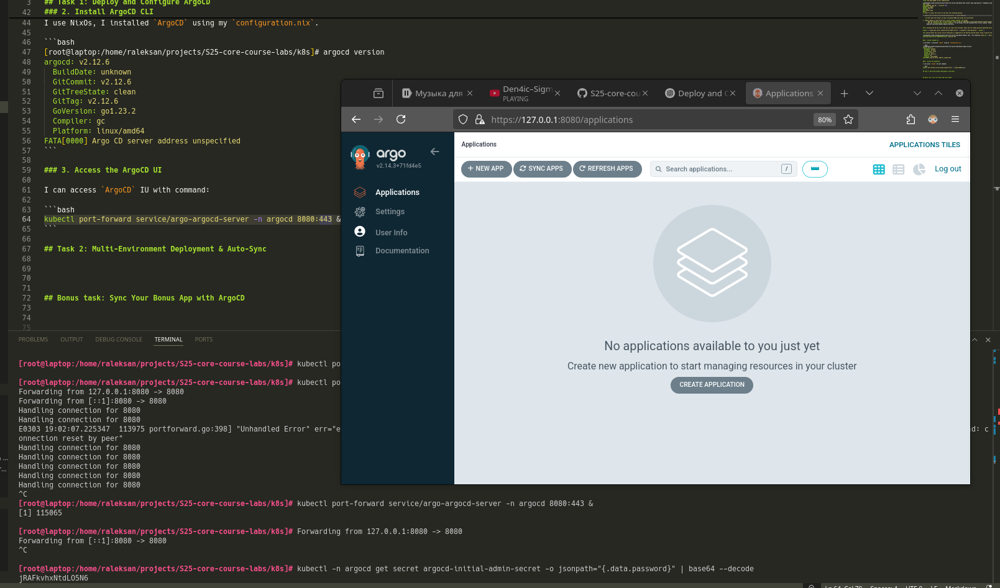
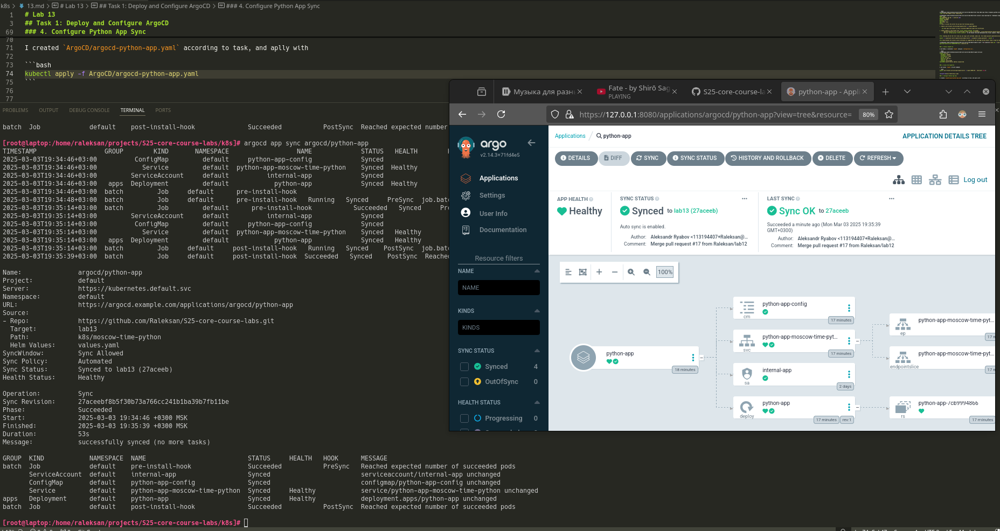
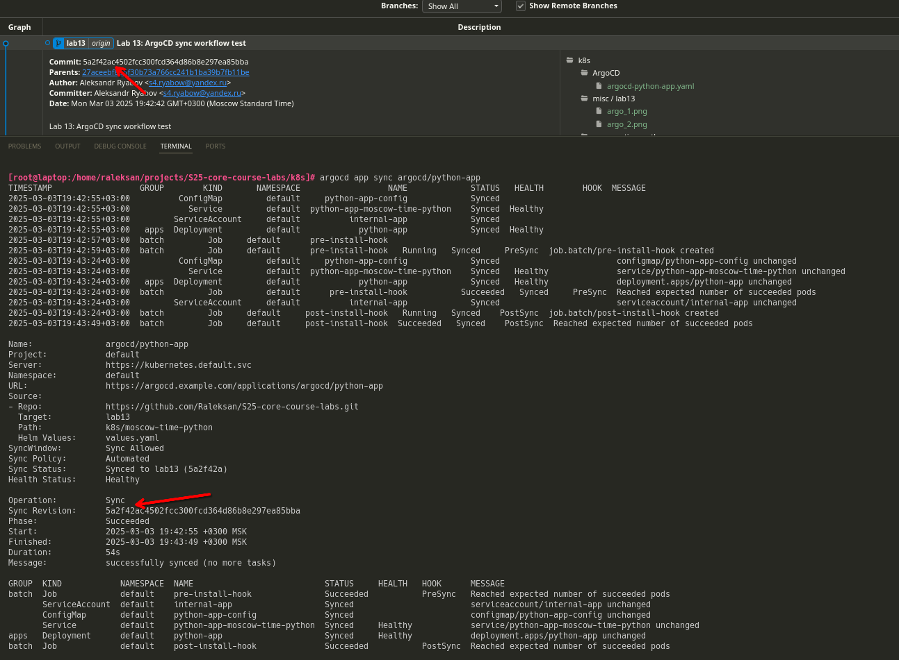
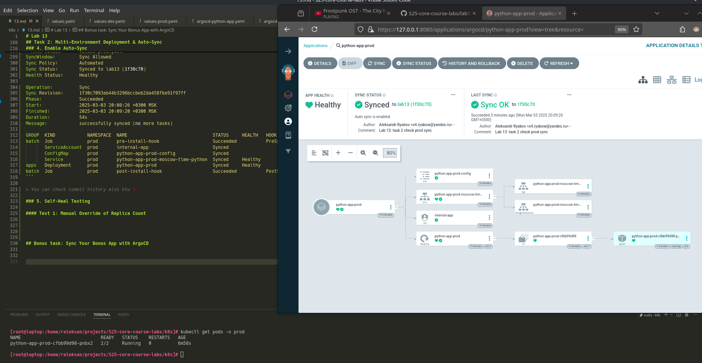
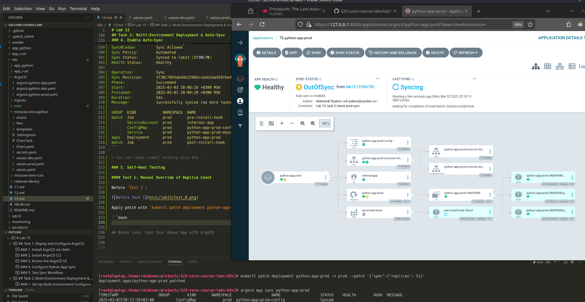
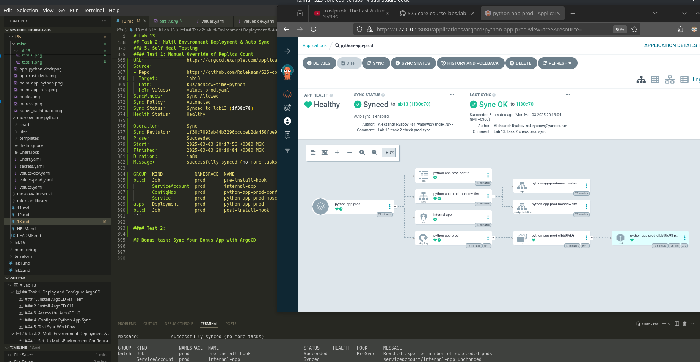
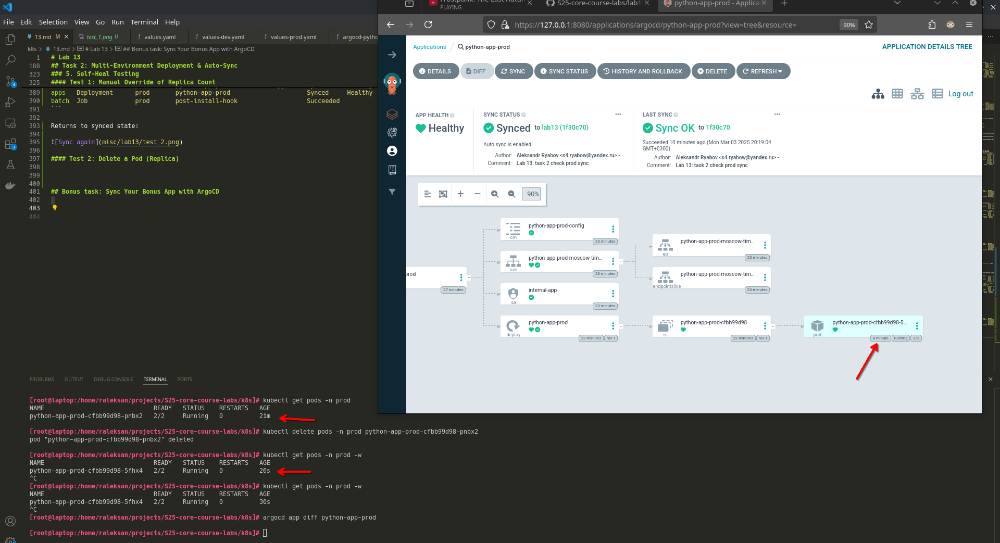
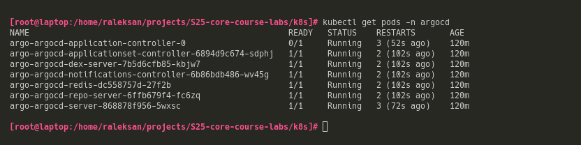
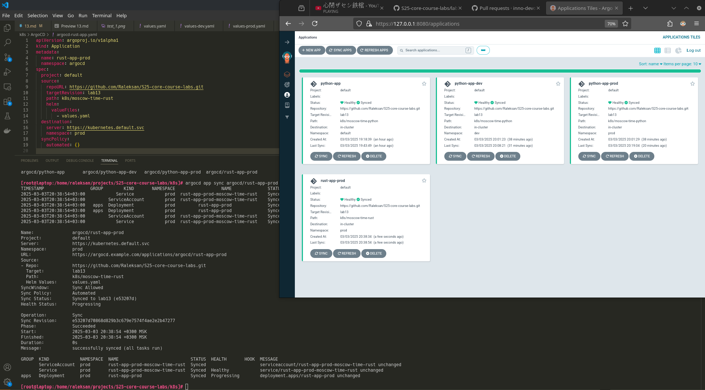
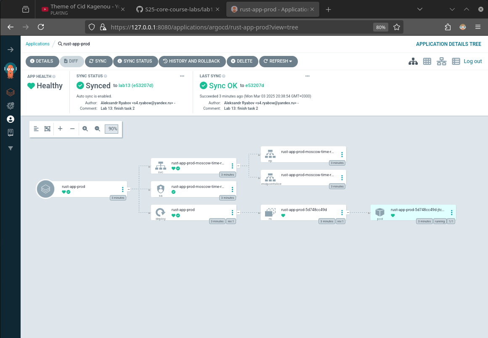

# Lab 13

## Task 1: Deploy and Configure ArgoCD

### 1. Install ArgoCD via Helm

Installation log:

```bash
[root@laptop:/home/raleksan/projects/S25-core-course-labs/k8s]# helm repo add argo https://argoproj.github.io/argo-helm
"argo" has been added to your repositories

[root@laptop:/home/raleksan/projects/S25-core-course-labs/k8s]# helm install argo argo/argo-cd --namespace argocd --create-namespace
NAME: argo
LAST DEPLOYED: Mon Mar  3 18:54:44 2025
NAMESPACE: argocd
STATUS: deployed
REVISION: 1
TEST SUITE: None
NOTES:
In order to access the server UI you have the following options:

1. kubectl port-forward service/argo-argocd-server -n argocd 8080:443

    and then open the browser on http://localhost:8080 and accept the certificate

2. enable ingress in the values file `server.ingress.enabled` and either
      - Add the annotation for ssl passthrough: https://argo-cd.readthedocs.io/en/stable/operator-manual/ingress/#option-1-ssl-passthrough
      - Set the `configs.params."server.insecure"` in the values file and terminate SSL at your ingress: https://argo-cd.readthedocs.io/en/stable/operator-manual/ingress/#option-2-multiple-ingress-objects-and-hosts


After reaching the UI the first time you can login with username: admin and the random password generated during the installation. You can find the password by running:

kubectl -n argocd get secret argocd-initial-admin-secret -o jsonpath="{.data.password}" | base64 -d

(You should delete the initial secret afterwards as suggested by the Getting Started Guide: https://argo-cd.readthedocs.io/en/stable/getting_started/#4-login-using-the-cli)

[root@laptop:/home/raleksan/projects/S25-core-course-labs/k8s]# kubectl wait --for=condition=ready pod -l app.kubernetes.io/name=argocd-server -n argocd --timeout=90s
pod/argo-argocd-server-868878f956-5wxsc condition met
```

### 2. Install ArgoCD CLI

I use NixOs, I installed `ArgoCD` using my `configuration.nix`.

```bash
[root@laptop:/home/raleksan/projects/S25-core-course-labs/k8s]# argocd version
argocd: v2.12.6
  BuildDate: unknown
  GitCommit: v2.12.6
  GitTreeState: clean
  GitTag: v2.12.6
  GoVersion: go1.23.2
  Compiler: gc
  Platform: linux/amd64
FATA[0000] Argo CD server address unspecified        
```

### 3. Access the ArgoCD UI

I can access `ArgoCD` IU with command:

```bash
kubectl port-forward service/argo-argocd-server -n argocd 8080:443 > /dev/null 2>&1 &
```



### 4. Configure Python App Sync

I created `ArgoCD/argocd-python-app.yaml` according to task, and aplly with 

```bash
kubectl apply -f ArgoCD/argocd-python-app.yaml
```

Verify success:

```bash
[root@laptop:/home/raleksan/projects/S25-core-course-labs/k8s]# argocd app sync argocd/python-app 
TIMESTAMP                  GROUP        KIND       NAMESPACE                  NAME             STATUS   HEALTH        HOOK  MESSAGE
2025-03-03T19:34:46+03:00          ConfigMap         default     python-app-config             Synced                       
2025-03-03T19:34:46+03:00            Service         default  python-app-moscow-time-python    Synced  Healthy              
2025-03-03T19:34:46+03:00         ServiceAccount     default          internal-app             Synced                       
2025-03-03T19:34:46+03:00   apps  Deployment         default            python-app             Synced  Healthy              
2025-03-03T19:34:46+03:00  batch         Job     default      pre-install-hook                                 
2025-03-03T19:34:48+03:00  batch         Job     default      pre-install-hook   Running   Synced     PreSync  job.batch/pre-install-hook created
2025-03-03T19:35:14+03:00  batch         Job         default      pre-install-hook           Succeeded   Synced     PreSync  Reached expected number of succeeded pods
2025-03-03T19:35:14+03:00         ServiceAccount     default          internal-app             Synced                        serviceaccount/internal-app unchanged
2025-03-03T19:35:14+03:00          ConfigMap         default     python-app-config             Synced                        configmap/python-app-config unchanged
2025-03-03T19:35:14+03:00            Service         default  python-app-moscow-time-python    Synced   Healthy              service/python-app-moscow-time-python unchanged
2025-03-03T19:35:14+03:00   apps  Deployment         default            python-app             Synced   Healthy              deployment.apps/python-app unchanged
2025-03-03T19:35:14+03:00  batch         Job     default     post-install-hook   Running   Synced    PostSync  job.batch/post-install-hook created
2025-03-03T19:35:39+03:00  batch         Job     default     post-install-hook  Succeeded   Synced    PostSync  Reached expected number of succeeded pods

Name:               argocd/python-app
Project:            default
Server:             https://kubernetes.default.svc
Namespace:          default
URL:                https://argocd.example.com/applications/argocd/python-app
Source:
- Repo:             https://github.com/Raleksan/S25-core-course-labs.git
  Target:           lab13
  Path:             k8s/moscow-time-python
  Helm Values:      values.yaml
SyncWindow:         Sync Allowed
Sync Policy:        Automated
Sync Status:        Synced to lab13 (27aceeb)
Health Status:      Healthy

Operation:          Sync
Sync Revision:      27aceebf8b5f30b73a766cc241b1ba39b7fb11be
Phase:              Succeeded
Start:              2025-03-03 19:34:46 +0300 MSK
Finished:           2025-03-03 19:35:39 +0300 MSK
Duration:           53s
Message:            successfully synced (no more tasks)

GROUP  KIND            NAMESPACE  NAME                           STATUS     HEALTH   HOOK      MESSAGE
batch  Job             default    pre-install-hook               Succeeded           PreSync   Reached expected number of succeeded pods
       ServiceAccount  default    internal-app                   Synced                        serviceaccount/internal-app unchanged
       ConfigMap       default    python-app-config              Synced                        configmap/python-app-config unchanged
       Service         default    python-app-moscow-time-python  Synced     Healthy            service/python-app-moscow-time-python unchanged
apps   Deployment      default    python-app                     Synced     Healthy            deployment.apps/python-app unchanged
batch  Job             default    post-install-hook              Succeeded           PostSync  Reached expected number of succeeded pods
```




### 5. Test Sync Workflow

To test `Sync Workflow` I updated `replicaCount` parameter in `moscow-time-python` up to '3'.

After I push commit with hash `5a2f42ac` and run command `argocd app sync argocd/python-app`

```bash
[root@laptop:/home/raleksan/projects/S25-core-course-labs/k8s]# argocd app sync argocd/python-app 
TIMESTAMP                  GROUP        KIND       NAMESPACE                  NAME             STATUS   HEALTH        HOOK  MESSAGE
2025-03-03T19:42:55+03:00          ConfigMap         default     python-app-config             Synced                       
2025-03-03T19:42:55+03:00            Service         default  python-app-moscow-time-python    Synced  Healthy              
2025-03-03T19:42:55+03:00         ServiceAccount     default          internal-app             Synced                       
2025-03-03T19:42:55+03:00   apps  Deployment         default            python-app             Synced  Healthy              
2025-03-03T19:42:57+03:00  batch         Job     default      pre-install-hook                                 
2025-03-03T19:42:59+03:00  batch         Job     default      pre-install-hook   Running   Synced     PreSync  job.batch/pre-install-hook created
2025-03-03T19:43:24+03:00          ConfigMap         default     python-app-config             Synced                        configmap/python-app-config unchanged
2025-03-03T19:43:24+03:00            Service         default  python-app-moscow-time-python    Synced   Healthy              service/python-app-moscow-time-python unchanged
2025-03-03T19:43:24+03:00   apps  Deployment         default            python-app             Synced   Healthy              deployment.apps/python-app unchanged
2025-03-03T19:43:24+03:00  batch         Job         default      pre-install-hook           Succeeded   Synced     PreSync  Reached expected number of succeeded pods
2025-03-03T19:43:24+03:00         ServiceAccount     default          internal-app             Synced                        serviceaccount/internal-app unchanged
2025-03-03T19:43:24+03:00  batch         Job     default     post-install-hook   Running   Synced    PostSync  job.batch/post-install-hook created
2025-03-03T19:43:49+03:00  batch         Job     default     post-install-hook  Succeeded   Synced    PostSync  Reached expected number of succeeded pods

Name:               argocd/python-app
Project:            default
Server:             https://kubernetes.default.svc
Namespace:          default
URL:                https://argocd.example.com/applications/argocd/python-app
Source:
- Repo:             https://github.com/Raleksan/S25-core-course-labs.git
  Target:           lab13
  Path:             k8s/moscow-time-python
  Helm Values:      values.yaml
SyncWindow:         Sync Allowed
Sync Policy:        Automated
Sync Status:        Synced to lab13 (5a2f42a)
Health Status:      Healthy

Operation:          Sync
Sync Revision:      5a2f42ac4502fcc300fcd364d86b8e297ea85bba
Phase:              Succeeded
Start:              2025-03-03 19:42:55 +0300 MSK
Finished:           2025-03-03 19:43:49 +0300 MSK
Duration:           54s
Message:            successfully synced (no more tasks)

GROUP  KIND            NAMESPACE  NAME                           STATUS     HEALTH   HOOK      MESSAGE
batch  Job             default    pre-install-hook               Succeeded           PreSync   Reached expected number of succeeded pods
       ServiceAccount  default    internal-app                   Synced                        serviceaccount/internal-app unchanged
       ConfigMap       default    python-app-config              Synced                        configmap/python-app-config unchanged
       Service         default    python-app-moscow-time-python  Synced     Healthy            service/python-app-moscow-time-python unchanged
apps   Deployment      default    python-app                     Synced     Healthy            deployment.apps/python-app unchanged
batch  Job             default    post-install-hook              Succeeded           PostSync  Reached expected number of succeeded pods
```



## Task 2: Multi-Environment Deployment & Auto-Sync

### 1. Set Up Multi-Environment Configurations

I added `values-dev.yaml` with `replicaCount` equal to '2' and `values-prod.yaml` with `replicaCount` equal to '4' for `k8s/moscow-time-python`.

### 2. Create Namespaces

```bash
[root@laptop:/home/raleksan/projects/S25-core-course-labs/k8s]# kubectl create namespace dev
namespace/dev created

[root@laptop:/home/raleksan/projects/S25-core-course-labs/k8s]# kubectl create namespace prod
namespace/prod created
```

### 3. Deploy Multi-Environment via ArgoCD

I created `argocd-python-dev.yaml` and `argocd-python-prod.yaml` which differs in service name, destination namespace, and Helm value file.

```bash
[root@laptop:/home/raleksan/projects/S25-core-course-labs/k8s]# kubectl apply -f ArgoCD/argocd-python-dev.yaml
application.argoproj.io/python-app-dev created

[root@laptop:/home/raleksan/projects/S25-core-course-labs/k8s]# kubectl apply -f ArgoCD/argocd-python-prod.yaml
application.argoproj.io/python-app-prod created
```

### 4. Enable Auto-Sync

Enable automatic Sync for `prod`:

- Sync before commit (currect commit `e3f9ce004e143512f2ef2f88e4b520379e0440f4`):

```bash
[root@laptop:/home/raleksan/projects/S25-core-course-labs/k8s]# argocd app sync argocd/python-app-prod 
TIMESTAMP  GROUP        KIND   NAMESPACE                  NAME    STATUS   HEALTH        HOOK  MESSAGE
2025-03-03T20:04:57+03:00  batch         Job        prod      pre-install-hook   Running   Synced     PreSync  job.batch/pre-install-hook created
2025-03-03T20:05:29+03:00  batch         Job            prod      pre-install-hook                Succeeded   Synced     PreSync  Reached expected number of succeeded pods
2025-03-03T20:05:29+03:00         ServiceAccount        prod          internal-app                 Running    Synced              serviceaccount/internal-app created
2025-03-03T20:05:29+03:00          ConfigMap            prod  python-app-prod-config               Running    Synced              configmap/python-app-prod-config created
2025-03-03T20:05:29+03:00            Service            prod  python-app-prod-moscow-time-python   Running    Synced              service/python-app-prod-moscow-time-python created
2025-03-03T20:05:29+03:00   apps  Deployment            prod       python-app-prod                 Running    Synced              deployment.apps/python-app-prod created
2025-03-03T20:05:29+03:00            Service            prod  python-app-prod-moscow-time-python  Succeeded   Synced              service/python-app-prod-moscow-time-python created
2025-03-03T20:05:29+03:00   apps  Deployment            prod       python-app-prod                Succeeded   Synced              deployment.apps/python-app-prod created
2025-03-03T20:05:29+03:00  batch         Job            prod     post-install-hook                 Running    Synced    PostSync  job.batch/post-install-hook created
2025-03-03T20:05:29+03:00         ServiceAccount        prod          internal-app                Succeeded   Synced              serviceaccount/internal-app created
2025-03-03T20:05:29+03:00          ConfigMap            prod  python-app-prod-config              Succeeded   Synced              configmap/python-app-prod-config created
2025-03-03T20:05:58+03:00  batch         Job        prod     post-install-hook  Succeeded   Synced    PostSync  Reached expected number of succeeded pods

Name:               argocd/python-app-prod
Project:            default
Server:             https://kubernetes.default.svc
Namespace:          prod
URL:                https://argocd.example.com/applications/argocd/python-app-prod
Source:
- Repo:             https://github.com/Raleksan/S25-core-course-labs.git
  Target:           lab13
  Path:             k8s/moscow-time-python
  Helm Values:      values-prod.yaml
SyncWindow:         Sync Allowed
Sync Policy:        Automated
Sync Status:        Synced to lab13 (e3f9ce0)
Health Status:      Healthy

Operation:          Sync
Sync Revision:      e3f9ce004e143512f2ef2f88e4b520379e0440f4
Phase:              Succeeded
Start:              2025-03-03 20:04:53 +0300 MSK
Finished:           2025-03-03 20:05:58 +0300 MSK
Duration:           1m5s
Message:            successfully synced (no more tasks)

GROUP  KIND            NAMESPACE  NAME                                STATUS     HEALTH   HOOK      MESSAGE
batch  Job             prod       pre-install-hook                    Succeeded           PreSync   Reached expected number of succeeded pods
       ServiceAccount  prod       internal-app                        Synced                        serviceaccount/internal-app created
       ConfigMap       prod       python-app-prod-config              Synced                        configmap/python-app-prod-config created
       Service         prod       python-app-prod-moscow-time-python  Synced     Healthy            service/python-app-prod-moscow-time-python created
apps   Deployment      prod       python-app-prod                     Synced     Healthy            deployment.apps/python-app-prod created
batch  Job             prod       post-install-hook                   Succeeded           PostSync  Reached expected number of succeeded pods
```

- Sync after commit (for now commit hash is `1f30c7093ab44b3296bccbeb2da458fbe91f97ff`)

```bash
[root@laptop:/home/raleksan/projects/S25-core-course-labs/k8s]# argocd app sync argocd/python-app-prod 
TIMESTAMP                  GROUP        KIND       NAMESPACE                  NAME                  STATUS   HEALTH        HOOK  MESSAGE
2025-03-03T20:08:26+03:00          ConfigMap            prod  python-app-prod-config                Synced                       
2025-03-03T20:08:26+03:00            Service            prod  python-app-prod-moscow-time-python    Synced  Healthy              
2025-03-03T20:08:26+03:00         ServiceAccount        prod          internal-app                  Synced                       
2025-03-03T20:08:26+03:00   apps  Deployment            prod       python-app-prod                  Synced  Healthy              
2025-03-03T20:08:27+03:00  batch         Job        prod      pre-install-hook                                 
2025-03-03T20:08:29+03:00  batch         Job        prod      pre-install-hook   Running   Synced     PreSync  job.batch/pre-install-hook created
2025-03-03T20:08:55+03:00  batch         Job            prod      pre-install-hook                Succeeded   Synced     PreSync  Reached expected number of succeeded pods
2025-03-03T20:08:55+03:00         ServiceAccount        prod          internal-app                  Synced                        serviceaccount/internal-app unchanged
2025-03-03T20:08:55+03:00          ConfigMap            prod  python-app-prod-config                Synced                        configmap/python-app-prod-config unchanged
2025-03-03T20:08:55+03:00            Service            prod  python-app-prod-moscow-time-python    Synced   Healthy              service/python-app-prod-moscow-time-python unchanged
2025-03-03T20:08:55+03:00   apps  Deployment            prod       python-app-prod                  Synced   Healthy              deployment.apps/python-app-prod unchanged
2025-03-03T20:08:55+03:00  batch         Job        prod     post-install-hook   Running   Synced    PostSync  job.batch/post-install-hook created
2025-03-03T20:09:20+03:00  batch         Job        prod     post-install-hook  Succeeded   Synced    PostSync  Reached expected number of succeeded pods

Name:               argocd/python-app-prod
Project:            default
Server:             https://kubernetes.default.svc
Namespace:          prod
URL:                https://argocd.example.com/applications/argocd/python-app-prod
Source:
- Repo:             https://github.com/Raleksan/S25-core-course-labs.git
  Target:           lab13
  Path:             k8s/moscow-time-python
  Helm Values:      values-prod.yaml
SyncWindow:         Sync Allowed
Sync Policy:        Automated
Sync Status:        Synced to lab13 (1f30c70)
Health Status:      Healthy

Operation:          Sync
Sync Revision:      1f30c7093ab44b3296bccbeb2da458fbe91f97ff
Phase:              Succeeded
Start:              2025-03-03 20:08:26 +0300 MSK
Finished:           2025-03-03 20:09:20 +0300 MSK
Duration:           54s
Message:            successfully synced (no more tasks)

GROUP  KIND            NAMESPACE  NAME                                STATUS     HEALTH   HOOK      MESSAGE
batch  Job             prod       pre-install-hook                    Succeeded           PreSync   Reached expected number of succeeded pods
       ServiceAccount  prod       internal-app                        Synced                        serviceaccount/internal-app unchanged
       ConfigMap       prod       python-app-prod-config              Synced                        configmap/python-app-prod-config unchanged
       Service         prod       python-app-prod-moscow-time-python  Synced     Healthy            service/python-app-prod-moscow-time-python unchanged
apps   Deployment      prod       python-app-prod                     Synced     Healthy            deployment.apps/python-app-prod unchanged
batch  Job             prod       post-install-hook                   Succeeded           PostSync  Reached expected number of succeeded pods
```

> You can check commit history also btw )

### 5. Self-Heal Testing

#### Test 1: Manual Override of Replica Count

Before `Test 1`:



Apply patch with `kubectl patch deployment python-app-prod -n prod --patch '{"spec":{"replicas": 5}}'` (I have '3' by default, threrefore set it to '5' with patch) :

Catch moment with `Out-Of-Sync`:



Test log: 

```bash
[root@laptop:/home/raleksan/projects/S25-core-course-labs/k8s]# kubectl patch deployment python-app-prod -n prod --patch '{"spec":{"replicas": 3}}'
deployment.apps/python-app-prod patched

[root@laptop:/home/raleksan/projects/S25-core-course-labs/k8s]# argocd app sync python-app-prod
TIMESTAMP                  GROUP        KIND       NAMESPACE                  NAME                  STATUS    HEALTH        HOOK  MESSAGE
2025-03-03T20:17:56+03:00          ConfigMap            prod  python-app-prod-config                Synced                        
2025-03-03T20:17:56+03:00            Service            prod  python-app-prod-moscow-time-python    Synced   Healthy              
2025-03-03T20:17:56+03:00         ServiceAccount        prod          internal-app                  Synced                        
2025-03-03T20:17:56+03:00   apps  Deployment            prod       python-app-prod                OutOfSync  Healthy              
2025-03-03T20:17:56+03:00  batch         Job        prod      pre-install-hook                                 
2025-03-03T20:17:58+03:00  batch         Job        prod      pre-install-hook   Running   Synced     PreSync  job.batch/pre-install-hook created
2025-03-03T20:18:37+03:00   apps  Deployment        prod       python-app-prod    Synced  Progressing              
2025-03-03T20:18:37+03:00   apps  Deployment        prod       python-app-prod    Synced  Healthy              
2025-03-03T20:18:39+03:00  batch         Job            prod      pre-install-hook                Succeeded   Synced     PreSync  Reached expected number of succeeded pods
2025-03-03T20:18:39+03:00         ServiceAccount        prod          internal-app                  Synced                        serviceaccount/internal-app unchanged
2025-03-03T20:18:39+03:00          ConfigMap            prod  python-app-prod-config                Synced                        configmap/python-app-prod-config unchanged
2025-03-03T20:18:39+03:00            Service            prod  python-app-prod-moscow-time-python    Synced   Healthy              service/python-app-prod-moscow-time-python unchanged
2025-03-03T20:18:39+03:00   apps  Deployment            prod       python-app-prod                  Synced   Healthy              deployment.apps/python-app-prod configured
2025-03-03T20:18:39+03:00  batch         Job        prod     post-install-hook   Running   Synced    PostSync  job.batch/post-install-hook created
2025-03-03T20:19:04+03:00  batch         Job        prod     post-install-hook  Succeeded   Synced    PostSync  Reached expected number of succeeded pods

Name:               argocd/python-app-prod
Project:            default
Server:             https://kubernetes.default.svc
Namespace:          prod
URL:                https://argocd.example.com/applications/python-app-prod
Source:
- Repo:             https://github.com/Raleksan/S25-core-course-labs.git
  Target:           lab13
  Path:             k8s/moscow-time-python
  Helm Values:      values-prod.yaml
SyncWindow:         Sync Allowed
Sync Policy:        Automated
Sync Status:        Synced to lab13 (1f30c70)
Health Status:      Healthy

Operation:          Sync
Sync Revision:      1f30c7093ab44b3296bccbeb2da458fbe91f97ff
Phase:              Succeeded
Start:              2025-03-03 20:17:56 +0300 MSK
Finished:           2025-03-03 20:19:04 +0300 MSK
Duration:           1m8s
Message:            successfully synced (no more tasks)

GROUP  KIND            NAMESPACE  NAME                                STATUS     HEALTH   HOOK      MESSAGE
batch  Job             prod       pre-install-hook                    Succeeded           PreSync   Reached expected number of succeeded pods
       ServiceAccount  prod       internal-app                        Synced                        serviceaccount/internal-app unchanged
       ConfigMap       prod       python-app-prod-config              Synced                        configmap/python-app-prod-config unchanged
       Service         prod       python-app-prod-moscow-time-python  Synced     Healthy            service/python-app-prod-moscow-time-python unchanged
apps   Deployment      prod       python-app-prod                     Synced     Healthy            deployment.apps/python-app-prod configured
batch  Job             prod       post-install-hook                   Succeeded           PostSync  Reached expected number of succeeded pods
```

Returns to synced state:



#### Test 2: Delete a Pod (Replica)

0. See stats of currecnt pod

1. Delete the pod with:

```bash
kubectl delete pods -n prod python-app-prod-cfbb99d98-pnbx2
```

2. Watch, that pod was recreated

```bash
kubectl get pods -n prod -w
```

3. Confirm ArgoCD shows no drift

```bash
argocd app diff python-app-prod
```

Test 2 log:



#### How ArgoCD handles configuration drift vs. runtime events

ArgoCD continuously monitors the live state of cluster and compares it to the state stored in Git repository.

When `Configuration Drift` is detected, `ArgoCD` just runs Sync with git repository to restore initial configuration.

When happens any `Runtime Event` like pod deletion, kubernetes kontroller handle it by self-healing (i.e. automatic pods recreation). 
`ArgoCD` do not react to such events, beacause overall desired state remains unchanged for `ArgoCD`.

## Bonus task: Sync Your Bonus App with ArgoCD

I created `ArgoCD` config for my `Rust` application: `ArgoCD/argocd-rust-app.yaml`.

Validate deployment



Screenshot with `ArgoCD` dashboard with my app




