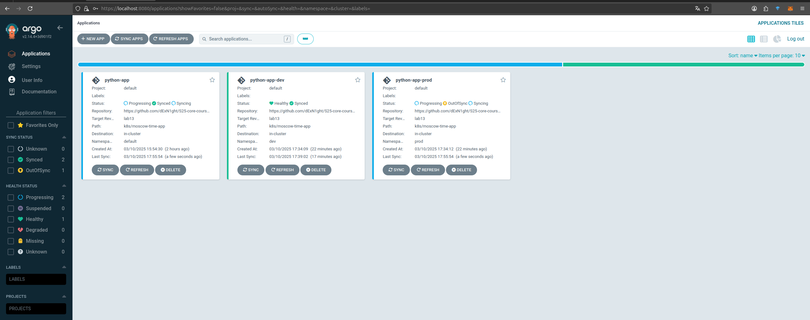

# Lab 13: ArgoCD for GitOps Deployment

## ArgoCD Setup for Multiple Environments

GitOps approach to application deployment using ArgoCD. Two environments were configured (dev and prod) with different configurations to demonstrate environment isolation and automated synchronization

## Environment Structure

### Dev Environment
- Namespace: dev
- 2 application replicas
- Limited resources (CPU: 50m-100m, Memory: 32Mi-64Mi)
- ClusterIP service type for internal access

### Prod Environment
- Namespace: prod
- 4 application replicas
- Increased resources (CPU: 100m-200m, Memory: 64Mi-128Mi)
- LoadBalancer service type for external access

## ArgoCD Applications

Created two ArgoCD applications to manage these environments:

```yaml
# argocd-python-dev.yaml
apiVersion: argoproj.io/v1alpha1
kind: Application
metadata:
  name: python-app-dev
  namespace: argocd
spec:
  project: default
  source:
    repoURL: https://github.com/dExN1ght/S25-core-course-labs.git
    targetRevision: lab13
    path: k8s/moscow-time-app
    helm:
      valueFiles:
        - values-dev.yaml
  destination:
    server: https://kubernetes.default.svc
    namespace: dev
  syncPolicy:
    automated:
      prune: true
      selfHeal: true
```

```yaml
# argocd-python-prod.yaml
apiVersion: argoproj.io/v1alpha1
kind: Application
metadata:
  name: python-app-prod
  namespace: argocd
spec:
  project: default
  source:
    repoURL: https://github.com/dExN1ght/S25-core-course-labs.git
    targetRevision: lab13
    path: k8s/moscow-time-app
    helm:
      valueFiles:
        - values-prod.yaml
  destination:
    server: https://kubernetes.default.svc
    namespace: prod
  syncPolicy:
    automated:
      prune: true
      selfHeal: true
```

## Self-Healing Tests

### Test 1: Manual Override of Replica Count

Manually changed the number of replicas in the prod environment from 4 to 5:

```bash
kubectl patch deployment python-app-prod-moscow-time-app -n prod --patch '{"spec":{"replicas": 5}}'
```

**Result before modification:**
```
NAME                                              READY   STATUS      RESTARTS   AGE
python-app-prod-moscow-time-app-f4645d55f-88h7x   1/1     Running     0          112s
python-app-prod-moscow-time-app-f4645d55f-gq7m9   1/1     Running     0          112s
python-app-prod-moscow-time-app-f4645d55f-lmwwp   1/1     Running     0          112s
python-app-prod-moscow-time-app-f4645d55f-q4rg4   1/1     Running     0          112s
```

**Immediately after modification:**
```
NAME                                              READY   STATUS      RESTARTS   AGE
python-app-prod-moscow-time-app-f4645d55f-88h7x   1/1     Running     0          112s
python-app-prod-moscow-time-app-f4645d55f-gq7m9   1/1     Running     0          112s
python-app-prod-moscow-time-app-f4645d55f-lmwwp   1/1     Running     0          112s
python-app-prod-moscow-time-app-f4645d55f-p9x2t   0/1     Running     0          11s
python-app-prod-moscow-time-app-f4645d55f-q4rg4   1/1     Running     0          112s
```

ArgoCD detected the drift from the Git configuration and reverted the replica count back to 4 as defined in the values-prod.yaml file

### Test 2: Pod Deletion

Deleted one of the pods in the prod environment:

```bash
kubectl delete pod -n prod python-app-prod-moscow-time-app-f4645d55f-gq7m9
```

**Result after deletion:**
```
NAME                                              READY   STATUS      RESTARTS   AGE
python-app-prod-moscow-time-app-f4645d55f-88h7x   1/1     Running     0          2m8s
python-app-prod-moscow-time-app-f4645d55f-lmwwp   1/1     Running     0          2m8s
python-app-prod-moscow-time-app-f4645d55f-lqxs5   0/1     Running     0          4s
python-app-prod-moscow-time-app-f4645d55f-p9x2t   1/1     Running     0          27s
python-app-prod-moscow-time-app-f4645d55f-q4rg4   1/1     Running     0          2m8s
```

Kubernetes automatically created a new pod (python-app-prod-moscow-time-app-f4645d55f-lqxs5) to replace the deleted one.

## Configuration drift vs runtime events

### Configuration Drift
When the actual state of the cluster differs from the configuration defined in Git (such as manually changing the number of replicas), ArgoCD detects this discrepancy and returns the cluster to the state defined in Git

### Runtime Events
Runtime events such as pod deletion or node failure are handled directly by Kubernetes controllers. For example, when a pod is deleted, as in Test 2, the Deployment controller automatically creates a new pod to maintain the desired state. ArgoCD doesn't intervene in this process as the replica count remains consistent with the Git configuration

## Advantages of GitOps with ArgoCD

1. **Single Source of Truth**: Cluster state always matches the Git configuration
2. **Automatic Self-Healing**: ArgoCD automatically fixes any deviations from the desired state
3. **Version Control**: All changes are tracked in Git, providing a complete history
4. **Environment Separation**: Different configurations for dev and prod environments
5. **Security**: Changes are only applied after being committed to the repository, reducing the risk of accidental changes
6. **Simplified Operations**: Deployment operations are standardized through Git workflows
7. **Declarative Configuration**: The desired state is declared, not the steps to get there

## ArgoCD Sync Status
Below is the sync status for both applications:

```bash
$ argocd app get python-app-dev
Name:               argocd/python-app-dev
Project:            default
Server:             https://kubernetes.default.svc
Namespace:          dev
URL:                https://argocd.example.com/applications/python-app-dev
Source:
- Repo:             https://github.com/dExN1ght/S25-core-course-labs.git
  Target:           lab13
  Path:             k8s/moscow-time-app
  Helm Values:      values-dev.yaml
Sync Status:        Synced to lab13 (7546453)
Health Status:      Healthy
```

```bash
$ argocd app get python-app-prod
Name:               argocd/python-app-prod
Project:            default
Server:             https://kubernetes.default.svc
Namespace:          prod
URL:                https://argocd.example.com/applications/python-app-prod
Source:
- Repo:             https://github.com/dExN1ght/S25-core-course-labs.git
  Target:           lab13
  Path:             k8s/moscow-time-app
  Helm Values:      values-prod.yaml
Sync Status:        Synced to lab13 (7546453)
Health Status:      Progressing
```

