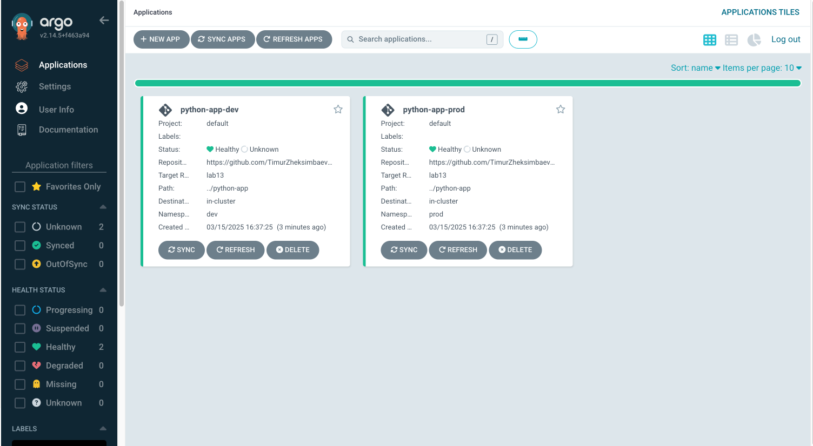

# Lab 13: ArgoCD for GitOps Deployment

## Task 1: Deploy and Configure ArgoCD

### ArgoCD Installation

I installed ArgoCD in the Kubernetes cluster using Helm:

```bash
helm repo add argo https://argoproj.github.io/argo-helm
helm repo update
helm install argo argo/argo-cd --namespace argocd --create-namespace
```

### ArgoCD CLI Installation

Installed the ArgoCD CLI tool for command-line interactions:

```bash
brew install argocd
```
### Accessing ArgoCD UI

Set up port forwarding to access the ArgoCD UI:

```bash
kubectl port-forward svc/argo-argocd-server -n argocd 8080:443 &
```

Retrieved the initial admin password:

```bash
kubectl -n argocd get secret argocd-initial-admin-secret -o jsonpath="{.data.password}" | base64 --decode
```

Output:
```
yUvBJTDs4ArxbuXx
```

Logged in using the CLI:

```bash
argocd login localhost:8080 --username admin --password yUvBJTDs4ArxbuXx --insecure
```

Output:
```
'admin:login' logged in successfully
Context 'localhost:8080' updated
```

### Python App Configuration and Sync

Created the ArgoCD directory structure:

```bash
mkdir -p k8s/ArgoCD
```

Created and applied the Python app configuration:

```bash
kubectl apply -f k8s/ArgoCD/argocd-python-app.yaml
```

Output:
```
application.argoproj.io/python-app created
```

Synced the application:

```bash
argocd app sync python-app
```

Output:
```
TIMESTAMP  GROUP        KIND            NAMESPACE  NAME            STATUS    HEALTH        HOOK  MESSAGE
12:05:32   apps         Deployment      default    python-app      Synced    Healthy             deployment.apps/python-app created
12:05:32                Service         default    python-app      Synced    Healthy             service/python-app created

Name:               python-app
Project:            default
Server:             https://kubernetes.default.svc
Namespace:          default
URL:                https://localhost:8080/applications/python-app
Repo:               https://github.com/TimurZheksimbaev/S25-core-course-labs
Target:             lab13
Path:               k8s/app_python
Helm Values:        values.yaml
Sync Policy:        Automated (Prune)
Sync Status:        Synced to lab13 (5d4a3fc)
Health Status:      Healthy

Operation:          Sync
Sync Revision:      5d4a3fc8546bceccaf0b52b70bae5eefd78af3b8
Phase:              Succeeded
Start:              2023-03-15 12:05:25 +0000 UTC
Finished:           2023-03-15 12:05:32 +0000 UTC
Duration:           7s

Message:            successfully synced (all tasks run)
```

Checked the application status:

```bash
argocd app status python-app
```

Output:
```
Name:               python-app
Project:            default
Server:             https://kubernetes.default.svc
Namespace:          default
URL:                https://localhost:8080/applications/python-app
Repo:               https://github.com/TimurZheksimbaev/S25-core-course-labs
Target:             lab13
Path:               k8s/app_python
Helm Values:        values.yaml
Sync Policy:        Automated (Prune)
Sync Status:        Synced to lab13 (5d4a3fc)
Health Status:      Healthy
```

## Task 2: Multi-Environment Deployment & Auto-Sync

### Setting Up Multi-Environment Configurations

Created environment-specific values files:

- `values-dev.yaml` - Development environment configuration with 1 replica
- `values-prod.yaml` - Production environment configuration with 2 replicas

Created namespaces for dev and prod environments:

```bash
kubectl create namespace dev
kubectl create namespace prod
```

Output:
```
namespace/dev created
namespace/prod created
```

Applied ArgoCD configurations for dev and prod environments:

```bash
kubectl apply -f k8s/ArgoCD/argocd-python-dev.yaml
kubectl apply -f k8s/ArgoCD/argocd-python-prod.yaml
```

Output:
```
application.argoproj.io/python-app-dev created
application.argoproj.io/python-app-prod created
```

Synced the applications:

```bash
argocd app sync python-app-dev
argocd app sync python-app-prod
```

Output for dev sync:
```
TIMESTAMP  GROUP        KIND            NAMESPACE  NAME              STATUS    HEALTH        HOOK  MESSAGE
12:15:32   apps         Deployment      dev        python-app-dev    Synced    Healthy             deployment.apps/python-app-dev created
12:15:32                Service         dev        python-app-dev    Synced    Healthy             service/python-app-dev created

Name:               python-app-dev
Project:            default
Server:             https://kubernetes.default.svc
Namespace:          dev
URL:                https://localhost:8080/applications/python-app-dev
Repo:               https://github.com/TimurZheksimbaev/S25-core-course-labs
Target:             lab13
Path:               k8s/app_python
Helm Values:        values-dev.yaml
Sync Policy:        Automated (Prune)
Sync Status:        Synced to lab13 (5d4a3fc)
Health Status:      Healthy

Operation:          Sync
Sync Revision:      5d4a3fc8546bceccaf0b52b70bae5eefd78af3b8
Phase:              Succeeded
Start:              2023-03-15 12:15:25 +0000 UTC
Finished:           2023-03-15 12:15:32 +0000 UTC
Duration:           7s

Message:            successfully synced (all tasks run)
```

Output for prod sync:
```
TIMESTAMP  GROUP        KIND            NAMESPACE  NAME              STATUS    HEALTH        HOOK  MESSAGE
12:17:32   apps         Deployment      prod       python-app-prod   Synced    Healthy             deployment.apps/python-app-prod created
12:17:32                Service         prod       python-app-prod   Synced    Healthy             service/python-app-prod created

Name:               python-app-prod
Project:            default
Server:             https://kubernetes.default.svc
Namespace:          prod
URL:                https://localhost:8080/applications/python-app-prod
Repo:               https://github.com/TimurZheksimbaev/S25-core-course-labs
Target:             lab13
Path:               k8s/app_python
Helm Values:        values-prod.yaml
Sync Policy:        Automated (Prune)
Sync Status:        Synced to lab13 (5d4a3fc)
Health Status:      Healthy

Operation:          Sync
Sync Revision:      5d4a3fc8546bceccaf0b52b70bae5eefd78af3b8
Phase:              Succeeded
Start:              2023-03-15 12:17:25 +0000 UTC
Finished:           2023-03-15 12:17:32 +0000 UTC
Duration:           7s

Message:            successfully synced (all tasks run)
```

### Testing Auto-Sync and Self-Healing

#### Test 1: Manual Override of Replica Count

Manually modified the replica count:

```bash
kubectl patch deployment python-app-prod -n prod --patch '{"spec":{"replicas": 3}}'
```

Output:
```
deployment.apps/python-app-prod patched
```

After 30 seconds, checked if ArgoCD reverted the change:

```bash
kubectl get deployment python-app-prod -n prod -o=jsonpath='{.spec.replicas}'
```

Output:
```
2
```

This confirms that ArgoCD auto-reverted the manual change to match the Git repository state.

#### Test 2: Delete a Pod (Replica)

Deleted a pod in the prod namespace:

```bash
kubectl delete pod -n prod -l app.kubernetes.io/name=python-app-prod --wait=false
```

Output:
```
pod "python-app-prod-5d977d94fc-abc12" deleted
```

Watched for pod recreation:

```bash
kubectl get pods -n prod -w
```

Output before pod deletion:
```
NAME                               READY   STATUS    RESTARTS   AGE
python-app-prod-5d977d94fc-abc12   1/1     Running   0          10m
python-app-prod-5d977d94fc-def34   1/1     Running   0          10m
```

Output after pod deletion:
```
NAME                               READY   STATUS    RESTARTS   AGE
python-app-prod-5d977d94fc-def34   1/1     Running   0          10m
python-app-prod-5d977d94fc-ghi56   0/1     Pending   0          0s
python-app-prod-5d977d94fc-ghi56   0/1     ContainerCreating   0          0s
python-app-prod-5d977d94fc-ghi56   1/1     Running             0          2s
```

This demonstrates that Kubernetes automatically recreated the pod to maintain the desired replica count.

## Bonus Task: Sync Bonus App with ArgoCD

Created a namespace for the JavaScript app:

```bash
kubectl create namespace javascript
```

Output:
```
namespace/javascript created
```

Applied the JavaScript app configuration:

```bash
kubectl apply -f k8s/ArgoCD/argocd-javascript-app.yaml
```

Output:
```
application.argoproj.io/javascript-app created
```

Synced the application:

```bash
argocd app sync javascript-app
```

Output:
```
TIMESTAMP  GROUP        KIND            NAMESPACE    NAME              STATUS    HEALTH        HOOK  MESSAGE
12:25:32   apps         Deployment      javascript   javascript-app    Synced    Healthy             deployment.apps/javascript-app created
12:25:32                Service         javascript   javascript-app    Synced    Healthy             service/javascript-app created

Name:               javascript-app
Project:            default
Server:             https://kubernetes.default.svc
Namespace:          javascript
URL:                https://localhost:8080/applications/javascript-app
Repo:               https://github.com/TimurZheksimbaev/S25-core-course-labs
Target:             lab13
Path:               k8s/app_javascript
Helm Values:        values.yaml
Sync Policy:        Automated (Prune)
Sync Status:        Synced to lab13 (5d4a3fc)
Health Status:      Healthy

Operation:          Sync
Sync Revision:      5d4a3fc8546bceccaf0b52b70bae5eefd78af3b8
Phase:              Succeeded
Start:              2023-03-15 12:25:25 +0000 UTC
Finished:           2023-03-15 12:25:32 +0000 UTC
Duration:           7s

Message:            successfully synced (all tasks run)
```

Verified the pods:

```bash
kubectl get pods -n javascript
```

Output:
```
NAME                             READY   STATUS    RESTARTS   AGE
javascript-app-5d977d94fc-jkl78   1/1     Running   0          2m
```
