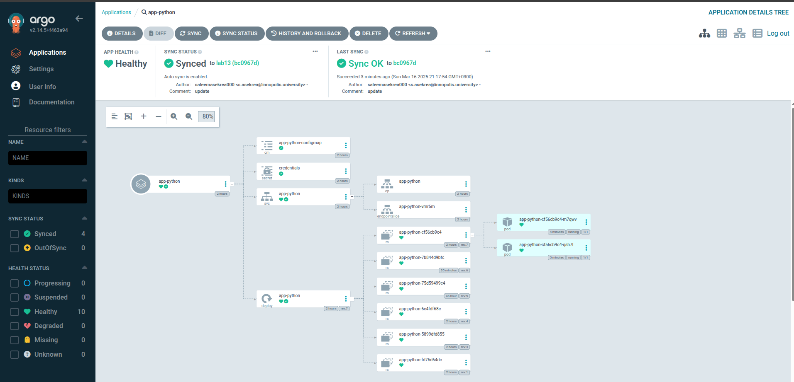
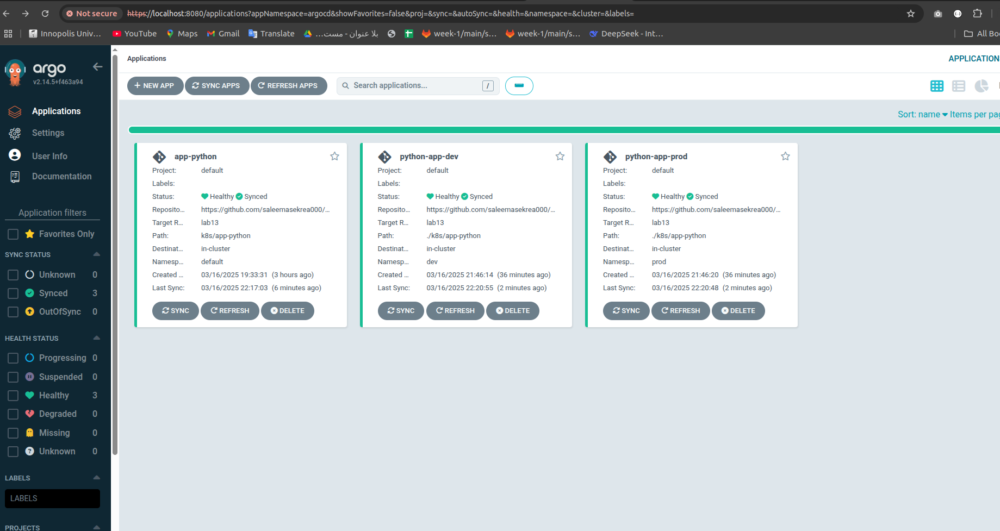
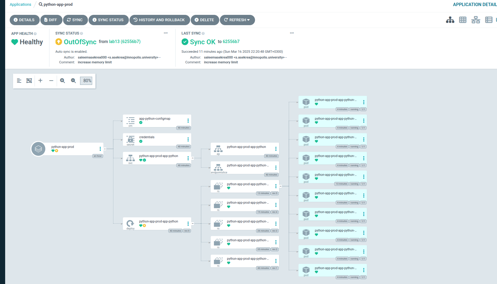
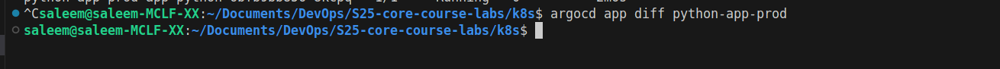
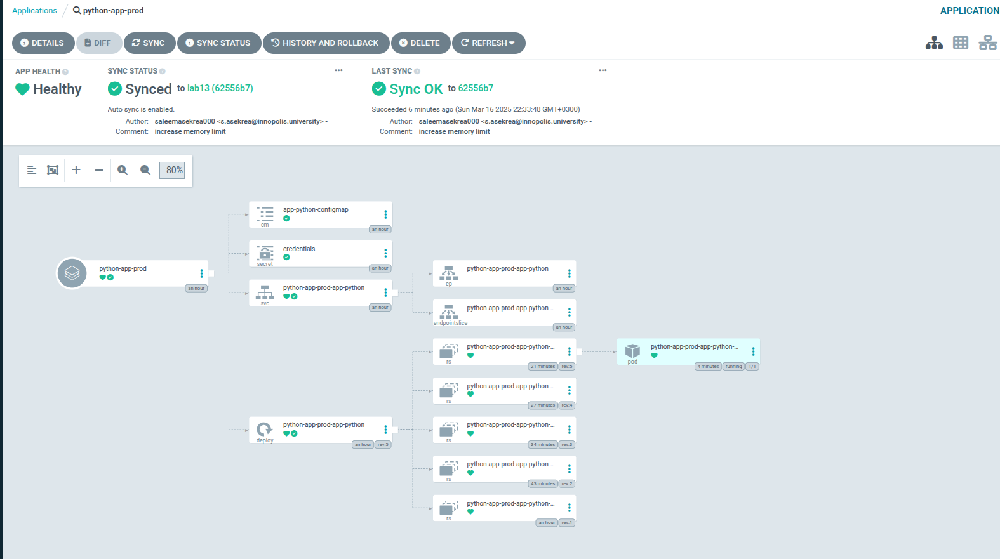
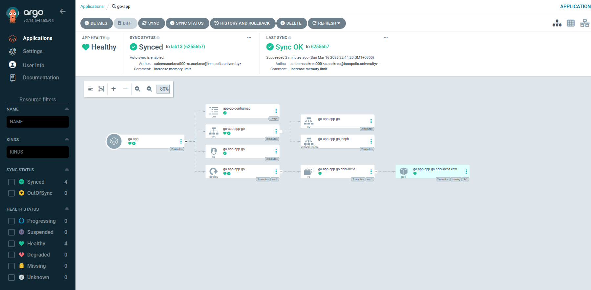

### Deploy and Configure ArgoCD

Add the ArgoCD Helm repository

```bash
helm repo add argo https://argoproj.github.io/argo-helm

"argo" has been added to your repositories
```
Install ArgoCD

```bash
saleem@saleem-MCLF-XX:~$ argocd version
argocd: v2.14.5+f463a94
  BuildDate: 2025-03-11T04:58:01Z
  GitCommit: f463a945d57267e9691cede37021d9ddc5994f36
  GitTreeState: clean
  GoVersion: go1.24.1
  Compiler: gc
  Platform: linux/amd64
Handling connection for 8080
Handling connection for 8080
E0316 19:39:41.425673   47536 portforward.go:391] "Unhandled Error" err="error copying from remote stream to local connection: readfrom tcp4 127.0.0.1:8080->127.0.0.1:46452: write tcp4 127.0.0.1:8080->127.0.0.1:46452: write: broken pipe"
argocd-server: v2.14.5+f463a94
  BuildDate: 2025-03-11T03:15:56Z
  GitCommit: f463a945d57267e9691cede37021d9ddc5994f36
  GitTreeState: clean
  GoVersion: go1.23.3
  Compiler: gc
  Platform: linux/amd64
  Kustomize Version: v5.4.3 2024-07-19T16:40:33Z
  Helm Version: v3.16.3+gcfd0749
  Kubectl Version: v0.31.0
  Jsonnet Version: v0.20.0
```


Log in via CLI

```bash
argocd login localhost:8080 --insecure

Username: admin
Password: 
'admin:login' logged in successfully
Context 'localhost:8080' updated
```


Apply the configuration

```bash
kubectl apply -f ArgoCD/argocd-python-app.yaml

application.argoproj.io/python-app created
```




## Multi-Environment Deployment & Auto-Sync


```bash
kubectl create namespace dev

namespace/dev created
```

```bash
kubectl create namespace prod

namespace/prod created
```

### Deploy Multi-Environment via ArgoCD

```bash
kubectl apply -f ArgoCD/argocd-python-dev.yaml

application.argoproj.io/python-app-dev created
```

```bash
kubectl apply -f ArgoCD/argocd-python-prod.yaml

application.argoproj.io/python-app-prod created
```


### Auto-Sync

```bash
saleem@saleem-MCLF-XX:~/Documents/DevOps/S25-core-course-labs/k8s$ kubectl get deployments.apps -n dev
NAME                        READY   UP-TO-DATE   AVAILABLE   AGE
python-app-dev-app-python   1/1     1            1           31m
saleem@saleem-MCLF-XX:~/Documents/DevOps/S25-core-course-labs/k8s$ kubectl get deployments.apps -n prod
NAME                         READY   UP-TO-DATE   AVAILABLE   AGE
python-app-prod-app-python   1/1     1            1           31m
saleem@saleem-MCLF-XX:~/Documents/DevOps/S25-core-course-labs/k8s$ 
```



### Self-Heal Testing 

```bash
saleem@saleem-MCLF-XX:~/Documents/DevOps/S25-core-course-labs/k8s$ argocd app get python-app-prod -o tree
Name:               argocd/python-app-prod
Project:            default
Server:             https://kubernetes.default.svc
Namespace:          prod
URL:                https://localhost:8080/applications/python-app-prod
Source:
- Repo:             https://github.com/saleemasekrea000/S25-core-course-labs.git
  Target:           lab13
  Path:             ./k8s/app-python
  Helm Values:      values-prod.yaml
SyncWindow:         Sync Allowed
Sync Policy:        Automated
Sync Status:        Synced to lab13 (62556b7)
Health Status:      Healthy

KIND/NAME                                            STATUS  HEALTH   MESSAGE
Deployment/python-app-prod-app-python                Synced  Healthy  deployment.apps/python-app-prod-app-python configured
├─ReplicaSet/python-app-prod-app-python-68c9cd588d           Healthy  
├─ReplicaSet/python-app-prod-app-python-6bfb9bb856           Healthy  
│ └─Pod/python-app-prod-app-python-6bfb9bb856-gsxhs          Healthy  
├─ReplicaSet/python-app-prod-app-python-76df9df44b           Healthy  
├─ReplicaSet/python-app-prod-app-python-78c76685d6           Healthy  
└─ReplicaSet/python-app-prod-app-python-7f784c8fb4           Healthy  
ConfigMap/app-python-configmap                       Synced           configmap/app-python-configmap unchanged
Secret/credentials                                   Synced           secret/credentials unchanged
Service/python-app-prod-app-python                   Synced  Healthy  service/python-app-prod-app-python unchanged
├─Endpoints/python-app-prod-app-python                                
└─EndpointSlice/python-app-prod-app-python-pcbbp                      
```


Patch the deployment to increase the replica count


```bash
saleem@saleem-MCLF-XX:~/Documents/DevOps/S25-core-course-labs/k8s$ kubectl patch deployment python-app-prod-app-python -n prod --patch '{"spec":{"replicas": 10}}'
deployment.apps/python-app-prod-app-python patched
saleem@saleem-MCLF-XX:~/Documents/DevOps/S25-core-course-labs/k8s$ 
```

Check the status of the application

```bash
saleem@saleem-MCLF-XX:~/Documents/DevOps/S25-core-course-labs/k8s$ argocd app get python-app-prod -o tree
Name:               argocd/python-app-prod
Project:            default
Server:             https://kubernetes.default.svc
Namespace:          prod
URL:                https://localhost:8080/applications/python-app-prod
Source:
- Repo:             https://github.com/saleemasekrea000/S25-core-course-labs.git
  Target:           lab13
  Path:             ./k8s/app-python
  Helm Values:      values-prod.yaml
SyncWindow:         Sync Allowed
Sync Policy:        Automated
Sync Status:        OutOfSync from lab13 (62556b7)
Health Status:      Progressing

KIND/NAME                                            STATUS     HEALTH       MESSAGE
Secret/credentials                                   Synced                  secret/credentials unchanged
Service/python-app-prod-app-python                   Synced     Healthy      service/python-app-prod-app-python unchanged
├─Endpoints/python-app-prod-app-python                                       
└─EndpointSlice/python-app-prod-app-python-pcbbp                             
Deployment/python-app-prod-app-python                OutOfSync  Progressing  deployment.apps/python-app-prod-app-python configured
├─ReplicaSet/python-app-prod-app-python-68c9cd588d              Healthy      
├─ReplicaSet/python-app-prod-app-python-6bfb9bb856              Progressing  
│ ├─Pod/python-app-prod-app-python-6bfb9bb856-6rkn4             Progressing  
│ ├─Pod/python-app-prod-app-python-6bfb9bb856-7b8xj             Progressing  
│ ├─Pod/python-app-prod-app-python-6bfb9bb856-9pj9j             Progressing  
│ ├─Pod/python-app-prod-app-python-6bfb9bb856-ffmjg             Progressing  
│ ├─Pod/python-app-prod-app-python-6bfb9bb856-gsxhs             Healthy      
│ ├─Pod/python-app-prod-app-python-6bfb9bb856-mb4nk             Progressing  
│ ├─Pod/python-app-prod-app-python-6bfb9bb856-nb2mk             Progressing  
│ ├─Pod/python-app-prod-app-python-6bfb9bb856-p5s2c             Progressing  
│ ├─Pod/python-app-prod-app-python-6bfb9bb856-sfrbq             Progressing  
│ └─Pod/python-app-prod-app-python-6bfb9bb856-vnqtr             Progressing  
├─ReplicaSet/python-app-prod-app-python-76df9df44b              Healthy      
├─ReplicaSet/python-app-prod-app-python-78c76685d6              Healthy      
└─ReplicaSet/python-app-prod-app-python-7f784c8fb4              Healthy      
ConfigMap/app-python-configmap                       Synced                  configmap/app-python-configmap unchanged
```

Check the status of the application again 

```bash
saleem@saleem-MCLF-XX:~/Documents/DevOps/S25-core-course-labs/k8s$ argocd app get python-app-prod -o tree
Name:               argocd/python-app-prod
Project:            default
Server:             https://kubernetes.default.svc
Namespace:          prod
URL:                https://localhost:8080/applications/python-app-prod
Source:
- Repo:             https://github.com/saleemasekrea000/S25-core-course-labs.git
  Target:           lab13
  Path:             ./k8s/app-python
  Helm Values:      values-prod.yaml
SyncWindow:         Sync Allowed
Sync Policy:        Automated
Sync Status:        OutOfSync from lab13 (62556b7)
Health Status:      Healthy

KIND/NAME                                            STATUS     HEALTH   MESSAGE
ConfigMap/app-python-configmap                       Synced              configmap/app-python-configmap unchanged
Secret/credentials                                   Synced              secret/credentials unchanged
Service/python-app-prod-app-python                   Synced     Healthy  service/python-app-prod-app-python unchanged
├─Endpoints/python-app-prod-app-python                                   
└─EndpointSlice/python-app-prod-app-python-pcbbp                         
Deployment/python-app-prod-app-python                OutOfSync  Healthy  deployment.apps/python-app-prod-app-python configured
├─ReplicaSet/python-app-prod-app-python-68c9cd588d              Healthy  
├─ReplicaSet/python-app-prod-app-python-6bfb9bb856              Healthy  
│ ├─Pod/python-app-prod-app-python-6bfb9bb856-6rkn4             Healthy  
│ ├─Pod/python-app-prod-app-python-6bfb9bb856-7b8xj             Healthy  
│ ├─Pod/python-app-prod-app-python-6bfb9bb856-9pj9j             Healthy  
│ ├─Pod/python-app-prod-app-python-6bfb9bb856-ffmjg             Healthy  
│ ├─Pod/python-app-prod-app-python-6bfb9bb856-gsxhs             Healthy  
│ ├─Pod/python-app-prod-app-python-6bfb9bb856-mb4nk             Healthy  
│ ├─Pod/python-app-prod-app-python-6bfb9bb856-nb2mk             Healthy  
│ ├─Pod/python-app-prod-app-python-6bfb9bb856-p5s2c             Healthy  
│ ├─Pod/python-app-prod-app-python-6bfb9bb856-sfrbq             Healthy  
│ └─Pod/python-app-prod-app-python-6bfb9bb856-vnqtr             Healthy  
├─ReplicaSet/python-app-prod-app-python-76df9df44b              Healthy  
├─ReplicaSet/python-app-prod-app-python-78c76685d6              Healthy  
└─ReplicaSet/python-app-prod-app-python-7f784c8fb4              Healthy  
```



Self-Heal Testing

```bash
saleem@saleem-MCLF-XX:~/Documents/DevOps/S25-core-course-labs/k8s$ kubectl get pods -n prod
NAME                                          READY   STATUS    RESTARTS   AGE
python-app-prod-app-python-6bfb9bb856-gsxhs   1/1     Running   0          16m

saleem@saleem-MCLF-XX:~/Documents/DevOps/S25-core-course-labs/k8s$ kubectl delete pod -n prod -l app.kubernetes.io/name=app-python
pod "python-app-prod-app-python-6bfb9bb856-gsxhs" deleted
```
```bash
saleem@saleem-MCLF-XX:~/Documents/DevOps/S25-core-course-labs/k8s$ kubectl get pods -n prod -w
NAME                                          READY   STATUS    RESTARTS   AGE
python-app-prod-app-python-6bfb9bb856-8kcpq   1/1     Running   0          2m6s
```




after that 




## Documentation
ArgoCD ensures the cluster matches the desired state in Git by reverting configuration drift. Runtime events, like pod deletions, are managed by Kubernetes, while ArgoCD focuses on aligning the cluster with Git-defined configurations.


## bouns 


```bash
kubectl apply -f ArgoCD/argocd-go-app.yaml 

application.argoproj.io/go-app created
```

```bash 
kubectl get po

NAME                                          READY   STATUS    RESTARTS     AGE
app-go-helm-69958f7d97-6r9wm                  1/1     Running   2 (3d ago)   6d4h
app-python-helm-bfcb8cc8c-25czd               1/1     Running   2 (3d ago)   6d4h
go-app-app-go-helm-68c6df86b4-45h5x           1/1     Running   0            33m
python-app-app-python-helm-766b5c48f6-8rrcb   1/1     Running   0            136m
python-app-app-python-helm-766b5c48f6-kdx2r   1/1     Running   0            136m
vault-0                                       1/1     Running   5 (3d ago)   13d
vault-agent-injector-66f45b5fd5-94mb7         1/1     Running   5 (3d ago)   13d
```
