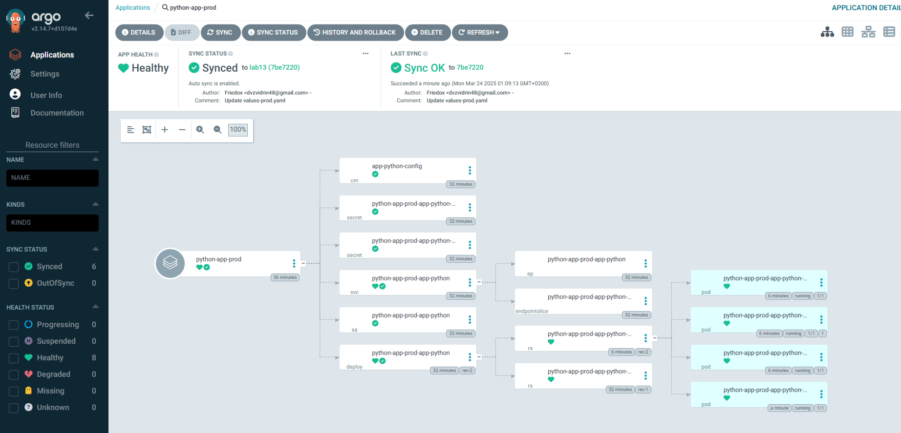
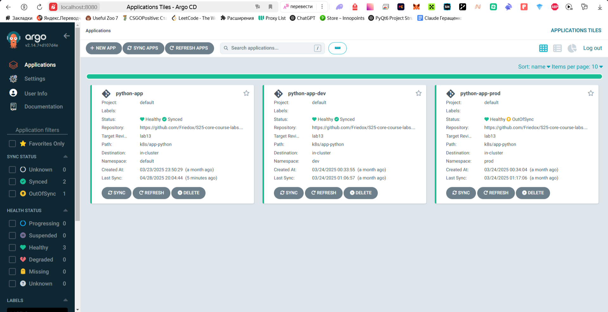
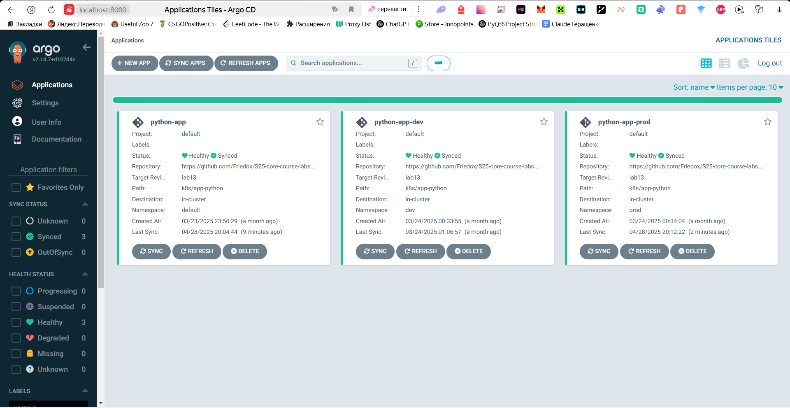
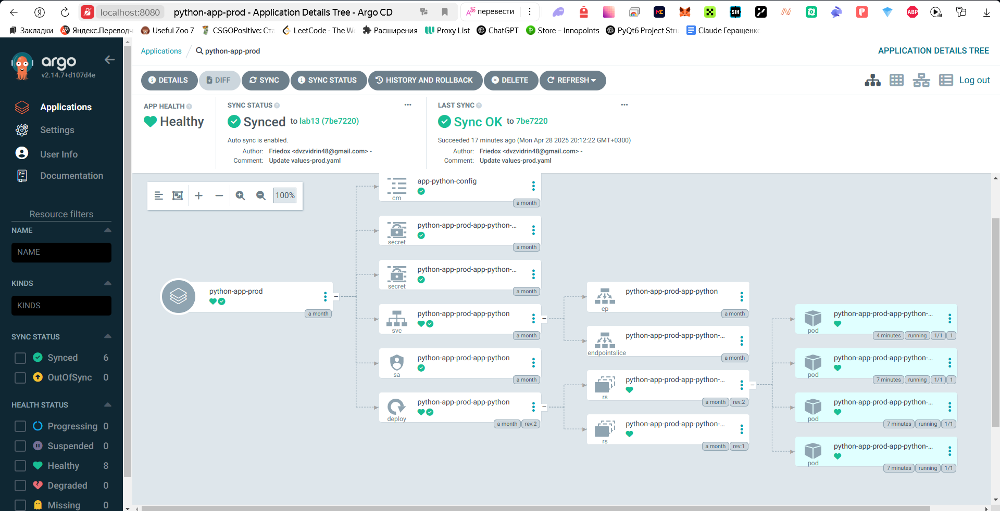
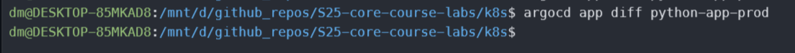

# Lab 13

## ArgoCD

### Verify argocd installation

```text
dm@DESKTOP-85MKAD8:/mnt/c/Users/dm$ kubectl wait --for=condition=ready pod -l app.kubernetes.io/name=argocd-server -n argocd --timeout=90s
pod/argo-argocd-server-5f5f4786db-vqdwb condition met
```

### App status

```bash
argocd app get python-app
```

```text
dm@DESKTOP-85MKAD8:/mnt/d/github_repos/S25-core-course-labs/k8s$ argocd app get python-app
Name:               argocd/python-app
Project:            default
Server:             https://kubernetes.default.svc
Namespace:          default
URL:                https://argocd.example.com/applications/python-app
Source:
- Repo:             https://github.com/Friedox/S25-core-course-labs.git
  Target:           lab13
  Path:             k8s/app-python
  Helm Values:      values.yaml
SyncWindow:         Sync Allowed
Sync Policy:        Automated
Sync Status:        Synced to lab13 (7be7220)
Health Status:      Healthy

GROUP  KIND            NAMESPACE  NAME                                STATUS     HEALTH   HOOK      MESSAGE
batch  Job             default    preinstall-hook                     Succeeded           PreSync   job.batch/preinstall-hook created
       ServiceAccount  default    python-app-app-python               Synced                        serviceaccount/python-app-app-python unchanged
       Secret          default    python-app-app-python-secret        Synced                        secret/python-app-app-python-secret unchanged
       Secret          default    python-app-app-python-vault-secret  Synced                        secret/python-app-app-python-vault-secret configured
       ConfigMap       default    app-python-config                   Synced                        configmap/app-python-config unchanged
       Service         default    python-app-app-python               Synced     Healthy            service/python-app-app-python unchanged
apps   Deployment      default    python-app-app-python               Synced     Healthy            deployment.apps/python-app-app-python unchanged
batch  Job             default    post-install-hook                   Succeeded           PostSync  job.batch/post-install-hook created
```

### ArgoCD UI


### Test Sync Workflow

The result after updating replica count to 3

```text
argocd app get python-app
Name:               argocd/python-app
Project:            default
Server:             https://kubernetes.default.svc
Namespace:          default
URL:                https://argocd.example.com/applications/python-app
Source:
- Repo:             https://github.com/Friedox/S25-core-course-labs.git
  Target:           lab13
  Path:             k8s/app-python
  Helm Values:      values.yaml
SyncWindow:         Sync Allowed
Sync Policy:        Automated
Sync Status:        Synced to lab13 (9e10d17)
Health Status:      Healthy

GROUP  KIND            NAMESPACE  NAME                                STATUS     HEALTH   HOOK      MESSAGE
batch  Job             default    preinstall-hook                     Succeeded           PreSync   job.batch/preinstall-hook created
       ServiceAccount  default    python-app-app-python               Synced                        serviceaccount/python-app-app-python created
       Secret          default    python-app-app-python-vault-secret  Synced                        secret/python-app-app-python-vault-secret created
       Secret          default    python-app-app-python-secret        Synced                        secret/python-app-app-python-secret created
       ConfigMap       default    app-python-config                   Synced                        configmap/app-python-config created
       Service         default    python-app-app-python               Synced     Healthy            service/python-app-app-python created
apps   Deployment      default    python-app-app-python               Synced     Healthy            deployment.apps/python-app-app-python created
batch  Job             default    post-install-hook                   Succeeded           PostSync  job.batch/post-install-hook created 
```

We also can see the change in UI


## Task 2

### Creating namespaces

```bash
kubectl create namespace dev
kubectl create namespace prod
```

```text
namespace/dev created
namespace/prod created
```

### Multi-Environment deployment

```text
kubectl apply -f ArgoCD/argocd-python-dev.yaml
application.argoproj.io/python-app-dev created
kubectl apply -f ArgoCD/argocd-python-prod.yaml
application.argoproj.io/python-app-prod created
```

### Auto-Sync



### Self-heal testing

#### Test 1
Output before patching replicaCount:
```bash
kubectl get pods -n prod
```

```text
NAME                                          READY   STATUS    RESTARTS       AGE
python-app-prod-app-python-7996c778dc-5tlld   1/1     Running   0              7m25s
python-app-prod-app-python-7996c778dc-7vzwl   1/1     Running   1 (5m5s ago)   7m25s
python-app-prod-app-python-7996c778dc-kkn62   1/1     Running   0              7m25s
python-app-prod-app-python-7996c778dc-zhn7l   1/1     Running   0              2m32s
```

---

```bash
kubectl patch deployment python-app-prod-app-python -n prod --patch '{"spec":{"replicas": 3}}'
```
```text
deployment.apps/python-app-prod-app-python patched
```

---

```bash
argocd app get python-app-prod
```

```text
Name:               argocd/python-app-prod
Project:            default
Server:             https://kubernetes.default.svc
Namespace:          prod
URL:                https://argocd.example.com/applications/python-app-prod
Source:
- Repo:             https://github.com/Friedox/S25-core-course-labs.git
  Target:           lab13
  Path:             k8s/app-python
  Helm Values:      values-prod.yaml
SyncWindow:         Sync Allowed
Sync Policy:        Automated
Sync Status:        OutOfSync from lab13 (7be7220)
Health Status:      Healthy

GROUP  KIND            NAMESPACE  NAME                                     STATUS     HEALTH   HOOK      MESSAGE
batch  Job             prod       preinstall-hook                          Succeeded           PreSync   job.batch/preinstall-hook created
       ServiceAccount  prod       python-app-prod-app-python               Synced                        serviceaccount/python-app-prod-app-python unchanged
       Secret          prod       python-app-prod-app-python-secret        Synced                        secret/python-app-prod-app-python-secret unchanged
       Secret          prod       python-app-prod-app-python-vault-secret  Synced                        secret/python-app-prod-app-python-vault-secret configured
       ConfigMap       prod       app-python-config                        Synced                        configmap/app-python-config unchanged
       Service         prod       python-app-prod-app-python               Synced     Healthy            service/python-app-prod-app-python unchanged
apps   Deployment      prod       python-app-prod-app-python               OutOfSync  Healthy            deployment.apps/python-app-prod-app-python configured
batch  Job             prod       post-install-hook                        Succeeded           PostSync  job.batch/post-install-hook created```
```



```bash
argocd app get python-app-prod
```

```text
Name:               argocd/python-app-prod
Project:            default
Server:             https://kubernetes.default.svc
Namespace:          prod
URL:                https://argocd.example.com/applications/python-app-prod
Source:
- Repo:             https://github.com/Friedox/S25-core-course-labs.git
  Target:           lab13
  Path:             k8s/app-python
  Helm Values:      values-prod.yaml
SyncWindow:         Sync Allowed
Sync Policy:        Automated
Sync Status:        Synced to lab13 (7be7220)
Health Status:      Healthy

GROUP  KIND            NAMESPACE  NAME                                     STATUS     HEALTH   HOOK      MESSAGE
batch  Job             prod       preinstall-hook                          Succeeded           PreSync   job.batch/preinstall-hook created
       ServiceAccount  prod       python-app-prod-app-python               Synced                        serviceaccount/python-app-prod-app-python unchanged
       Secret          prod       python-app-prod-app-python-secret        Synced                        secret/python-app-prod-app-python-secret unchanged
       Secret          prod       python-app-prod-app-python-vault-secret  Synced                        secret/python-app-prod-app-python-vault-secret configured
       ConfigMap       prod       app-python-config                        Synced                        configmap/app-python-config unchanged
       Service         prod       python-app-prod-app-python               Synced     Healthy            service/python-app-prod-app-python unchanged
apps   Deployment      prod       python-app-prod-app-python               Synced     Healthy            deployment.apps/python-app-prod-app-python configured
batch  Job             prod       post-install-hook                        Succeeded           PostSync  job.batch/post-install-hook created
```

And the app syncs back



#### Test 2

Initial state (all pods running)

```bash
kubectl get pods -n prod
```

```text
NAME                                          READY   STATUS    RESTARTS   AGE
python-app-prod-app-python-7996c778dc-m9lhh   1/1     Running   0          59s
python-app-prod-app-python-7996c778dc-qhs2v   1/1     Running   0          59s
python-app-prod-app-python-7996c778dc-tnflh   1/1     Running   0          59s
python-app-prod-app-python-7996c778dc-x8sr5   1/1     Running   0          59s```
```

Delete a pod

```bash
kubectl delete pod python-app-prod-app-python-7996c778dc-m9lhh -n prod
```

```text
pod "python-app-prod-app-python-7996c778dc-m9lhh" deleted
```

Pods after deletion:
```bash
dm@DESKTOP-85MKAD8:/mnt/d/github_repos/S25-core-course-labs/k8s$ kubectl get pods -n prod -w
```

```text
NAME                                          READY   STATUS    RESTARTS   AGE
python-app-prod-app-python-7996c778dc-pcpc9   1/1     Running   0          37s
python-app-prod-app-python-7996c778dc-qhs2v   1/1     Running   0          3m11s
python-app-prod-app-python-7996c778dc-tnflh   1/1     Running   0          3m11s
python-app-prod-app-python-7996c778dc-x8sr5   1/1     Running   0          3m11s
```

Check that the pod was recreated



```bash
argocd app diff python-app-prod
```




No drift in argocd

### How ArgoCD handles configuration drift vs. runtime events

ArgoCD detects configuration drift when changes to managed resources differ from the Git state and marks the application as "OutOfSync".
Pod deletions are runtime events handled by Kubernetes Deployments and do not change the configuration. Therefore, ArgoCD considers the application "Synced".
