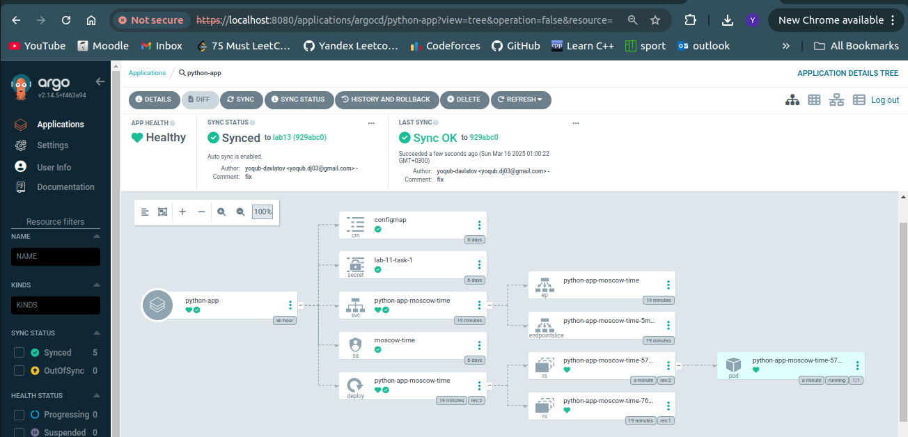
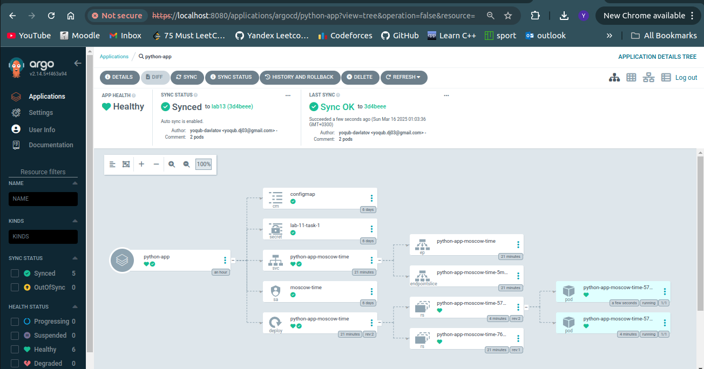
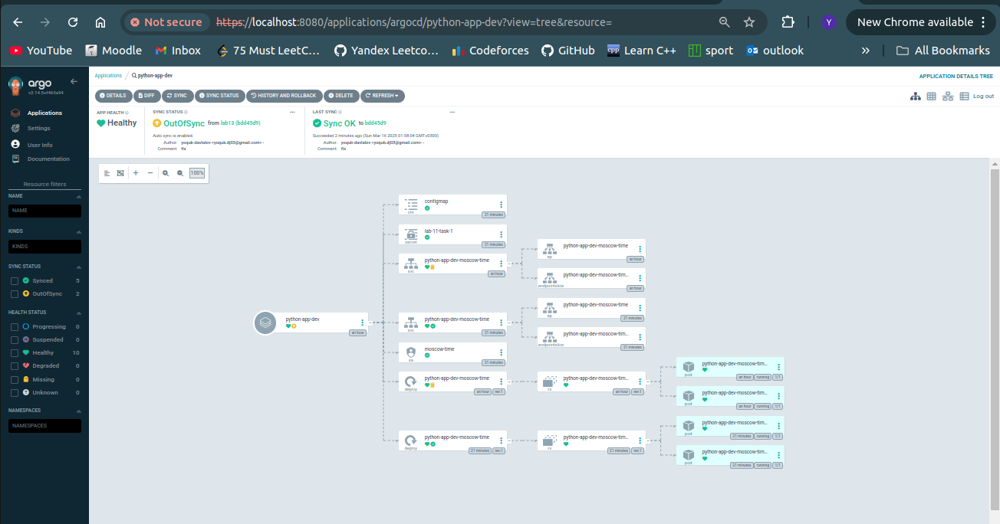
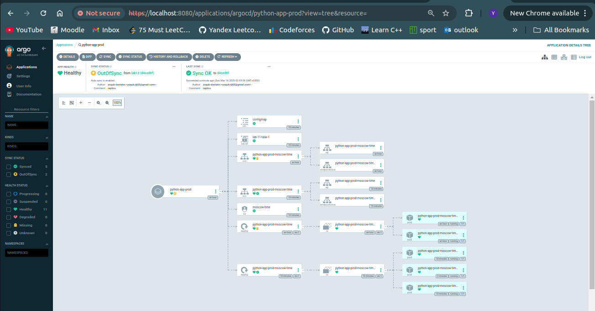
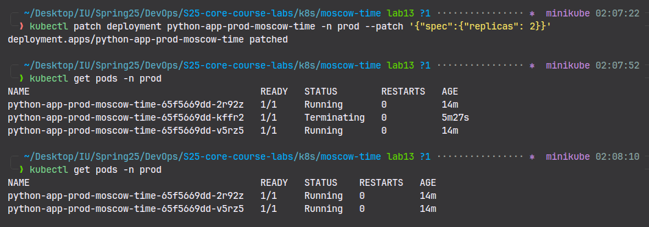

# ArgoCD for GitOps Deployment

## Deploy and Configure ArgoCD

- With 1 replica:



- With 2 replicas



## Multi-Environment Deployment

- Dev env:



- Prod env:


- Add one replica to prod:



- Manually change replica count:



- Pod deletion

  - Before:

  ```bash
  kubectl get pods -n prod --show-labels

  NAME                                          READY   STATUS    RESTARTS   AGE   LABELS
  python-app-prod-moscow-time-65f5669dd-2r92z   1/1     Running   0          23m   app.kubernetes.io/instance=python-app-prod,app.kubernetes.io/managed-by=Helm,app.kubernetes.io/name=moscow-time,app.kubernetes.io/version=1.16.0,helm.sh/chart=moscow-time-0.1.0,pod-template-hash=65f5669dd
  python-app-prod-moscow-time-65f5669dd-v5rz5   1/1     Running   0          23m   app.kubernetes.io/instance=python-app-prod,app.kubernetes.io/managed-by=Helm,app.kubernetes.io/name=moscow-time,app.kubernetes.io/version=1.16.0,helm.sh/chart=moscow-time-0.1.0,pod-template-hash=65f5669dd
  ```

  - Delete pods

  ```bash
  kubectl delete pod -n prod -l app.kubernetes.io/name=moscow-time
  pod "python-app-prod-moscow-time-65f5669dd-2r92z" deleted
  pod "python-app-prod-moscow-time-65f5669dd-v5rz5" deleted
  ```

  - After

  ```bash
  kubectl get pods -n prod
  NAME                                          READY   STATUS    RESTARTS   AGE
  python-app-prod-moscow-time-65f5669dd-2nt8h   1/1     Running   0          46s
  python-app-prod-moscow-time-65f5669dd-76jn6   1/1     Running   0          46s
  ```

## How ArgoCD handles configuration drift vs. runtime events

ArgoCD handles configuration drift by continuously monitoring the cluster state and comparing it to the desired state in Git; if differences are detected, it marks the application as OutOfSync and can automatically revert changes if selfHeal is enabled. Runtime events, such as pod restarts, HPA scaling, or rolling updates, are expected Kubernetes behaviors and are not considered drift, so ArgoCD does not intervene. This ensures that only intentional, Git-driven changes persist while allowing normal cluster operations to run smoothly
