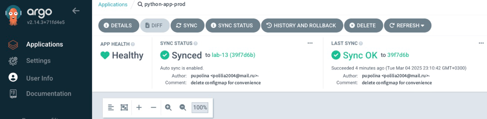
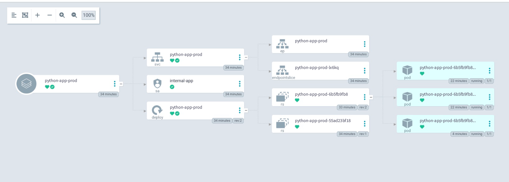
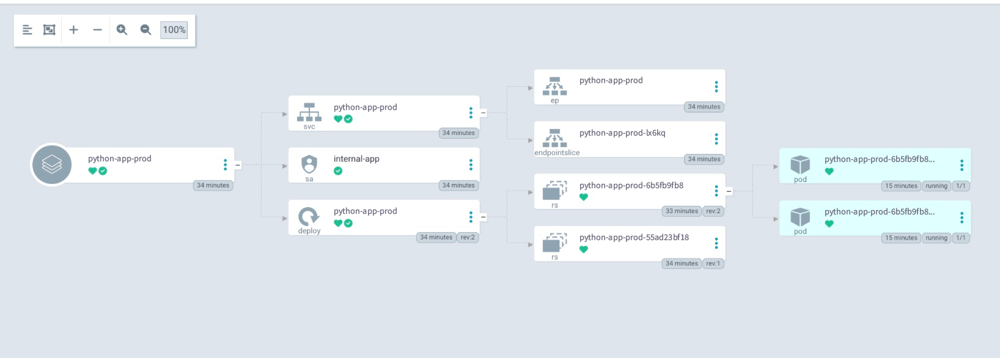

# ArgoCD for GitOps Deployment

## Multi-Environment Deployment & Auto-Sync

### Before Pod Deletion:

```bash
kubectl get pods -n prod
```

Command output:

```bash
NAME                                    READY   STATUS    RESTARTS   AGE
python-app-prod-6b5fb9fb86-88s75        1/1     Running   0          5m
python-app-prod-6b5fb9fb86-2j7th        1/1     Running   0          5m
python-app-prod-6b5fb9fb86-zbhpf        1/1     Running   0          5m
```

### After Pod Deletion:

```bash
kubectl get pods -n prod
```

Command output:

```bash
NAME                                    READY   STATUS    RESTARTS   AGE
python-app-prod-6b5fb9fb86-2j7th        1/1     Running   0          6m21s
python-app-prod-6b5fb9fb86-zbhpf        1/1     Running   0          6m21s
```

### Screenshots 

#### ArgoCD UI showing sync status 

 

#### The dashboard after both tests

 

 

### Explanation of Auto-Sync and Self-Healing

**Auto-Sync:**
ArgoCD continuously monitors the Git repository for changes. When an update (e.g., a change in replicaCount) is detected in the desired state, ArgoCD automatically syncs the live state to match the desired state.

**Self-Healing:**
If a manual change is made (e.g., patching the replica count to a different number) or if a pod is deleted, the Kubernetes controllers (with ArgoCD's auto-sync enabled) detect the drift. ArgoCD then automatically reverts configuration drift (e.g., resetting the replica count back to the value defined in Git) while runtime events like pod deletion are naturally corrected by the Deployment controller.