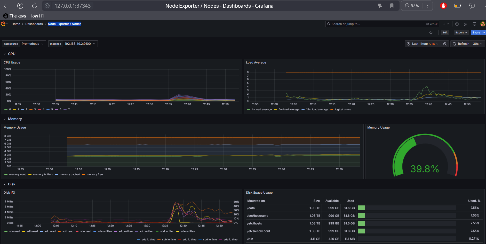

# Lab #13

---

### ArgoCD in k8s


### Correct logic in ArgoCD


### Starting application with ArgoCD

* To reduce the amount of unnecessary work, I just commented out the parts of the manifests of application
  (such as secrets and pre-install-hook)

* Also, I have problems with correctly deleting the ArgoCD deployment, then I use the next command
  to properly remove all the deprecated things: 
  `kubectl patch application/APP_NAME --type json --patch='[ { "op": "remove", "path": "/metadata/finalizers" } ]' -n argocd`

```bash
catorleader@CatOrLeader:/mnt/d/Studying/S25-core-course-labs/k8s$ argocd app get python-app
Name:               argocd/python-app
Project:            default
Server:             https://kubernetes.default.svc
Namespace:          default
URL:                https://argocd.example.com/applications/python-app
Source:
- Repo:             https://github.com/CatOrLeader/S25-core-course-labs.git
  Target:           lab13
  Path:             k8s/python-app
  Helm Values:      values.yaml
SyncWindow:         Sync Allowed
Sync Policy:        Automated
Sync Status:        Synced to lab13 (b64af8e)
Health Status:      Healthy

GROUP  KIND            NAMESPACE  NAME                   STATUS     HEALTH   HOOK      MESSAGE
       ServiceAccount  default    python-app             Synced                        serviceaccount/python-app created
       ConfigMap       default    config-map-python-app  Synced                        configmap/config-map-python-app created
       Service         default    python-app             Synced     Healthy            service/python-app created
apps   Deployment      default    python-app             Synced     Healthy            deployment.apps/python-app created
       Pod             default    post-hook-python-app   Succeeded           PostSync  pod/post-hook-python-app created
catorleader@CatOrLeader:/mnt/d/Studying/S25-core-course-labs/k8s$ argocd app sync python-app
TIMESTAMP                  GROUP        KIND       NAMESPACE                  NAME     STATUS   HEALTH        HOOK  MESSAGE
2025-03-04T10:56:10+03:00         ServiceAccount     default            python-app     Synced
2025-03-04T10:56:10+03:00   apps  Deployment         default            python-app     Synced  Healthy
2025-03-04T10:56:10+03:00          ConfigMap         default  config-map-python-app    Synced
2025-03-04T10:56:10+03:00            Service         default            python-app     Synced  Healthy
2025-03-04T10:56:12+03:00         ServiceAccount     default            python-app     Synced                       serviceaccount/python-app unchanged
2025-03-04T10:56:12+03:00          ConfigMap         default  config-map-python-app    Synced                       configmap/config-map-python-app unchanged
2025-03-04T10:56:12+03:00            Service         default            python-app     Synced  Healthy              service/python-app unchanged
2025-03-04T10:56:12+03:00   apps  Deployment         default            python-app     Synced  Healthy              deployment.apps/python-app unchanged
2025-03-04T10:56:12+03:00                Pod     default  post-hook-python-app   Running   Synced    PostSync  pod/post-hook-python-app created
2025-03-04T10:56:32+03:00                Pod     default  post-hook-python-app  Succeeded   Synced    PostSync  pod/post-hook-python-app created

Name:               argocd/python-app
Project:            default
Server:             https://kubernetes.default.svc
Namespace:          default
URL:                https://argocd.example.com/applications/python-app
Source:
- Repo:             https://github.com/CatOrLeader/S25-core-course-labs.git
  Target:           lab13
  Path:             k8s/python-app
  Helm Values:      values.yaml
SyncWindow:         Sync Allowed
Sync Policy:        Automated
Sync Status:        Synced to lab13 (b64af8e)
Health Status:      Healthy

Operation:          Sync
Sync Revision:      b64af8e476e4c940b253718cf1b975037a70416d
Phase:              Succeeded
Start:              2025-03-04 10:56:10 +0300 MSK
Finished:           2025-03-04 10:56:32 +0300 MSK
Duration:           22s
Message:            successfully synced (no more tasks)

GROUP  KIND            NAMESPACE  NAME                   STATUS     HEALTH   HOOK      MESSAGE
       ServiceAccount  default    python-app             Synced                        serviceaccount/python-app unchanged
       ConfigMap       default    config-map-python-app  Synced                        configmap/config-map-python-app unchanged
       Service         default    python-app             Synced     Healthy            service/python-app unchanged
apps   Deployment      default    python-app             Synced     Healthy            deployment.apps/python-app unchanged
       Pod             default    post-hook-python-app   Succeeded           PostSync  pod/post-hook-python-app created
catorleader@CatOrLeader:/mnt/d/Studying/S25-core-course-labs/k8s$
```

### Updating application

* Then, I set the application `replicaCount` to 3, and push changes into the repository. It takes time to 
  ArgoCD synchronization process (by default: 3 minutes)

* On the screenshot, you can check the sha commit value


### Additional application

* I delete hooks for the additional application and sync it using the ArgoCD

```bash
catorleader@CatOrLeader:/mnt/d/Studying/S25-core-course-labs/k8s$ kubectl -n argocd get secret argocd-initial-admin-secret -o jsonpath="{.data.password}" | base64 --decode
AD6Fqwq4b1Vz5q-Wcatorleader@CatOrLeader:/mnt/d/Studying/S25-core-course-labs/k8s$ kubectl apply -f ArgoCD/argocd-java-app.yaml
Warning: metadata.finalizers: "resources-finalizer.argocd.argoproj.io": prefer a domain-qualified finalizer name including a path (/) to avoid accidental conflicts with other finalizer writers
application.argoproj.io/java-app created
catorleader@CatOrLeader:/mnt/d/Studying/S25-core-course-labs/k8s$ argocd app sync java-app
TIMESTAMP                  GROUP        KIND       NAMESPACE                  NAME    STATUS   HEALTH        HOOK  MESSAGE
2025-03-04T11:07:38+03:00            Service         default              java-app    Synced  Healthy
2025-03-04T11:07:38+03:00         ServiceAccount     default              java-app    Synced
2025-03-04T11:07:38+03:00   apps  Deployment         default              java-app    Synced  Healthy
2025-03-04T11:07:38+03:00   apps  Deployment         default              java-app    Synced  Healthy              deployment.apps/java-app unchanged
2025-03-04T11:07:38+03:00         ServiceAccount     default              java-app    Synced                       serviceaccount/java-app unchanged
2025-03-04T11:07:38+03:00            Service         default              java-app    Synced  Healthy              service/java-app configured

Name:               argocd/java-app
Project:            default
Server:             https://kubernetes.default.svc
Namespace:          default
URL:                https://argocd.example.com/applications/java-app
Source:
- Repo:             https://github.com/CatOrLeader/S25-core-course-labs.git
  Target:           lab13
  Path:             k8s/java-app
  Helm Values:      values.yaml
SyncWindow:         Sync Allowed
Sync Policy:        Automated
Sync Status:        Synced to lab13 (7e09b0b)
Health Status:      Healthy

Operation:          Sync
Sync Revision:      7e09b0b1d468905c034d3d5f97def8f2d72a4e29
Phase:              Succeeded
Start:              2025-03-04 11:07:38 +0300 MSK
Finished:           2025-03-04 11:07:38 +0300 MSK
Duration:           0s
Message:            successfully synced (all tasks run)

GROUP  KIND            NAMESPACE  NAME      STATUS  HEALTH   HOOK  MESSAGE
       ServiceAccount  default    java-app  Synced                 serviceaccount/java-app unchanged
       Service         default    java-app  Synced  Healthy        service/java-app configured
apps   Deployment      default    java-app  Synced  Healthy        deployment.apps/java-app unchanged
catorleader@CatOrLeader:/mnt/d/Studying/S25-core-course-labs/k8s$ argocd app get java-app
Name:               argocd/java-app
Project:            default
Server:             https://kubernetes.default.svc
Namespace:          default
URL:                https://argocd.example.com/applications/java-app
Source:
- Repo:             https://github.com/CatOrLeader/S25-core-course-labs.git
  Target:           lab13
  Path:             k8s/java-app
  Helm Values:      values.yaml
SyncWindow:         Sync Allowed
Sync Policy:        Automated
Sync Status:        Synced to lab13 (7e09b0b)
Health Status:      Healthy

GROUP  KIND            NAMESPACE  NAME      STATUS  HEALTH   HOOK  MESSAGE
       ServiceAccount  default    java-app  Synced                 serviceaccount/java-app unchanged
       Service         default    java-app  Synced  Healthy        service/java-app configured
apps   Deployment      default    java-app  Synced  Healthy        deployment.apps/java-app unchanged
catorleader@CatOrLeader:/mnt/d/Studying/S25-core-course-labs/k8s$
```

### ArgoCD UI




---


