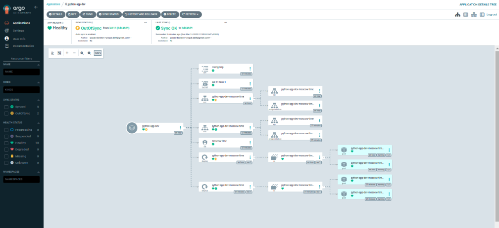

# Lab 13: ArgoCD & Multi-Environment Deployment

This document outlines how to configure **ArgoCD** for **multi-environment** (dev/prod) deployments, enable auto-sync, and demonstrate self-healing.

---

## **Task 1: Deploy and Configure ArgoCD**

1. **Install ArgoCD** via Helm:

```bash
helm repo add argo https://argoproj.github.io/argo-helm
helm install argocd argo/argo-cd --namespace argocd --create-namespace
```

2. **Verify**:

```bash
kubectl get pods -n argocd
```

```
NAME                                       READY   STATUS    RESTARTS   AGE
argocd-redis-xxxxx                         1/1     Running   0          2m
argocd-repo-server-xxxxx                   1/1     Running   0          2m
argocd-server-xxxxx                        1/1     Running   0          2m
```

3. **ArgoCD CLI**:

```bash
argocd version
```

4. **Forward port** and log in:

```bash
kubectl port-forward svc/argocd-server -n argocd 8080:443 &
argocd login localhost:8080 --insecure
```

---

## **Task 2: Multi-Environment Deployment & Auto-Sync**

### 1. Multi-Environment Configurations (Helm)

We have **two** values files: `values-dev.yaml` and `values-prod.yaml`. Each sets different `replicaCount`, etc.

### 2. Create Namespaces

```bash
kubectl create namespace dev
kubectl create namespace prod
```

### 3. ArgoCD Applications

We define two **Application** manifests in `k8s/ArgoCD/`: `argocd-python-dev.yaml` and `argocd-python-prod.yaml`, each pointing to a different values file and namespace.

**Example** for **prod**:

```yaml
apiVersion: argoproj.io/v1alpha1
kind: Application
metadata:
  name: python-app-prod
  namespace: argocd
spec:
  project: default
  source:
    repoURL: https://github.com/<your-username>/S25-core-course-labs.git
    targetRevision: main
    path: k8s/python-app
    helm:
      valueFiles:
        - values-prod.yaml
  destination:
    server: https://kubernetes.default.svc
    namespace: prod
  syncPolicy:
    automated: {}
```

Apply them:

```bash
kubectl apply -f argocd-python-dev.yaml
kubectl apply -f argocd-python-prod.yaml
```

ArgoCD will sync both dev/prod automatically.

---

## 4. Test Auto-Sync

1. **Change** something in `values-prod.yaml` (e.g., `replicaCount: 3`) then commit & push.
2. **Check** ArgoCD:
   ```bash
   argocd app get python-app-prod
   ```
   It should say `Synced` and show the new replicas.

```



```

---

## 5. Self-Heal Testing

### **Test 1: Manual Override of Replica Count**

1. **Patch** the prod deployment directly:
   ```bash
   kubectl patch deployment python-app-prod -n prod --patch '{"spec":{"replicas": 3}}'
   ```
2. ArgoCD sees drift and reverts it to the chart’s setting (maybe 2 replicas). Check:
   ```bash
   argocd app status python-app-prod
   ```
   The final status is **Synced**, matching your Helm chart.

### **Test 2: Delete a Pod**

1. **Delete** a Pod in the **prod** namespace:
   ```bash
   kubectl delete pod -n prod -l app.kubernetes.io/name=python-app
   ```
2. **Kubernetes** will recreate the pod automatically.
3. ArgoCD sees no drift because the desired replicas are still the same.
4. **Observe**:
   ```bash
   kubectl get pods -n prod -w
   argocd app diff python-app-prod
   ```
   Should show no differences.

## 6. Final Outputs in Prod Namespace

```bash
kubectl get pods -n prod
```

Example before/after a pod deletion:

```
NAME                              READY   STATUS    RESTARTS   AGE
python-app-prod-7f56c5c446-abc12  1/1     Running   0          2m
python-app-prod-7f56c5c446-def45  1/1     Running   0          2m

# After deletion, new pod appears.
```
